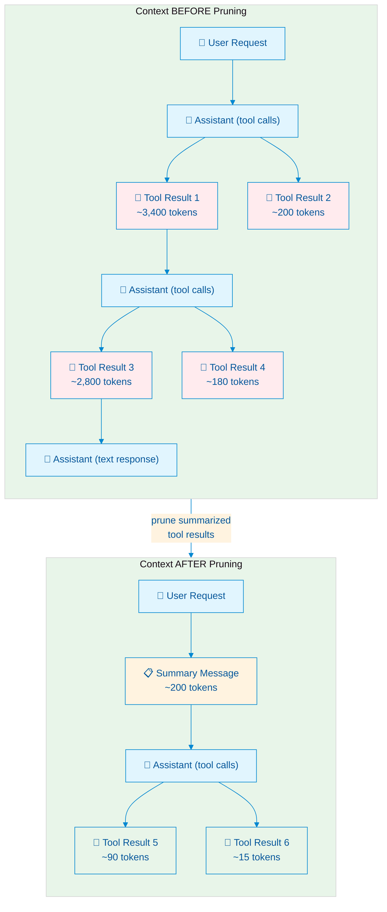
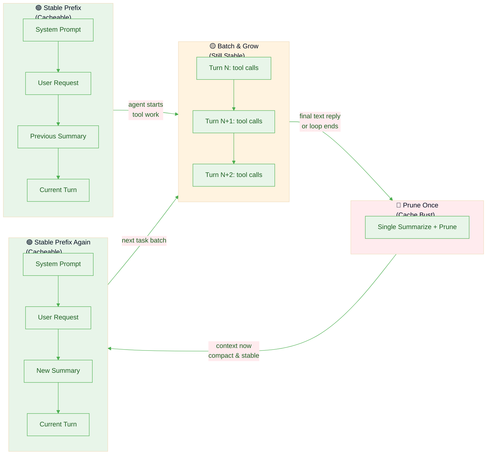

# Understanding Context Pruning in Pi

> How `pi-condense` compresses tool-call history, why it matters for long-running sessions, and how it balances context size against provider-side prefix caching.

---

## Table of Contents

1. [What Does a Long Session Look Like?](#what-does-a-long-session-look-like)
2. [What Pruning Does](#what-pruning-does)
3. [Pruned Data Is Still Available](#pruned-data-is-still-available)
4. [What Actually Lives in the Pruner Index](#what-actually-lives-in-the-pruner-index)
5. [How the Model Re-reads Raw Outputs](#how-the-model-re-reads-raw-outputs)
6. [How Prefix Caching Works](#how-prefix-caching-works)
7. [Why Frequent Pruning Busts Cache](#why-frequent-pruning-busts-cache)
8. [The Sweet Spot: Batch and Prune](#the-sweet-spot-batch-and-prune)
9. [Pre-flush Pipeline & Safeguards](#pre-flush-pipeline--safeguards)
   - [Stub-replace instead of delete](#stub-replace-instead-of-delete)
   - [Protected tools](#protected-tools)
   - [Eager single-result spill](#eager-single-result-spill)
   - [Trivial-batch skip (minBatchChars)](#trivial-batch-skip-minbatchchars)
   - [Content-hash dedup](#content-hash-dedup)
   - [Oversized summary skip](#oversized-summary-skip)
   - [Frontier persistence](#frontier-persistence)
   - [Other UI / observability features](#other-ui--observability-features)
   - [Token-budget auto-flush trigger](#token-budget-auto-flush-trigger)
   - [Budget-delta flush](#budget-delta-flush)
10. [Chain Compression](#chain-compression)
    - [Protected-output relocation](#protected-output-relocation)
11. [Error Purge](#error-purge)
12. [Main-loop Thinking Strip](#main-loop-thinking-strip)
13. [Why Summarization Works: Research Evidence](#why-summarization-works-research-evidence)
    - [SUPO — Summarization augmented Policy Optimization](#supo--summarization-augmented-policy-optimization)
    - [ReSum — Recursive Summarization for Long-Horizon Agents](#resum--recursive-summarization-for-long-horizon-agents)
    - [ACON — Agent Context Optimization](#acon--agent-context-optimization)
14. [Summary](#summary)

---

## What Does a Long Session Look Like?

In Pi, every assistant turn that calls tools produces a sequence of messages in the context tree. In a long coding or research session, this accumulates rapidly:

### ASCII: A typical Pi context tree (before pruning)

```
┌─────────────────────────────────────────────────────────────────────────┐
│  SESSION CONTEXT (growing without bound)                                │
├─────────────────────────────────────────────────────────────────────────┤
│                                                                         │
│  [system]     You are Pi, a helpful coding assistant...                 │
│                                                                         │
│  [user]       Build a React component that fetches data from            │
│               an API and displays it in a table...                      │
│                                                                         │
│  ── Turn 1 ─────────────────────────────────────────                    │
│  [assistant]  <tool_call name="read_file" id="tc-001">                  │
│                 {"path": "src/App.tsx"}                                 │
│  [tool]       export default function App() { ... }        ← 45 tokens  │
│                                                                         │
│  ── Turn 2 ─────────────────────────────────────────                    │
│  [assistant]  <tool_call name="read_file" id="tc-002">                  │
│                 {"path": "package.json"}                                │
│  [tool]       { "dependencies": { "react": "^18.2.0", ... }  ← 120 tok  │
│                                                                         │
│  ── Turn 3 ─────────────────────────────────────────                    │
│  [assistant]  <tool_call name="web_search" id="tc-003">                 │
│               <tool_call name="read_file" id="tc-004">                  │
│  [tool-003]   React Table v7 docs, TanStack Table API...   ← 3,400 tok  │
│  [tool-004]   import { useState } from 'react'; ...        ← 200 tokens │
│                                                                         │
│  ── Turn 4 ─────────────────────────────────────────                    │
│  [assistant]  <tool_call name="edit_file" id="tc-005">                  │
│  [tool]       ✔︎  File updated successfully                 ← 15 tokens  │
│                                                                         │
│  ── Turn 5 ─────────────────────────────────────────                    │
│  [assistant]  <tool_call name="bash" id="tc-006">                       │
│               <tool_call name="read_file" id="tc-007">                  │
│  [tool-006]   BUILD OUTPUT (npm run build):                ← 2,800 tok  │
│               [warn] Circular dependency detected...                    │
│               [warn] Chunk size exceeds 500kb...                        │
│               [error] TypeScript compilation failed...                  │
│  [tool-007]   Updated file contents...                     ← 180 tokens │
│                                                                         │
│  ── Turn 6 ── ... (more turns, more tool calls) ──                      │
│                                                                         │
│  ═══════════════════════════════════════════════════════                │
│  Context size: ~15,000 tokens and growing...                            │
│  Most tokens are raw tool outputs the model already "consumed"          │
│  ═══════════════════════════════════════════════════════                │
│                                                                         │
└─────────────────────────────────────────────────────────────────────────┘
```

In a long session this can grow to **30k–100k+ tokens**. The model pays for every token on every subsequent request. More importantly, the "signal" (what the model actually needs to know) is buried in a mountain of "noise" (full build logs, search results, file contents it already processed).

---

## What Pruning Does

`pi-condense` intercepts completed tool-call batches, summarizes them, and replaces each raw `ToolResultMessage` in future context with a small breadcrumb stub that points at `context_tree_query` for recovery. The original full output is archived in the session index.

### ASCII: The same session *after* pruning Turns 1–5

```
┌─────────────────────────────────────────────────────────────────────────┐
│  SESSION CONTEXT (after pruning Turns 1-5)                              │
├─────────────────────────────────────────────────────────────────────────┤
│                                                                         │
│  [system]     You are Pi, a helpful coding assistant...                 │
│                                                                         │
│  [user]       Build a React component that fetches data from            │
│               an API and displays it in a table...                      │
│                                                                         │
│  [summary]    ╔════════════════════════════════════════════╗            │
│               ║ ⚃  [pruner] Turn 1–5 summary (7 tools)     ║            │
│               ║                                            ║            │
│               ║ • Read existing App.tsx and package.json   ║            │
│               ║ • Searched React Table docs; decided on    ║            │
│               ║   @tanstack/react-table v8                 ║            │
│               ║ • Created DataTable component with         ║            │
│               ║   sorting, pagination, useQuery hook       ║            │
│               ║ • Build failed: circular dependency in     ║            │
│               ║   utils/index.ts → fix by inlining helpers ║            │
│               ║                                            ║            │
│               ║ Summarized tool refs: t1..t7               ║            │
│               ║ Use context_tree_query for raw outputs     ║            │
│               ╚════════════════════════════════════════════╝            │
│               ← ~200 tokens (was ~6,760 tokens)                         │
│                                                                         │
│  ── Turn 6 ─────────────────────────────────────────                    │
│  [assistant]  <tool_call name="read_file" id="tc-008">                  │
│               <tool_call name="edit_file" id="tc-009">                  │
│  [tool-008]   import { helperA } from './helpers'; ...     ← 90 tokens  │
│  [tool-009]   ✔︎  File updated successfully                 ← 15 tokens  │
│                                                                         │
│  ═══════════════════════════════════════════════════════                │
│  Context size: ~500 tokens (plus current turn)                          │
│  ~96% reduction in "stale" context tokens                               │
│  ═══════════════════════════════════════════════════════                │
│                                                                         │
└─────────────────────────────────────────────────────────────────────────┘
```

### Mermaid: The pruning transformation



**Key points:**

- The `AssistantMessage` tool-call blocks are **kept** (they carry the `toolCallId`s the model uses to reference originals via `context_tree_query`).
- `ToolResultMessage` entries for summarized tool calls are **replaced with a small stub** (`[Summarized in pruner summary, ref \`tN\`. Use context_tree_query to retrieve full output.]`) carrying`role: "toolResult"`, the original`toolCallId`/`toolName`/`timestamp`, and`isError: false`. The stub preserves role alternation, so pi-ai's`transformMessages.insertSyntheticToolResults` no longer injects a synthetic `{ isError: true, "No result provided" }` for the (no-longer-)orphaned tool call. See [Stub-replace instead of delete](#stub-replace-instead-of-delete).
- Every pruned tool call is also copied into the pruner's runtime/session index with its `toolCallId`, tool name, args, status, turn index, timestamp, and full `resultText`.
- A summary message is injected as a `"steer"` (`pi.sendMessage` runtime path) or appended directly via `sessionManager.appendCustomMessageEntry` (session path, used when Pi may already be shutting down). Both deliver before the next LLM call.
- The session JSONL file retains the original tool-result entries unchanged — pruning only affects what the *next* request sees in active context.
- **Recovery grace window (`recoveryGraceTurns`, default 3):** after the model recovers a tool call via `context_tree_query`, that tool call's output is rendered **verbatim** (not re-stubbed) for the next N user-turn-groups, then reverts to the normal stub. Without this, the pruner re-prunes its own recovery output on the very next flush, forcing the model into a retrieve -> re-stub -> re-query loop ("fighting the pruner") whenever it keeps referencing the same recovered data across a few turns.
  - Enforced at **render time**, in Phase 1 stub-replace and in chain-compression eligibility — NOT at capture time. Capture-time exclusion would collide with frontier trim: a tool call already past the frontier is dropped forever, so excluding a recovered call from capture would either need to resurrect frontier state or degrade the lifetime bound into permanent verbatim retention for anything ever recovered.
  - Trade-off: this bounds but does not eliminate regrowth. A tool call still referenced after its grace window expires is re-stubbed and may be re-queried again — the accepted cost of keeping the window's context-growth impact bounded instead of unbounded.

---

## Pruned Data Is Still Available

Pruning does **not** delete data. It moves raw tool results out of the hot path (active LLM context) and into an indexed archive the model can query later.

There are two separate things happening during pruning:

1. **Context filtering:** future requests stop including the old `toolResult` messages.
2. **Index preservation:** the extension stores each summarized tool call in the pruner index, keyed by `toolCallId`.

That distinction is the core idea:

- **Pruned from context** does **not** mean **lost**
- It means **hidden from the default prompt**, but still **recoverable on demand**

### ASCII: How `context_tree_query` recovers pruned data

```
┌─────────────────────────────────────────────────────────────────────────┐
│  RECOVERING PRUNED DATA via context_tree_query                          │
├─────────────────────────────────────────────────────────────────────────┤
│                                                                         │
│  [summary]  ... build failed: circular dependency ...                   │
│             - `t1` read config.ts -> 3 exports                          │
│             Summarized tool refs: `t1`                                  │
│             Use `context_tree_query` with these refs                    │
│                                                                         │
│  ── LLM calls context_tree_query({ toolCallIds: ["t1"] }) ──            │
│                                                                         │
│  [tool]     ⌕  context_tree_query result                                │
│             ┌─────────────────────────────────────────────────────┐     │
│             │  Tool: bash (t1)                                    │     │
│             │  Status: OK                                         │     │
│             │  ─────────────────────────────────────────────────  │     │
│             │  $ npm run build                                    │     │
│             │  > react-app@0.1.0 build                            │     │
│             │  > tsc && vite build                                │     │
│             │                                                     │     │
│             │  [warn] Circular dependency: src/utils/index.ts ->  │     │
│             │         src/utils/helpers.ts -> src/utils/index.ts  │     │
│             │  [warn] (!) Some chunks are larger than 500 kBs     │     │
│             │  [error] TS2345: Argument of type 'X' not assignable│     │
│             │          to parameter of type 'Y'...                │     │
│             │                                                     │     │
│             │  [Output truncated: 200/512 lines shown]            │     │
│             └─────────────────────────────────────────────────────┘     │
│                                                                         │
│  The LLM now has the full build log back in context, on demand,         │
│  without permanently inflating the context window.                      │
│                                                                         │
└─────────────────────────────────────────────────────────────────────────┘
```

## What Actually Lives in the Pruner Index

When a batch is summarized, the extension writes a record for each tool call into `ToolCallIndexer` and persists that record into the session as a custom index entry.

Conceptually, each indexed record looks like this (see `ToolCallRecord` in `src/types.ts`):

```ts
{
  toolCallId: "tc-006",
  toolName: "bash",
  args: { command: "npm run build" },
  resultText: "full original raw output...",
  isError: false,
  turnIndex: 5,
  timestamp: 1745251200000 // epoch ms
}
```

This matters because the summary is **not** the only surviving representation of the old tool call.
The model still has access to:

- the original `toolCallId`
- the tool name and arguments
- whether the tool errored
- which turn it came from
- the full original raw result text

So after pruning, the model is working with a **two-layer memory**:

1. **Hot memory:** compact summary text kept directly in context
2. **Cold memory:** full raw tool outputs stored in the pruner index and retrievable by ID

### What is removed vs what is preserved

| Part of old turn | After pruning | Why |
|---|---|---|
| Assistant tool-call block | **Kept in context** | Preserves the `toolCallId` anchors the model uses to reference originals |
| Tool result message | **Replaced by a short stub in active context** | Saves tokens (typical 50–100× reduction per call) while keeping the `toolCallId` anchor and giving the model an explicit `context_tree_query` breadcrumb. The stub keeps `role: "toolResult"` and `isError: false` so role alternation stays intact |
| Summary message | **Added to context** | Gives the model a compact description of what happened |
| Indexed tool-call record | **Stored in pruner index** (`context-prune-index` session entry) | Lets the model re-open the original raw output later via `context_tree_query` |
| Duplicate of an already-indexed record (same toolName + content) | **Aliased to the original; no new summary, no LLM call** (`context-prune-dedup-alias` session entry) | See [Content-hash dedup](#content-hash-dedup) |

## How the Model Re-reads Raw Outputs

The intended recovery flow is:

1. The model reads a summary message.
2. The summary lists the short refs (`t1`, `t2`, …) that were summarized. Each per-tool bullet also carries its own inline `` `tN` `` ref (copied from a `[[N:toolname]]` label the summarizer emits, validated against the tool at that position), so the model can jump from a bullet straight to its ref; the flat footer still lists every ref as a fallback.
3. The model decides the summary is not enough and wants exact raw output.
4. The model calls `context_tree_query({ toolCallIds: ["t1", ...] })`. The tool accepts short refs and full `toolCallId`s interchangeably (`indexer.resolveToolCallId`).
5. The tool looks up those IDs in the pruner index.
6. The tool returns the original stored output back into the current turn.
7. The model can now inspect that raw result and continue reasoning.

### ASCII: end-to-end "prune, then re-read" flow

```text
assistant turn with tools
        │
        ▼
raw tool results exist in context
        │
        ▼
batch gets summarized
        │
        ├─► summary message added to context
        │      └─► includes short refs (`t1`, `t2`, …)
        │
        ├─► tool results indexed by toolCallId
        │      └─► full raw resultText stored in index/session
        │
        └─► old toolResult messages removed from future context

later...
        │
        ▼
model sees summary and decides: "I need the exact old output"
        │
        ▼
context_tree_query({ toolCallIds: ["t1"] })
        │
        ▼
query tool resolves short ref / id and loads the indexed record
        │
        ▼
original raw output is returned into the current turn
        │
        ▼
model continues with exact old context back in view
```

### Why this is important

- summaries keep the default context small
- short refs / `toolCallId`s keep old work addressable
- `context_tree_query` makes the archive readable again
- the model can "page in" exact old context only when it actually needs it

Summaries are the default view; raw data remains addressable through `context_tree_query`.

---

## How Prefix Caching Works

Modern LLM API providers (Anthropic, OpenAI, vLLM, etc.) implement **prefix caching** (also called "prompt caching") to speed up repeated requests with similar prompts.

### How it works

LLM inference has two phases:

1. **Prefill** — compute Key-Value (KV) attention states for all input tokens
2. **Decode** — generate output tokens autoregressively, reusing the cached KV states

Prefix caching stores the KV states for an exact token sequence on the provider's GPU. When a new request shares an identical prefix, the provider **skips prefill** for that prefix and starts from the cached KV state.

### ASCII: Cache hit vs cache miss

```
┌─────────────────────────────────────────────────────────────────────────┐
│                    WITHOUT PREFIX CACHING                               │
├─────────────────────────────────────────────────────────────────────────┤
│                                                                         │
│  Request 1:  [System] [User Q1] ──► LLM computes KV for ALL tokens      │
│                                        │                                │
│                                        ▼                                │
│                                   Generate answer                       │
│                                                                         │
│  Request 2:  [System] [User Q2] ──► LLM computes KV for ALL tokens      │
│              ▲▲▲▲▲▲▲▲▲▲▲▲▲▲▲▲▲         │ (EVERYTHING recomputed)        │
│              Same prefix as Request 1  ▼                               │
│                                   Generate answer                       │
│                                                                         │
│  Time:  ████████████████████████████████████████  ~2.5s each            │
│  Cost:  Full input tokens priced at standard rate                       │
│                                                                         │
└─────────────────────────────────────────────────────────────────────────┘

┌─────────────────────────────────────────────────────────────────────────┐
│                    WITH PREFIX CACHING (HIT)                            │
├─────────────────────────────────────────────────────────────────────────┤
│                                                                         │
│  Request 1:  [System] [User Q1] ──► LLM computes KV for ALL tokens      │
│                                        │                                │
│                    ┌───────────────────┘                                │
│                    ▼                                                    │
│              [STORED IN CACHE]                                          │
│                                                                         │
│  Request 2:  [System] [User Q2] ──► SKIP! KV loaded from cache          │
│              ▲▲▲▲▲▲▲▲▲▲▲▲▲▲▲▲▲         │ (prefix match = instant)       │
│              Cache hit!                ▼                                │
│                                   Only compute NEW tokens               │
│                                   Generate answer                       │
│                                                                         │
│  Time:  ████████████████████░░░░░░░░░░░░░░░░░░░  ~0.5s (80% faster)     │
│  Cost:  Cached prefix at 50-90% discount (provider-dependent)           │
│                                                                         │
└─────────────────────────────────────────────────────────────────────────┘
```

### Provider specifics

| Provider | Cache Activation | Match Type | Duration |
|---|---|---|---|
| **Anthropic** | Manual — `cache_control: {type: "ephemeral"}` on message blocks | Exact prefix from breakpoints | Tied to usage pattern |
| **OpenAI** | Automatic for prompts ≥1,024 tokens | Exact prefix match; ~first 256 tokens hashed for routing | 5–10 min inactivity (up to 1 hr) |
| **vLLM / Self-hosted** | Automatic via hash-based block matching | Exact block match | Instance lifetime |

### Critical rule

> **Cache matching requires *exact* token sequences.** Any change — reordering messages, editing text, adding/removing tool results, even whitespace — alters the prefix hash and triggers a **cache miss**.

---

## Why Frequent Pruning Busts Cache

Every time you prune, you **rewrite the prefix**. The message that was previously a 3,400-token tool result is now a 200-token summary. That's a different token sequence, so the cache is invalidated.

### ASCII: The per-turn pruning trap (naive per-turn pruning)

```
┌─────────────────────────────────────────────────────────────────────────┐
│  NAIVE PER-TURN PRUNING — AGGRESSIVE BUT CACHE-UNFRIENDLY               │
├─────────────────────────────────────────────────────────────────────────┤
│                                                                         │
│  Turn 1:  Read file → 45 tokens                                         │
│           └──► summarize → inject summary                               │
│           │                                                             │
│           └──► CACHE BUST: context changed from [toolResult] to [sum]   │
│                                                                         │
│  Turn 2:  Read package.json → 120 tokens                                │
│           └──► summarize → inject summary                               │
│           │                                                             │
│           └──► CACHE BUST again: prefix rewritten AGAIN                 │
│                                                                         │
│  Turn 3:  Web search + read file → 3,600 tokens                         │
│           └──► summarize → inject summary                               │
│           │                                                             │
│           └──► CACHE BUST again: prefix rewritten AGAIN                 │
│                                                                         │
│  After 5 turns:                                                         │
│    • 5 summarizer LLM calls (latency + cost)                            │
│    • 5 cache busts (FULL prefill every time)                            │
│    • No prefix ever stayed stable long enough to benefit from caching   │
│                                                                         │
│  Time:  ████████████████░░░░░░  ~80% spent on re-computing prefixes     │
│                                                                         │
└─────────────────────────────────────────────────────────────────────────┘
```

---

## The Sweet Spot: Batch and Prune

The insight is simple: **batch many tool turns, then prune once**. Everything before the prune point stays in the prefix cache and remains cacheable. Only the new suffix (since the last prune) needs fresh computation.

### ASCII: Batch pruning (`agent-message` mode)

```
┌─────────────────────────────────────────────────────────────────────────┐
│  agent-message MODE — BATCH THEN PRUNE (RECOMMENDED)                    │
├─────────────────────────────────────────────────────────────────────────┤
│                                                                         │
│  ┌─────────────────────────────────────────────────────────────────┐    │
│  │  BATCH PHASE: Tool turns accumulate (not pruned yet)            │    │
│  │                                                                 │    │
│  │  Turn 1: Read file → 45 tokens   ═══════╗                       │    │
│  │  Turn 2: Read package → 120 tokens  ════╬══════╗                │    │
│  │  Turn 3: Web search + read → 3,600 tok  ═════╬═╬═════╗          │    │
│  │  Turn 4: Edit file → 15 tokens    ═══════╬═╬═╬═╬════╬═════╗     │    │
│  │  Turn 5: Build + read → 2,980 tokens    ═╬═╬═╬═╬════╬═════╬═╗   │    │
│  │  Turn 6: Read + edit → 105 tokens   ═════╬═╬═╬═╬════╬═════╬═╬   │    │
│  │                                       ▼ ▼ ▼ ▼   ▼     ▼   ▼ ▼   │    │
│  │  All these tool results stay in context UNCHANGED               │    │
│  │  → Prefix cache is STABLE → cache HITS on every turn            │    │
│  └─────────────────────────────────────────────────────────────────┘    │
│                                    │                                    │
│                                    │ Agent sends final text reply       │
│                                    ▼                                    │
│  ┌─────────────────────────────────────────────────────────────────┐    │
│  │  PRUNE PHASE: Single summary replaces batch                     │    │
│  │                                                                 │    │
│  │  [summary] "Built React table component. Key decisions:..."     │    │
│  │                                                                 │    │
│  │  ONE cache bust, then context is STABLE again                   │    │
│  └─────────────────────────────────────────────────────────────────┘    │
│                                    │                                    │
│  ┌─────────────────────────────────────────────────────────────────┐    │
│  │  STABLE PHASE: New requests reuse cached prefix                 │    │
│  │                                                                 │    │
│  │  User: "Now add sorting"                                        │    │
│  │  → Cache HIT on [system] + [user] + [summary] prefix            │    │
│  │  → Only "Now add sorting" needs prefill                         │    │
│  │  → Fast + cheap                                                 │    │
│  └─────────────────────────────────────────────────────────────────┘    │
│                                                                         │
│  Result: 1 cache bust per meaningful work unit, not per turn            │
│                                                                         │
└─────────────────────────────────────────────────────────────────────────┘
```

### Mermaid: Cache-friendly pruning lifecycle



### Cache impact trade-off

| Mode | Cache Busts per 5 Turns | Context Reclaimed | Recommended for |
|---|---|---|---|
| `agent-message` | 1 | After batch | **Default** — best balance |
| `on-demand` | 0–1 | When you say so | Maximum cache preservation |

> **Everything before the previous pruning point stays in the prefix cache.** The cached prefix is the stable foundation; only the new suffix (recent turns since last prune) changes per request.

---

## Pre-flush Pipeline & Safeguards

`flushPending` runs a deterministic pipeline BEFORE any summarizer LLM call. Each step is configurable and each one can drop a batch entirely, in which case the prune frontier still advances so the same tool calls are not reconsidered next flush.

```
captured batches (from turn_end or session scan)
  │
  ├─ 1. Protected-tools/paths filter   (capture-time, see below)
  │     tool calls whose toolName is in protectedTools, OR whose args.path
  │     matches any protectedPaths glob, never enter the batch
  │
  ├─ 2. Eager single-result spill     (config: spillThreshold, default 65536)
  │     turn_end: single result >= spillThreshold chars → write sidecar;
  │     index immediately via addBatch (no LLM); pruner emits file-pointer stub;
  │     dedup precedence: protected → dedup → spill (duplicate → alias, no second file)
  │
  ├─ 3. Frontier trim                 (drop tool calls already past the frontier)
  │
  ├─ 4. Content-hash dedup            (config: dedupByContentHash, default ON)
  │     identical (toolName, normalize(resultText)) → alias of original;
  │     no LLM call; persist as context-prune-dedup-alias
  │
  ├─ 5. Trivial-batch skip            (config: minBatchChars, default 1000)
  │     batches whose remaining raw chars < threshold → skip; no LLM call;
  │     leave originals in context; advance frontier
  │
  ├─ 6. Summarizer LLM call           (parallel: one call per batch)
  │     resolveModel + summarizeBatch / summarizeBatches
  │
  └─ 7. Oversized post-check          (summary >= raw? → skip; advance frontier)
```

The outcome label written into `context-prune-frontier` is one of `summarized`, `skipped-deduped`, `skipped-trivial`, or `skipped-oversized` so the audit trail captures *why* a range was passed over.

### Stub-replace instead of delete

Before v0.11.0 the pruner deleted summarized `ToolResultMessage` entries outright. This worked, but it left the matching `AssistantMessage.toolCall` blocks orphaned, and pi-ai's `transformMessages.insertSyntheticToolResults` would inject `{ isError: true, content: "No result provided" }` for every orphan at LLM call time. The model then saw a parade of fake "tool errors" before the unrelated summary user-message appeared later, which mildly confused larger reasoning models.

The pruner now keeps the toolResult message but replaces its content with a small stub:

```
[Summarized in pruner summary, ref `tN`. Use context_tree_query to retrieve full output.]
```

Properties:

- `role: "toolResult"` and the original `toolCallId` / `toolName` / `timestamp` are preserved — role alternation is intact; no synthetic-result injection.
- `isError: false`, so the model does not interpret the stub as a tool failure.
- The stub references the **short ref** (`t1`, `t2`, …) the indexer assigned at summary time. Legacy entries from before short-refs landed fall back to the raw `toolCallId`.
- Deterministic per `toolCallId` — the stub text never changes across calls, so the prefix cache continues to hit on the pruned range.

Implementation: `src/pruner.ts` `pruneMessages(messages, indexer)` returns `{ messages, pruned }`. When `pruned === false`, the original array reference is returned and the `context` handler skips reconstruction entirely.

### Protected tools & paths

A tool call is protected if **either** its `toolName` is in `protectedTools` **or** its `args.path` (string) matches any glob in `protectedPaths`. Protected calls are filtered out **at capture time** - they never enter the `pendingBatches` queue, so their raw `ToolResultMessage` stays verbatim in future LLM context.

**`protectedTools: string[]`** (default `[]`) - allowlist of tool names. Covers tools whose output is a small handle that must be reused byte-for-byte (e.g. a session-id) or planning tools like `todowrite` / `todoread`.

**`protectedPaths: string[]`** (default `["**/skills/**/*.md"]`) - glob list matched against `args.path`. Designed for skill files that carry multi-step workflow gates; summarizing them is categorically lossy. Non-string or missing `path` arguments never match. Set `[]` to disable. Edit with `/pruner protected-paths`.

Glob contract: full-path match against the raw `args.path` string with `\` normalized to `/`. `*` and `?` match within a segment (no `/`); `**` crosses segments; `**/` also matches zero directories (so `**/SKILL.md` matches a bare relative `SKILL.md`). Case-sensitive. All other characters are regex-escaped literals.

**Render-time re-check:** stub replacement runs in-flight on every turn (`pruneMessages`). If a tool call's persisted `args` now satisfy `isProtected` (e.g. a pattern was added mid-session), the stub is skipped and the raw result is left verbatim - this repairs already-summarized records in existing sessions with no schema change. Declared limitation: records inside already-compressed chains (`context-prune-chain` entries) are NOT repaired - their `protectedToolCallIds` set is fixed at compression time (forward-only). Dedup-alias edge: an alias resolving to an unprotected original stays stubbed.

Names and patterns that don't match any captured tool call are silently ignored.

### Eager single-result spill

`spillThreshold: number` (default `65536`) is a capture-time safeguard for outsized single tool results (e.g. a 1 MB web fetch, a full binary diff). When a single `ToolResultMessage`'s `resultText.length` reaches the threshold, the result is spilled immediately at `turn_end` — before the pending-queue trim and before any LLM call.

**Sidecar location:** `<sessionDir>/<sessionId>-blobs/<sanitizedToolCallId>.txt`.

**Index entry:** `addBatch` is called synchronously with the spilled body (no LLM round-trip). The record is immediately `isSummarized = true`; the pruner emits a mechanical file-pointer stub:

```
[Spilled: <toolName> (<N> bytes). Head preview:
<first spillPreviewBytes bytes>
Full output: <sidecar path>. Use context_tree_query(<shortRef>) to retrieve.]
```

**Dedup precedence:** `protected → dedup → spill`. An oversized result that is also a content-hash duplicate of a prior record is aliased to the original; no second sidecar is written.

**Atomicity:** the sidecar is written first; only on success is the in-memory record mutated. A write failure leaves the result inline for the normal flush and is logged via `console.error` — no data is lost.

**Hybrid storage:** bodies below `spillThreshold` stay inline in the `context-prune-index` session entry (portable, as before); only oversized bodies are spilled. Moving the session `.jsonl` without its `-blobs/` directory loses only the giant-blob recovery path; the stub and head preview remain in the index entry.

### Trivial-batch skip (minBatchChars)

`minBatchChars: number` (default `1000`) is a pre-flush guard against "summary would be roughly the same size as the input" cases. If the total raw `resultText` across a batch is below the threshold, the batch is skipped: no summarizer LLM call, no `context-prune-index` entry, no `context-prune-summary` injection. The frontier still advances, so the same tool calls are not reconsidered next flush.

Why it exists: a short LLM summary like "Tool X did Y" is itself ~50–150 chars per call. For a 200-byte file read or an `ls` of a short directory, the summary is the same size or larger than the input — the post-call `skipped-oversized` mechanism would catch it anyway, but only after the LLM round-trip and the cost. `minBatchChars` short-circuits the obvious cases at zero LLM cost.

Set `minBatchChars: 0` to disable. The default `1000` skips obvious trivial batches (`git status`, small file reads, short directory listings) without affecting realistic tool outputs. Edit with `/pruner min-batch-chars <n>` or via the settings overlay.

### Content-hash dedup

`dedupByContentHash: boolean` (default `true`) catches re-reads of already-pruned tool outputs at zero LLM cost.

Mechanism:

1. When a batch enters `flushPending`, each tool call is hashed by `SHA-1(toolName + "\0" + normalize(resultText))`.
2. The indexer's `contentHashToOriginal` map (populated by every earlier `addBatch` / `reconstructFromSession`) is consulted.
3. A hit means an earlier prune already covered identical content. The duplicate is registered as an alias of the original via `indexer.registerDuplicate(newId, originalId, appendEntry)`:
   - `dedupAliasToOriginal[newId] = originalId` (so `isSummarized(newId) === true` and `resolveToolCallId(newId) === originalId`).
   - `toolCallIdToAlias[newId] = toolCallIdToAlias[originalId]` (so `getShortRefForToolCallId(newId)` returns the **same** `tN` as the original).
   - A `context-prune-dedup-alias` custom entry is persisted so `reconstructFromSession` rebuilds the maps after a restart.
4. The duplicate is removed from the batch — no summarizer call, no new index entry.
5. Later, `pruneMessages` stub-replaces the duplicate's `ToolResultMessage` using the original's short ref, and `context_tree_query` returns the original's record whether the model passes the duplicate's id or the original's.

Normalization is conservative: `\r\n` → `\n`, per-line trailing whitespace stripping, final `trim()`. Internal whitespace, tabs, and capitalization are preserved so two genuinely different outputs do **not** collide.

Typical wins: re-reading an unchanged file, repeated `git status` / `ls`, retries of the same command. v1 only matches against records **already in the indexer** (cross-flush dedup); intra-flush dedup is deferred so canonicals that get skipped as oversized / trivial never produce dangling aliases.

Edit with `/pruner dedup on|off|status` or the settings overlay.

### Oversized summary skip

Last-resort safeguard: if the summarizer LLM produces a summary longer than the raw tool-result text it would replace, the batch is left untouched — the original tool results stay in context, no summary is injected, and the frontier still advances so the next prune attempt starts after this range instead of retrying it. The `quietOversizedSkips` config silences the info notification (the skip itself still happens).

This is rare in practice once `minBatchChars` is on, because the cases where summarization makes things bigger are exactly the cases the trivial-batch skip already catches earlier.

### Frontier persistence

The last attempted prune boundary is persisted as `context-prune-frontier` so `flushPending` knows where the previous attempt left off, even if that attempt was a skip rather than a real summary. Without this, a batch that's been skipped as oversized would be re-attempted (with the same LLM call, the same oversize result, the same skip) on every subsequent flush.

### Other UI / observability features

- **Tree browser (`/pruner tree`):** interactive, foldable tree of pruned tool calls grouped under their summaries. `Ctrl-O` on a summary node opens the full markdown summary in a bordered overlay.
- **Configurable summarizer thinking (`summarizerThinking`):** trade summary cost / latency for quality (`off` / `minimal` / `low` / `medium` / `high` / `xhigh`). `default` omits the option entirely so the provider chooses.
- **Cumulative stats:** `context-prune-stats` entries track input/output tokens and cost of every summarizer call; full detail surfaces in `/pruner stats`. Cost is also emitted on the `cost:external` pi.events channel for external aggregators (cumulative per session, live only).
- **Live reclaim ratio:** measured once per `pruneMessages` call via `sizeMessages(messages) = JSON.stringify(messages).length`, comparing the input array before pruning to the result after. Estimated tokens = chars / 4. The measurement covers all four reclaim mechanisms in a single point (stub-replace, error-purge, chain-range-prune, thinking-strip); appears on the status line as `│ prune: ON · 92k->14k (-85%) │` once at least one prune has occurred (the `│ … │` wrapper keeps the segment visually isolated in the shared footer, load-order independent).
- **Live progress for `/pruner now`:** an `aboveEditor` widget shows one row per pending batch with braille spinner, streamed summary-char count, and ✓ / ⚠ status.

### Summarizer outage fallback

Provider incidents are routinely per-model: a cheap summarizer model (e.g.
Haiku) can be down while the session's main model (Sonnet/Opus) stays healthy.
Without a fallback, `runSummarization` returns `null`, the batch is re-queued,
and the next flush retries the same dead model — pruning stalls for the whole
outage and context grows unbounded.

`src/summarizer-fallback.ts` adds a sticky, in-memory `FallbackController` that
engages only on **transient** failures of the configured summarizer model and
only when a distinct fallback model exists (`summarizerModel` != `default` and
the resolved model differs from `ctx.model`):

- **Classification is coarse** (pi-ai surfaces no status code on the throw):
  `auth` (pre-flight key failure) and `unusable` (empty / length-truncated)
  never trip the controller; a `transient` stream error / `stopReason: error`
  does. Aborts propagate unchanged.
- **Enter:** a transient primary failure is retried once on the session model.
  If that succeeds, the session flips to fallback and a one-time warning fires.
- **Sticky + probe:** while in fallback, all calls route to the session model.
  After a 10-minute cooldown (`COOLDOWN_MS`, internal, not configurable) one
  batch of the next flush probes the primary; success recovers (info notify),
  failure stays in fallback.
- **In-memory only:** no `context-prune-*` entry; `reset()` on `session_start`.
  A restart mid-outage re-detects on the next flush.

Cost note: the initial detection flush can fire up to N doomed primary calls
before the outage is known; steady state is 0 doomed calls, plus exactly 1
probe per 10 minutes. After the primary recovers, summarization keeps running
on the (often pricier) session model for up to one cooldown before the probe
switches back.

---

## Why Summarization Works: Research Evidence

Summarizing tool-call history is not just a hack — it is an active research area with strong empirical support. Three recent papers establish the benefits:

---

### SUPO — Summarization augmented Policy Optimization

> **Paper:** *SUPO (arXiv:2510.06727)* — Miao Lu et al.  
> **TL;DR:** RL-trained agents with built-in summarization outperform standard agents on long-horizon tasks while using *less* context.

**Core idea:**
SUPO integrates summarization directly into the RL training pipeline for tool-using agents. Instead of treating context compression as an afterthought, the policy gradient is derived to optimize **both** tool-use behavior **and** summarization strategy end-to-end.

**Method:**

- Periodically compresses tool-using history via LLM-generated summaries
- Retains task-relevant information in compact form
- Derives a policy gradient that lets standard LLM RL infrastructure optimize both behaviors simultaneously
- Enables training beyond fixed context limits

**Key results:**

- Significantly improved success rate on interactive function calling and search tasks
- **Same or lower working context length** compared to baselines that don't summarize
- Test-time scaling: increasing the maximum summarization rounds during evaluation further improves performance

**Why this matters for Pi:**
SUPO proves that summarization is not just about saving tokens — it actively **improves task success** on long-horizon multi-turn problems by preventing context overflow and keeping relevant signals prominent.

---

### ReSum — Recursive Summarization for Long-Horizon Agents

> **Paper:** *ReSum (arXiv:2509.13313)* — Xixi Wu et al. (Alibaba)  
> **TL;DR:** A plug-and-play summarization tool enables web agents to explore indefinitely without hitting context limits, achieving 4.5–12.7% gains over ReAct.

**Core idea:**
ReSum addresses the fundamental conflict between **exploration** (needing many tool calls) and **context limits** (fixed window size). Current agents append every thought/action/observation to history until they crash into the context ceiling.

**Method:**

- Periodically invokes an external **summary tool** to condense interaction history
- The agent restarts reasoning from the compressed summary
- Introduces **ReSum-GRPO**: adapts Group Relative Policy Optimization with **advantage broadcasting** — propagates final trajectory rewards across all segments so early exploration steps get proper credit
- Trained a specialized **ReSumTool-30B** to extract key evidence and propose next steps

**Key results:**

- **4.5% improvement** over ReAct in training-free settings
- **Further 8.2% gain** with ReSum-GRPO training
- A 30B ReSum-enhanced agent with only 1K training samples achieves competitive performance with leading open-source models
- Enables "unbounded exploration" — the agent never hits a hard context wall

**Why this matters for Pi:**
ReSum validates the exact architecture `pi-condense` uses: an external summarizer module, periodic compression, and recovery from compressed state. The plug-and-play nature means it works with off-the-shelf agents — no retraining required.

---

### ACON — Agent Context Optimization

> **Paper:** *ACON (arXiv:2510.00615)* — Minki Kang et al. (Microsoft/ KAIST)  
> **TL;DR:** Optimized compression guidelines reduce memory by 26–54% while preserving accuracy; distilled compressors retain >95% of performance.

**Core idea:**
ACON is a unified framework that compresses **both** environment observations and interaction histories into "concise yet informative condensations." It treats compression as an optimization problem: maximize task reward while minimizing context cost.

**Method:**

- **Gradient-free** — uses natural language space optimization (no model fine-tuning)
- **Failure-driven guideline optimization:** runs the agent with and without compression, collects cases where compression caused failure, and uses an optimizer LLM to refine compression guidelines
- Two-step alternation:
  1. **Utility maximization** — ensure task success is preserved
  2. **Compression maximization** — make summaries shorter while keeping sufficiency
- **Distillation:** optimized compressor can be distilled into smaller models (e.g., Qwen-14B) with >95% accuracy retention

**Key results:**

- **26–54% reduction in peak tokens** across AppWorld, OfficeBench, and Multi-objective QA
- Preserves task performance with large models
- **Smaller LMs improve 20–46%** as agents when context compression removes distracting noise
- Distilled compressor retains **>95% accuracy**

**Why this matters for Pi:**
ACON demonstrates that **compression not only saves tokens but can improve agent performance** — especially for smaller models, where long noisy context actively degrades reasoning quality. The failure-driven optimization approach shows that even simple summarization, when guided by task structure, preserves critical signals.

### Token-budget auto-flush trigger

`autoBudgetThreshold` (default `null`) is an ADDITIONAL flush trigger orthogonal to `pruneOn`. When set to a fraction in `(0, 1]`, the extension evaluates `tokens / contextWindow` at the end of every tool-using turn; when the ratio meets the threshold, all pending batches are flushed immediately regardless of the configured `pruneOn` mode.

Why we compute the ratio ourselves rather than using `ContextUsage.percent`: the provider's `percent` field is a 0–100 value, and both it and `tokens` are `null` immediately after a provider-side compaction. Using `tokens / contextWindow` directly gives a 0–1 fraction that matches the config unit and is independently null-safe — a `null` tokens value makes the trigger a no-op until usage is reported again.

Lineage: simplified take on DCP's `maxContextLimit` nudging — a single threshold that forces a flush rather than separate nudge/force thresholds.

### Budget-delta flush

`budgetTurnDelta: number | null` (default `null`) is a per-turn usage-jump trigger ORed with `autoBudgetThreshold`. When set to a fraction in `(0, 1]`, the extension compares the current turn's usage fraction (`tokens / contextWindow`) to the previous turn's and forces a flush if the jump meets or exceeds the delta.

Use case: a single enormous tool result can jump context usage by 20–30 percentage points in one turn; `autoBudgetThreshold` misses this until the next turn. `budgetTurnDelta` catches the spike immediately.

**`previousFraction` tracking:**

- Reset to `null` on `session_start` and `session_tree` (session reload).
- Left unchanged on a null-tokens turn immediately following a provider-side compaction (treating a post-compaction null as `0` would produce a spurious spike on the next real turn).
- The post-restart first turn cannot fire a delta trigger (no prior fraction to compare) and falls back to `autoBudgetThreshold` alone.

`null` = off (default).

---

## Chain Compression

Chain compression is a second layer on top of the per-batch tool-result stub pruner. It operates on entire closed conversation chains rather than individual tool results, reclaiming the tokens that the stub pruner cannot touch: assistant thinking blocks, encrypted thinking signatures, and tool-call argument bodies.

### What a closed chain is

A **closed chain** is a span of messages from one user message through any number of tool-using assistant turns and their results, ending in a final text-only assistant reply:

```
[user msg]                         ← chain start (kept raw)
[assistant: thinking + toolCalls]  ← middle (dropped)
[toolResult]                       ← middle (dropped)
[assistant: thinking + toolCalls]  ← middle (dropped)
[toolResult]                       ← middle (dropped)
[assistant: text-only]             ← chain close (kept, thinking stripped)
```

### What gets dropped vs. kept

| Part | After chain compression |
|---|---|
| Start user message | **Kept raw** |
| Middle assistant turns (all) | **Dropped** — assistant thinking + signatures + toolCall argument blocks |
| Middle tool results (all) | **Dropped** — already stub-replaced by the per-batch pruner; now fully removed |
| Per-batch summary message(s) for this chain | **Suppressed** — replaced by the chain-level synthetic |
| Final text-only assistant | **Kept**, thinking blocks stripped (safe — no following tool cycle depends on the signature) |
| Synthetic `<compressed-chain>` user message | **Injected** immediately after the start user message |

### Transform composition order

```
raw messages from session
  │
  ├─ [1] tool-result stub-replace   (per-batch; existing)
  ├─ [2] error-purge                (phase 2)
  ├─ [3] chain-range-prune          (runs AFTER stubs)
  │        for each compressed chain:
  │          drop middle assistants (by toolCallId overlap)
  │          drop middle toolResults (by toolCallId)
  │          suppress per-batch summaries (by toolCallRefs overlap)
  │          inject <compressed-chain> after start user
  │          strip thinking from final assistant
  └─ [4] thinking-strip             (keep thinking on last K assistant turns)
```

### Identification model

Pi-ai's `Message` union (`UserMessage | AssistantMessage | ToolResultMessage`) has no `.id` field. Chain compression uses:

- `timestamp: number` to identify user / final-assistant boundary messages
- `toolCallId` sets to identify middle assistant turns and their tool results

This is why the persisted `ChainCompressionEntry` stores `startUserTimestamp` + `droppedToolCallIds` rather than message IDs.

### Rolling window

`chainCompression.rollingWindow` (default `3`) controls how many recently-closed chains stay raw. Once the (K+1)-th chain closes, the oldest chain beyond the window is compressed.

- With K=3: the three most-recently-closed chains stay as-is; the fourth triggers compression of the oldest. Exactly K closed chains are kept raw (the open/live chain is never counted).
- `/pruner compact` bypasses the window and compresses every eligible chain immediately (retroactive).

**Closing-message threading.** In agent-message mode the flush runs from `message_end`, which pi emits to extensions *before* it persists the message to the session (`agent-session.js` runs `_emitExtensionEvent` ahead of `sessionManager.appendMessage`). So at flush time `getBranch()` is missing the just-closed final assistant, and the newest chain would read as open — over-retaining by one (effective K+1). `index.ts` threads the triggering `event.message` through `FlushOptions.closingMessage` into `withClosingMessage` so the chain closes and the window is exactly K.

### Synthetic message format

The injected user message body:

```
<compressed-chain id="b1" tools="t3,t4,t5">
[existing per-batch summary text]
</compressed-chain>
```

- `id="b1"` is a stable monotonic block ID (`b1`, `b2`, …) assigned at compression time and persisted in the `context-prune-chain` session entry.
- `tools="t3,t4,t5"` lists the short `tN` refs from the per-batch index so the model can call `context_tree_query` to recover individual tool outputs.
- The body is the cohesive LLM **range summary** when present (see below), else the existing `context-prune-summary` text reused verbatim.

### Range summary fusion

By default (`chainCompression.fuseRangeSummary`, default `true`) a compressed chain's per-batch summaries are fused into ONE cohesive summary by a single summarizer call at compression time, persisted as `rangeSummaryText` on the `context-prune-chain` entry and used as the synthetic body. This is recursive summarization (summary-of-summaries): the input is the already-pruned per-batch summary text, so it never re-sends raw tool output.

- **Gate:** only spans with >= 2 distinct per-batch summaries are fused (nothing to fuse otherwise); single-summary spans use that summary directly.
- **Non-fatal:** if the fusion call fails or returns empty, the entry stores no `rangeSummaryText` and the renderer falls back to the per-batch concatenation — the chain still compresses.
- **Cost:** one extra summarizer call per multi-batch span, charged to the same summarizer model and folded into the usage stats (`rangesSummarized` counter). Set `fuseRangeSummary: false` to keep the zero-LLM concatenation.
- **Recovery:** unchanged — the span's tool outputs stay in `context-prune-index` and are recoverable via `context_tree_query`; the raw span text stays in the session JSONL.

### Cache impact

Each new chain compression busts the prefix cache from the affected chain's start-user-message onward. Mitigation: the rolling window concentrates compression decisions at predictable points (one event per chain close), so cache is only invalidated when an old chain ages out of the window — not on every turn.

### Recovery

Chain compression does not delete data from the session JSONL. The original tool outputs remain in `context-prune-index` entries and are recoverable via `context_tree_query`. To undo compression of a specific chain, delete the matching `context-prune-chain` entry from the session file — the chain will re-appear in context on next load.

### Protected-output relocation

**Contract:** outputs protected by tool name (`protectedTools`) or path glob (`protectedPaths`) must never be pruned from LLM context. The per-batch pipeline honours this at capture time (protected tool calls never enter the batch). Chain compression, however, operates at the *message range* level and drops entire middle turns wholesale - which would silently remove any protected `ToolResultMessage` residing in those turns.

**Mechanism:** detection (`detectChains`) records which middle tool-call ids are protected on the `ChainRange`; `compressEligible` copies that id list onto the persisted `ChainCompressionEntry.protectedToolCallIds` (it stores ids only, no text). At render time, `applyChainCompressions` pulls each protected `ToolResultMessage`'s verbatim text live from the raw branch and embeds it inside the synthetic `<compressed-chain>` block:

```
<compressed-chain id="b1" tools="t3,t4,t5">
[range summary text]
<protected-output tool="todoread">...verbatim output...</protected-output>
</compressed-chain>
```

The protected output is relocated (moved), not copied — the original `ToolResultMessage` is dropped with the rest of the middle turns. The text stays in LLM context because it is embedded in the surviving synthetic block. It is NOT registered in the tool-call index and is NOT recoverable via `context_tree_query`; it does not need to be, because it is present verbatim.

The `context-prune-chain` session entry carries the matching `protectedToolCallIds` array so `session_start` reconstruction can re-embed the outputs on reload.

**Rejected alternative:** skip compression for any chain that contains a protected tool. Rejected because `todowrite`/`todoread` recur in most chains for opted-in users, so this strategy would forfeit most chain compression for the people who most need `protectedTools`.

### Deferred

- **Model-driven trigger.** The compressor is autonomous (rolling window). A model-callable compress tool (DCP-style: the model compresses a sub-task as it closes) is not implemented; the earlier scaffolded `agentic-auto` mode + `context_prune` tool were removed in v1.0.0.
- **Multi-turn span merging.** Each compressed span maps 1:1 to a closed chain (one user -> text-only-assistant round). Merging several consecutive closed spans into one topic summary is future work.

---

## Error Purge

Failed tool calls often embed large argument bodies in the assistant message — a `write` call with a 30 KB file body, an `edit` call with a multiline diff. The error result is small (e.g. `"Error: file not found"`), but the original `arguments` stay in the assistant turn indefinitely.

Error purge replaces those arg bodies with compact stubs after the error has cooled down:

```
{ "_purged": "<purged-errored-args size=\"N\"/>" }
```

**What triggers a purge:**

- The matching `ToolResultMessage` has `isError: true`.
- The error occurred at least `purgeErrors.cooldownTurns` assistant turns ago (default 2). The cooldown gives the model 1–2 turns to retry before context is mutated.
- The JSON-stringified argument body is at least `purgeErrors.minArgChars` characters long (default 500). Small args are not worth the substitution.

**What error purge does NOT touch:**

- The `ToolResultMessage` content — the error message stays visible so the model can see what went wrong.
- Non-errored `toolCall` argument bodies.
- Argument bodies below `minArgChars`.
- Anything when `purgeErrors.enabled` is `false`.

**Transform position:** Error purge runs in Phase 2, after stub-replace and before chain range prune.

```
[stub-replace] → [error-purge] → [chain-range-prune] → [thinking-strip]
```

**Config keys:**

| Key | Default | Description |
|---|---|---|
| `purgeErrors.enabled` | `true` | Master toggle |
| `purgeErrors.cooldownTurns` | `2` | Turns to wait after error before purging |
| `purgeErrors.minArgChars` | `500` | Minimum argument body size to purge |

---

## Main-loop Thinking Strip

Chain compression and the summarizer target *tool* mass. But in long single-agent sessions the dominant cost is often **assistant `thinking` blocks**: on Opus 4.5+/Sonnet 4.6+ the API retains every prior-turn thinking block by default, and pi-ai replays them all (with signatures) on every request. One autonomous ops session held ~405 K tokens (~80% of a 500 K window) in thinking alone, untouched by every other strategy — chain compression only fires on *closed* spans, and that session was one long open span.

Thinking strip is a deterministic, zero-LLM transform (Phase 4) that keeps `thinking` blocks only on the last `keepLastTurns` **assistant turns** and strips them from older assistant messages, leaving each message's `text` and `toolCall` blocks intact.

### Turn unit

`keepLastTurns` counts **assistant messages**, not user-bounded spans. The target failure mode is a single long open chain (zero subagents, near-zero user turns) where a span-based window would keep everything. Counting assistant turns directly bounds thinking accumulation regardless of whether any chain closes.

### Provider safety

Anthropic's extended-thinking contract during tool use:

- Only the **last assistant turn's** thinking is required; "you can omit thinking blocks from prior assistant role turns" and the API auto-filters them.
- A message's thinking blocks must be dropped **all-or-nothing** ("the entire sequence of consecutive thinking blocks must match the outputs … you can't rearrange or modify the sequence"). The strip reuses `withoutThinkingBlocks`, which removes every thinking block (and its signature) from a message.

`keepLastTurns` is clamped to `>= 1`, so the most-recent assistant turn — the one that may be awaiting tool results — always keeps its thinking. This is the minimum safe window; the default of 16 is far above the floor and preserves recent reasoning continuity.

### Transform position

Thinking strip runs **last**, after chain-range-prune, so "last K assistant turns" is measured over the turns that actually survive to the LLM:

```
[stub-replace] → [error-purge] → [chain-range-prune] → [thinking-strip]
```

In a session with no closed chains, Phases 1–3 may be no-ops and thinking strip does all the work. Where chain compression *does* fire, the two cooperate: chain compression drops whole old middle turns (including their thinking); thinking strip mops up thinking in the surviving recent / in-flight turns beyond K.

### Cache impact

Each new assistant turn slides the keep-window by one, stripping the turn that falls out and invalidating the prefix cache from that point (~K turns deep). The stable cached prefix (everything older than the window) still grows monotonically; only a K-deep tail churns. The trade vs the status quo: without stripping, thinking accrues without bound and is billed as cached input on every request until the window overflows; with stripping, total context is bounded at the cost of re-processing the last ~K turns' thinking each turn. Net-positive for long sessions; a literal no-op for sessions under `keepLastTurns` turns. Smaller K is cheaper on both savings and churn (worse only for reasoning continuity).

### Recovery

Stripped thinking is **not** recoverable via `context_tree_query` — unlike tool outputs, thinking blocks are not indexed. The raw thinking remains in the session JSONL on disk (the `context` hook never mutates storage); reloading the session without the extension, or reading the file directly, shows the original blocks. Thinking is transient model-internal reasoning, so drop-without-recovery is intentional.

### Config keys

| Key | Default | Description |
|---|---|---|
| `thinkingStrip.enabled` | `true` | Master toggle (gated behind the top-level `enabled`) |
| `thinkingStrip.keepLastTurns` | `16` | Keep thinking on the last N assistant turns; strip older. Clamped to `>= 1` |

---

## Summary

| Concern | How Pruning Addresses It |
|---|---|
| **Context grows without bound** | Replaces raw tool outputs (~thousands of tokens) with compact summaries (~hundreds) |
| **Signal lost in noise** | Summaries surface the key decisions and facts; raw data is demoted to on-demand query |
| **Cache performance** | Batch-then-prune (`agent-message`) minimizes cache invalidation; stub-replace keeps the pruned tail deterministic so it stays cacheable |
| **Data availability** | `context_tree_query` recovers full original outputs at any time, including aliased duplicates |
| **Wasted LLM calls** | Pre-flush content-hash dedup catches re-reads at zero cost; `minBatchChars` short-circuits batches too small to be worth summarizing |
| **Plan / state churn** | `protectedTools` keeps allowlisted tool outputs verbatim across turns |
| **Empirical benefit** | SUPO, ReSum, and ACON all show summarization improves or preserves task success while reducing context length 26–54% |

### Choosing a mode

```
┌─────────────────────────────────────────────────────────────────────┐
│                        MODE DECISION TREE                           │
├─────────────────────────────────────────────────────────────────────┤
│                                                                     │
│  "I want maximum control"                                           │
│       └──► on-demand  + /pruner now                                 │
│                                                                     │
│  "I want the best balance of automation, savings, and cache hits"   │
│       └──► agent-message  ◄── DEFAULT                               │
│                                                                     │
└─────────────────────────────────────────────────────────────────────┘
```

### Recommended reading

- Anthropic prompt caching docs: <https://docs.claude.com/en/docs/build-with-claude/prompt-caching>
- OpenAI prompt caching docs: <https://platform.openai.com/docs/guides/prompt-caching>
- SUPO: <https://arxiv.org/abs/2510.06727>
- ReSum: <https://arxiv.org/abs/2509.13313>
- ACON: <https://arxiv.org/abs/2510.00615>
