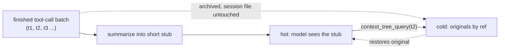

<p align="center">
  
</p>

# pi-condense

[](https://buymeacoffee.com/jjurasszek)

A [Pi coding-agent](https://github.com/earendil-works/pi) extension that keeps long agent sessions cheap by pruning context - **the context-economy layer of the pi agent toolkit** (see below).

## The problem

Every long agent session accumulates raw tool output - file reads, command dumps, search results - that the model already used and will never need again verbatim. Left in context, it degrades reasoning on later turns, inflates the cost of *every* subsequent request, and pushes a smaller/cheaper model past the point where it can still drive. Provider prompt-caching does not fix this on its own: naive trimming actively fights it, because rewriting the prompt on every turn busts the cache you were relying on to keep costs down.

**pi-condense** replaces finished tool-call batches with short, recoverable summaries, timed around exactly that caching problem. Nothing is deleted - the session file on disk is untouched, and any summarized result can be pulled back verbatim via the `context_tree_query` tool. Net effect: long sessions stay affordable, and a smaller/cheaper driver model stays viable for longer.

## Why this, not naive trimming

- **Recoverable, not lossy.** Originals are archived and addressable by a short ref. Summarizing only changes what the model *sees by default* - not what it can retrieve on demand.
- **Batched against the cache, not per turn.** Pruning fires once per finished unit of work (configurable), so the prompt prefix stays stable in between and providers keep serving it from cache. Pruning every turn instead would bust the cache on every single turn - the opposite of the intended savings.

The full argument, with diagrams, is in **[PRUNING.md](PRUNING.md)**; this README stays at the "why and how to use it" level.

## Part of the pi agent toolkit

Four independent extensions for the [pi coding agent](https://github.com/earendil-works/pi), each owning one concern of running agents seriously:

- [pi-quiver](https://github.com/jjuraszek/pi-quiver) - capabilities (fetch, doc conversion, session tools)
- [pi-cohort](https://github.com/jjuraszek/pi-cohort) - coordination (delegate to focused child agents)
- **pi-condense - context economy (this repo): prune context, keep it recoverable**
- [pi-gauntlet](https://github.com/jjuraszek/pi-gauntlet) - process (the gated brainstorm->ship workflow)

No code dependency either way. The practical coupling: pi-condense is what keeps a long pi-cohort fan-out or a long pi-gauntlet gated run affordable as it grows, and both can surface pi-condense's live cost via the shared `cost:external` channel (see [External cost channel](#external-cost-channel)).

## Mental model

Two-layer memory, not deletion:

- **Hot:** a compact summary of a finished batch, kept in active context.
- **Cold:** the full original tool results, archived in a session-local index and addressable by a short ref (`t1`, `t2`, ...).

The model reads the hot summary by default and calls `context_tree_query` when it actually needs the cold original back. See [PRUNING.md](PRUNING.md) for the full before/after diagrams and the prefix-cache mechanics behind the batching schedule.



## Quick example

```bash
pi install npm:pi-condense
```

```bash
/pruner on                          # enable pruning (off by default)
/pruner model openai/gpt-4.1-mini   # pick a cheap summarizer
/pruner status                      # see mode, model, trigger, cumulative stats
```

## Architecture

| Trigger mode | Fires | Cache impact |
|---|---|---|
| `agent-message` (default) | When the agent sends a final text-only reply | ~1 cache rewrite per task batch |
| `on-demand` | Only when you run `/pruner now` | None until you ask |

Before any summarizer call, a pre-flush pipeline can drop or redirect a batch at zero LLM cost: protected tools/paths are never touched, content-hash duplicates are aliased to the original, batches too small to be worth summarizing are skipped outright, and oversized single results are spilled straight to a sidecar file. Closed tool-call chains older than a rolling window are additionally range-compressed. Full pipeline and each safeguard: [PRUNING.md § Pre-flush Pipeline & Safeguards](PRUNING.md#pre-flush-pipeline--safeguards), [§ Chain Compression](PRUNING.md#chain-compression).

### External cost channel

Every summarizer cost update is emitted on the shared `pi.events` channel `cost:external` (`source: "pi-condense"`, cumulative per session, live only - not persisted, not re-seeded on restart). This is a generic channel: pi-condense is a producer, not the owner. [pi-cohort](https://github.com/jjuraszek/pi-cohort) is the canonical consumer, folding it into a single `Σ$` total alongside its own subagent costs.

## Key concepts

| Term | Meaning |
|---|---|
| Stub | The short breadcrumb (`[Summarized in pruner summary, ref \`t1\`...]`) that replaces a pruned tool result in context |
| `context_tree_query` | The tool the model calls to recover a stubbed original by ref |
| Batch vs chain | A batch is one flush's worth of tool calls; a chain is a longer closed sequence eligible for range compression |
| Prune frontier | The last attempted prune boundary - advances even on a skip, so nothing is reconsidered twice |
| Prompt-cache interaction | Why batching (not per-turn pruning) is the default - see [PRUNING.md](PRUNING.md#how-prefix-caching-works) |
| `cost:external` | The shared cost-reporting channel pi-condense emits on (see above) |

## When to use / when NOT to use

**Use it for:** long coding or research sessions where tool output dominates the prompt; setups deliberately running a smaller/cheaper driver model; pi-cohort fan-outs or pi-gauntlet runs where cost compounds across many turns or many children.

**Don't reach for it when:** the session is short and one-shot - there is nothing accumulated to prune, only latency to add. It also doesn't replace a provider's own native context-compaction feature if you already rely on that, and it doesn't reduce the cost of the *current* turn's tool calls - only of history that has already been produced.

## Limitations

- Pruning only applies to batches captured *while enabled*. Enabling mid-session does not retroactively summarize earlier turns.
- Summarizer calls run synchronously inside the turn boundary, so they add latency proportional to the summarizer model's response time. Pick a fast one.
- Content-hash dedup only matches against records already in the indexer (cross-flush); two identical outputs within the *same* flush both go through the summarizer.
- The tree browser (`/pruner tree`) does not inline original tool outputs - use `context_tree_query` for that.

## Install

Published to npm as [`pi-condense`](https://www.npmjs.com/package/pi-condense).

**User scope** (all repos under your pi profile):

```bash
pi install npm:pi-condense
```

**Project scope** (current repo only, committable via `.pi/settings.json`):

```bash
pi install -l npm:pi-condense
```

**Try without installing**:

```bash
pi -e npm:pi-condense
```

**From a local checkout** (for hacking on the extension itself):

```bash
git clone git@github.com:jjuraszek/pi-condense.git ~/repos/pi-condense
cd ~/path/to/your/repo
pi install -l ~/repos/pi-condense
# or one-shot, no install:
pi -e ~/repos/pi-condense/index.ts
```

Pin a specific version with `npm:pi-condense@X.Y.Z`. Upgrade by re-running `pi install`. Remove with `pi remove pi-condense`. Once installed, the extension auto-loads on every `pi` invocation; no flags needed. See [CHANGELOG.md](CHANGELOG.md) for release history.

By default the extension is **off**. `/pruner on` enables it and it stays enabled across sessions in the same pi agent directory.

## Configuration - the knobs most people touch

Settings live under `contextPrune` in `<agent-dir>/settings.json` (`$PI_CODING_AGENT_DIR` if set, else `~/.pi/agent`). Each pi preset gets its own settings.

| Key | Default | Notes |
|---|---|---|
| `enabled` | `false` | Master switch (or just use `/pruner on`) |
| `summarizerModel` | `"default"` | Pin a cheap model instead of reusing your active one - see the plan-by-plan table in [doc/configuration.md](doc/configuration.md#choosing-a-summarizer-model) |
| `pruneOn` | `agent-message` | Trigger mode - see Architecture above |
| `autoBudgetThreshold` | `null` | Fraction (e.g. `0.8`) of the context window that force-flushes everything regardless of `pruneOn` |
| `protectedTools` / `protectedPaths` | `[]` / `["**/skills/**/*.md"]` | Tool names / path globs that are never pruned |
| `spillThreshold` | `65536` | Chars above which a single oversized result spills straight to a sidecar file |

The full settings JSON, every key, the commands table, footer widget states, spilled-output details, and the summarizer-model-by-plan table live in **[doc/configuration.md](doc/configuration.md)**.

## Relationship to the rest of the platform

pi-condense is the context-economy layer: it has no code dependency on the other three, but it is what keeps a long [pi-cohort](https://github.com/jjuraszek/pi-cohort) parallel fan-out or a long [pi-gauntlet](https://github.com/jjuraszek/pi-gauntlet) gated run affordable as they grow, and research on summarization-based context management suggests it can also make a smaller driver model hold up better on long tasks (see [PRUNING.md § Research Evidence](PRUNING.md#why-summarization-works-research-evidence) - a cited hypothesis, not a benchmark run in this repo).

## Roadmap

No committed roadmap beyond what's already tracked in [CHANGELOG.md](CHANGELOG.md); proposals and in-progress work show up there and in repo issues first.

## Support

If this saves you tokens, [buy me a coffee](https://buymeacoffee.com/jjurasszek).

## Lineage

Adds pre-flush safeguards, agent-message batching, chain compression, and an npm release flow on top of the original approach from [`championswimmer/pi-context-prune`](https://github.com/championswimmer/pi-context-prune).

## References

- Anthropic prompt caching: <https://docs.claude.com/en/docs/build-with-claude/prompt-caching>
- AWS Bedrock prompt caching: <https://docs.aws.amazon.com/bedrock/latest/userguide/prompt-caching.html>
- OpenAI prompt caching: <https://platform.openai.com/docs/guides/prompt-caching>
- Research backing summarization-based context management: see [PRUNING.md § Research Evidence](PRUNING.md#why-summarization-works-research-evidence)

## License

MIT - see [LICENSE](LICENSE).
