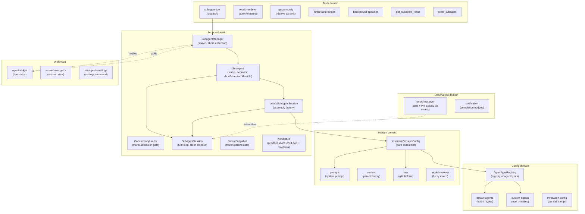
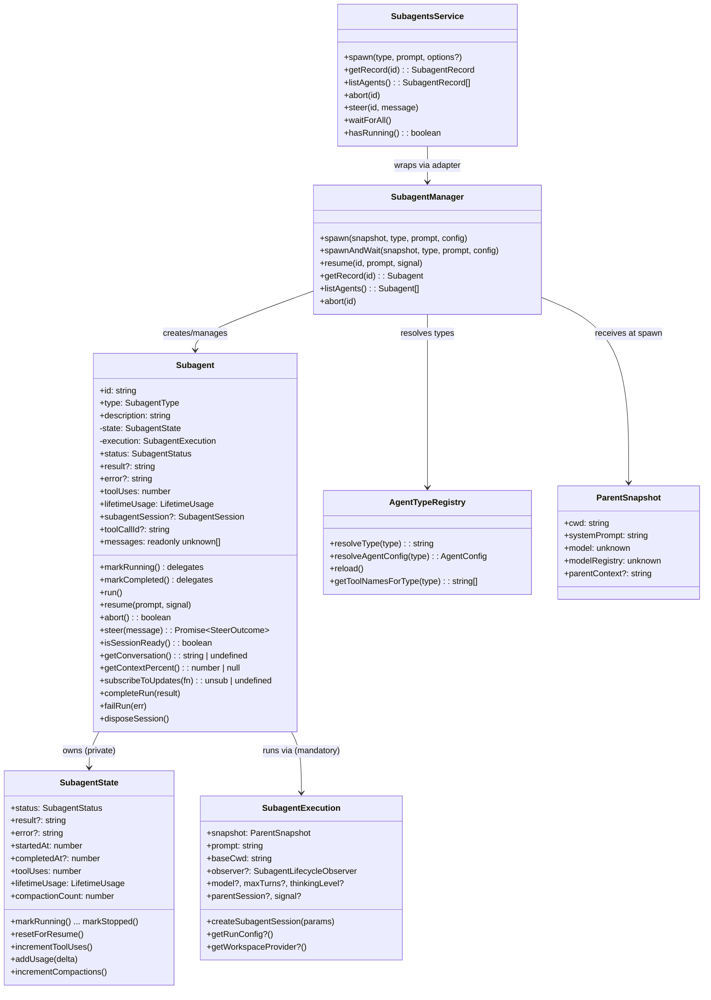
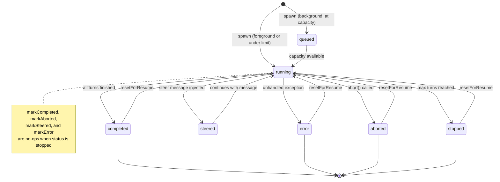
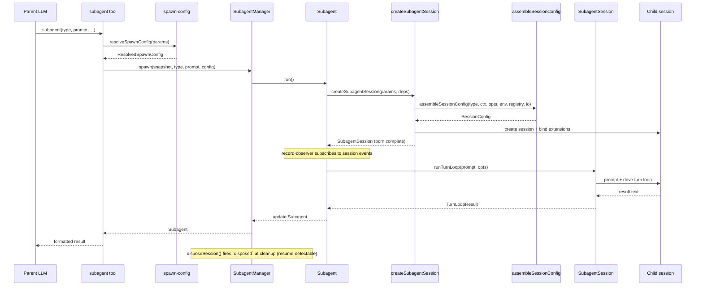
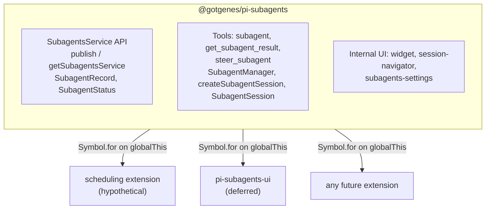
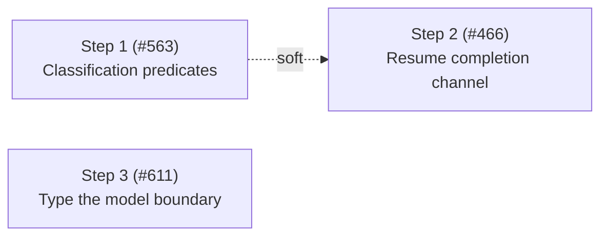

# Architecture

This document describes the architecture of the pi-subagents fork: a focused, composable core with a stable API boundary that other extensions can build on.

## Design principles

1. **Narrow core** — the extension owns agent spawning, execution, and result retrieval.
   Everything else is a consumer.
2. **Composable by default** — other extensions can spawn agents, observe their lifecycle, and display their state without importing this package directly.
3. **Typed API boundary** — this package exports a `SubagentsService` interface and `Symbol.for()` accessors (`publishSubagentsService` / `getSubagentsService`).
   Consumers declare this package as an optional peer dependency and use dynamic import for compile-time types.
   The runtime bridge is `Symbol.for("@gotgenes/pi-subagents:service")` on `globalThis` — no separate API package.
4. **No time-based scheduling** — cron-style timed dispatch (upstream's `schedule.ts` subsystem) is removed from the core (#52).
   Timed dispatch is a separate concern that any extension can implement by calling `spawn()` on the published API.
   The max-concurrent admission gate is not scheduling in this sense — concurrency management stays in core.
5. **UI is an in-core, substitutable consumer** — [ADR-0004](../decisions/0004-reconsider-ui-direction.md) records the per-component decision: the widget shrinks to background agents only, the bespoke conversation viewer is replaced by native session navigation, the `/agents` command is dissolved into focused surfaces, and the surviving UI stays in the core as a reactive consumer (not extracted to a separate package).
   Extraction remains an available future option because the composition invariant holds — the core is byte-for-byte identical with or without a given UI consumer.
6. **Snapshot, don't capture** — mutable parent state (ctx, session, model) is read once at spawn time and frozen into a `ParentSnapshot` data object.
   No live references survive past the spawn call.
7. **Subscribe, don't thread** — observation of agent progress uses direct session-event subscription, not callback parameters threaded through multiple layers.
8. **Construct complete** — objects are born with all their dependencies.
   If state isn't available yet, the object that needs it doesn't exist yet.
   No post-construction field writes from external code — if an object can't be instantiated ready-to-go, the prep work hasn't been done and the right dependencies haven't been identified.
9. **State owns its mutations** — mutable state lives in a class whose methods enforce valid transitions and invariants.
   Free functions that mutate module-scoped variables, closure-captured bags-of-functions, and external writes to shared interfaces are replaced by classes that encapsulate the state they manage.
10. **Open for extension, closed for modification** — pi-subagents is a minimal core that publishes events and a service API.
    Other packages (pi-permission-system, a future UI extension, hypothetical OTel integration) hook into these events to add permissions, rendering, or telemetry.
    Pi-subagents has zero knowledge of its consumers — dependency arrows point inward, never outward.

## Domain model

The extension is organized around six domains, each responsible for one aspect of managing agents.



### Key domain types



## Agent lifecycle



Note: `markStopped` always succeeds regardless of current status.
Other terminal transitions guard against overwriting `stopped` — once an agent is stopped, only `resetForResume` can return it to `running`.

## Execution flow



## Module organization

The extension's source files are organized into domain directories — `config/`, `session/`, `lifecycle/`, `observation/`, `service/`, `tools/`, `ui/`, and `handlers/` — plus a handful of root-level entry-point and shared modules.

### Current layout

```text
src/
├── index.ts                        entry point, tool registration, event wiring
├── runtime.ts                      SubagentRuntime factory (session-scoped state)
├── types.ts                        shared type definitions
├── settings.ts                     SettingsManager (persistent operational settings)
├── debug.ts                        debug logging utility
├── layered-settings.ts             loadLayeredSettings helper (published as @gotgenes/pi-subagents/settings)
│
├── config/                         agent type definitions and resolution
│   ├── agent-types.ts              AgentTypeRegistry class
│   ├── default-agents.ts           built-in agent configs (general-purpose, Explore, Plan)
│   ├── custom-agents.ts            user-defined agent .md file loader
│   └── invocation-config.ts        per-call config merge
│
├── session/                        session assembly and preparation
│   ├── session-config.ts           pure assembler (main entry)
│   ├── prompts.ts                  system prompt building
│   ├── content-items.ts            shared message content parsing (tool-call names, assistant content)
│   ├── context.ts                  parent conversation extraction
│   ├── conversation.ts             render a session's messages as formatted text
│   ├── env.ts                      git/platform detection
│   ├── model-resolver.ts           fuzzy model name resolution
│   └── session-dir.ts              session directory derivation
│
├── lifecycle/                      agent execution and state tracking
│   ├── subagent-manager.ts         collection manager + observer wiring
│   ├── create-subagent-session.ts  assembly factory: session creation, binding, tool filtering
│   ├── subagent-session.ts         born-complete child session: turn loop, steer, dispose
│   ├── turn-limits.ts              normalizeMaxTurns (turn-count policy)
│   ├── subagent.ts                 owns full execution lifecycle (run, abort, steer)
│   ├── subagent-state.ts           lifecycle status + metrics value object (transitions, accumulators)
│   ├── run-listeners.ts            per-run observer-unsub and signal-detach handles
│   ├── workspace-bracket.ts        child workspace prepare/dispose lifecycle
│   ├── concurrency-limiter.ts       background admission gate: schedules run thunks FIFO against the limit
│   ├── parent-snapshot.ts          immutable spawn-time parent state
│   ├── child-lifecycle.ts          child-execution lifecycle event publisher
│   ├── workspace.ts                workspace provider seam (generative extension surface)
│   └── usage.ts                    token usage tracking
│
├── observation/                    progress tracking and notification
│   ├── record-observer.ts          session-event stats observer
│   ├── notification.ts             completion nudges + per-agent consumed-result tracking
│   ├── renderer.ts                 notification TUI component
│   ├── composite-subagent-observer.ts fans manager notifications out to multiple observers
│   └── subagent-events-observer.ts manager lifecycle observer (event emission + persistence + notification)
│
├── service/                        cross-extension API boundary
│   ├── service.ts                  SubagentsService interface + Symbol.for() accessors
│   └── service-adapter.ts          SubagentsServiceAdapter class wrapping SubagentManager
│
├── tools/                          LLM-facing tool implementations
│   ├── agent-tool.ts               subagent tool definition, validation, dispatch
│   ├── result-renderer.ts          pure per-status result rendering
│   ├── spawn-config.ts             pure config resolution
│   ├── foreground-runner.ts        foreground execution loop
│   ├── background-spawner.ts       background spawn setup
│   ├── get-result-tool.ts          get_subagent_result tool
│   ├── get-result-report.ts        pure get_subagent_result report formatter
│   ├── steer-tool.ts               steer_subagent tool
│   └── helpers.ts                  shared tool utilities
│
├── ui/                             user-facing presentation
│   ├── agent-widget.ts             above-editor live status widget
│   ├── widget-renderer.ts          pure rendering for widget
│   ├── display.ts                  pure formatters and shared types
│   ├── subagents-settings.ts       /subagents:settings command handler
│   ├── session-navigation.ts       pure session-selection and transcript-source logic
│   └── session-navigator.ts        /subagents:sessions command handler
│
└── handlers/                       event handlers
    ├── index.ts                    barrel re-export
    ├── interrupt.ts                turn_start handler — abort all subagents on parent interrupt (ESC)
    ├── lifecycle.ts                session_start, session_before_switch, session_shutdown
    └── tool-start.ts               tool_execution_start handler
```

### Observation model

Record statistics (tool uses, token usage, compaction counts) and live activity (active tools, response text, turn counts) are updated by `record-observer.ts`, which subscribes directly to session events.
This is the single per-child session subscription — all run state lives on the `Subagent` record.

The widget reads agent state by polling the records exposed via `SubagentManager.listAgents()` every 80 ms; that poll loop is now started by the manager's lifecycle notifications (the widget subscribes as a `SubagentManagerObserver` fanned out through `CompositeSubagentObserver`), not by inbound calls from the spawn tools.
The `/subagents:sessions` navigator reads messages via `Subagent.agentMessages` and subscribes to updates via `Subagent.subscribeToUpdates()` — no direct `AgentSession` reference (#277).

## Cross-extension architecture



Consumers call `getSubagentsService()?.spawn(...)` at runtime.
They declare this package as an optional peer dependency and use dynamic import for compile-time types.

### What the core owns

- The three tools: `subagent` (née `Agent`), `get_subagent_result`, `steer_subagent`.
- `SubagentManager` — spawn, abort, resume, collection management, observer wiring.
- `ConcurrencyLimiter` — background admission gate: schedules run thunks FIFO against a configurable concurrency limit.
- `createSubagentSession` — assembly factory: session creation and extension binding; returns a born-complete `SubagentSession`.
- `SubagentSession` — the born-complete child session: drives the turn loop (`runTurnLoop`/`resumeTurnLoop`), steers, and disposes (firing `disposed` at true session disposal, so resume executions are registry-detected).
- `child-lifecycle` — publishes the child-execution lifecycle (`spawning`, `session-created` before `bindExtensions()`, `completed`, `disposed`) on `pi.events`.
  Reactive consumers subscribe: `@gotgenes/pi-permission-system` registers each child session on `session-created` and unregisters it on `disposed`.
  This replaced the former outbound `permission-bridge` (#261, [ADR-0002]) — the core no longer looks up a named consumer.
- `workspace` — the single generative seam (#262, [ADR-0002]): a registered `WorkspaceProvider` supplies a child's cwd plus bracketed `dispose()` at run-start.
  With no provider, children run in the parent cwd (default unchanged); the git worktree strategy lives behind this seam in `@gotgenes/pi-subagents-worktrees` (#263, the seam's first consumer).
- `session-config` — pure configuration assembler (called by `createSubagentSession`).
- `SubagentRuntime` — session-scoped state bag with methods.
- `ParentSnapshot` — immutable snapshot of parent session state, captured once at spawn time.
- `record-observer` — session-event observer that updates record statistics without callback threading.
- Agent type registry — default agents, custom `.md` file loading.
- Prompt assembly, context extraction, skills, environment.
- Worktree isolation — evicted to `@gotgenes/pi-subagents-worktrees` via the workspace provider seam in Phase 16 (#263, [ADR-0002]); `git` no longer appears in the core.
- Token usage tracking.
- Session directory derivation and persisted `SessionManager` for subagent transcripts.
- Settings persistence.
- Internal UI (widget, `/subagents:sessions` session navigator, `/subagents:settings` command) — the conversation viewer and `/agents` menu were removed in Phase 19 (Steps 5–6, [#442], [#441]) per [ADR-0004].

### What the core dropped

- **Scheduling** (`schedule.ts`, `schedule-store.ts`, `ui/schedule-menu.ts`) — removed (#52).
- **Ad-hoc RPC** (`cross-extension-rpc.ts`) — replaced by the typed `SubagentsService` published via `Symbol.for()` (#49).
- **Group join** (`group-join.ts`) — removed (#49).
- **Output file** (`output-file.ts`) — replaced by `session-dir.ts` + `SessionManager.create()` (#61).
- **Callback threading** — the three-layer `on*` callback chain was replaced by direct session-event subscriptions (#100).
- **Live `ctx` capture** — replaced by `ParentSnapshot`, an immutable data object captured once at spawn time (#99).

## SubagentsService

The `SubagentsService` interface, accessor functions, and serializable types are exported from `@gotgenes/pi-subagents` via the `./service` export map entry.
No separate API package is needed.

Consumers declare this package as an optional peer dependency:

```json
{
  "peerDependencies": {
    "@gotgenes/pi-subagents": ">=5.0.0"
  },
  "peerDependenciesMeta": {
    "@gotgenes/pi-subagents": { "optional": true }
  }
}
```

At runtime, consumers use dynamic import for type-safe access to the accessor functions:

```typescript
const { getSubagentsService } = await import("@gotgenes/pi-subagents");
const svc = getSubagentsService();
if (svc) {
  svc.spawn("Explore", "Check for stale TODOs");
}
```

Pi's extension loader creates a fresh `jiti` instance per extension with `moduleCache: false`, so module-scoped singletons don't survive across extensions.
The accessor functions use `Symbol.for("@gotgenes/pi-subagents:service")` on `globalThis`, which is process-global by spec, to bridge this gap.
The dynamic import provides compile-time types; the `Symbol.for()` key is the actual runtime channel.

### Interface

See `src/service.ts` for the canonical definition.
Key types:

- `SubagentsService` — `spawn`, `getRecord`, `listAgents`, `abort`, `steer`, `waitForAll`, `hasRunning`.
- `SubagentRecord` — serializable agent snapshot (no live session objects).
- `SpawnOptions` — `description`, `model`, `maxTurns`, `thinkingLevel`, `inheritContext`, `foreground`, `bypassQueue`.
- `SUBAGENT_EVENTS` — channel constants for `pi.events` subscriptions.

### Accessor pattern

```typescript
const SERVICE_KEY = Symbol.for("@gotgenes/pi-subagents:service");

export function publishSubagentsService(service: SubagentsService): void {
  (globalThis as Record<symbol, unknown>)[SERVICE_KEY] = service;
}

export function getSubagentsService(): SubagentsService | undefined {
  return (globalThis as Record<symbol, unknown>)[SERVICE_KEY] as
    | SubagentsService
    | undefined;
}
```

If Pi gains a native service registry ([earendil-works/pi#4207]), these accessors can be updated to delegate to `pi.registerService()` / `pi.getService()` internally while keeping the same consumer API.

### Lifecycle events

The core emits events on `pi.events` that any extension can observe:

| Channel               | Payload                                                                             | When                                          |
| --------------------- | ----------------------------------------------------------------------------------- | --------------------------------------------- |
| `subagents:started`   | `{ id, type, description }`                                                         | Agent begins running                          |
| `subagents:completed` | `{ id, type, description, status, result?, error?, toolUses, durationMs, tokens? }` | Agent finishes successfully                   |
| `subagents:failed`    | same as `completed` (`buildEventData` shape)                                        | Agent ends in `error`/`stopped`/`aborted`     |
| `subagents:compacted` | `{ id, type, description, reason, tokensBefore, compactionCount }`                  | Child session compacts                        |
| `subagents:created`   | `{ id, type, description, isBackground }`                                           | Background agent created (pre-admission)      |
| `subagents:steered`   | `{ id, message }`                                                                   | Steering message delivered to a running agent |

These are fire-and-forget broadcast events — no request IDs, no reply channels.

## Architecture direction

pi-subagents **is** a minimal orchestrator with inverted dependencies.
The core spawns a child session derived from the parent, runs the turn loop, tracks and streams and collects the result, gates concurrency, supports resume, and **publishes its lifecycle**.
Everything else — permissions, worktree/workspace isolation, UI, telemetry — is an extension that attaches through one of two surfaces and never reaches into the core.
This inversion landed across Phases 14, 16, 18, and 19; the sections below describe the resulting boundary and the deeper direction still being sharpened.

The rationale and the full reasoning chain that led here are recorded in [`docs/decisions/0002-extensions-on-a-minimal-core.md`](../decisions/0002-extensions-on-a-minimal-core.md).

A separate, longer-horizon note — [`client-server-opportunities.md`](./client-server-opportunities.md) — records what Pi's eventual client-server split (Mario Zechner's session-sync unification) would unlock for pi-subagents: viewing live subagent sessions, viewing suspended ones, and operators interacting with a subagent through an editor.
That architecture is not on the near-term roadmap; the note captures the opportunity so it is on record.

### Two extension surfaces

Extensions attach through exactly two surfaces, distinguished by the direction of information flow.

1. **Lifecycle events (observational) — unlimited.**
   The core emits awaited, ordered events for the child-execution lifecycle (`spawning`, `session-created` pre-`bindExtensions`, `completed`, `disposed`).
   Any number of extensions subscribe; handlers return nothing.
   Reactive concerns live here: permission detection, telemetry, UI, notifications.
   Adding a reactive concern never modifies the core.
2. **Provider seams (generative) — rationed.**
   The rare concern that must _inject_ a value the core consumes synchronously registers a provider the core consults.
   Today there is exactly one: the **workspace provider** (returns the child's working directory plus bracketed setup/teardown).
   A provider seam is the only place the core is "open," so the list is kept as small as possible.

The discriminator when deciding how a concern attaches:

- It only needs to **know** what happened → subscribe to a lifecycle event (observational, unlimited).
- It must **return a value the core consumes** → register a provider (generative, rationed).

The governing rule — **no vacant hooks**: the architecture must _admit_ a seam without _shipping_ it until a concrete consumer exists.
A provider seam with no consumer is a speculative abstraction that taxes every reader and that `fallow` flags as dead.
Latent extensibility is the deliverable; a vacant hook is not.

The [first-principles refinement](#first-principles-refinement-and-the-deeper-target) below sharpens this two-surface split.
The awaited, behavior-affecting lifecycle events (notably `session-created` before `bindExtensions`) are _hooks_ — the child's own extension surface applied recursively, generative because the core waits on the handler before deciding what to do next.
The observational surface then carries only fire-and-forget broadcasts of immutable snapshots, which no consumer can use to change the core.

### Core responsibilities (keep)

- **Agent definitions** — name, model, thinking, system prompt, tools list.
- **Prompt composition** — system prompt assembly.
- **Session lifecycle** — create child sessions, bind extensions, run conversation loop, track results.
- **Concurrency management** — queue, abort, resume, max concurrency.
- **Recursion guard** — remove pi-subagents' own three tools from child sessions (prevent infinite nesting).
  With `isolated` removed (#264), children always load the parent's resources, so the guard is unconditional rather than gated on `cfg.extensions`.
  This is the core defending its own invariant, keyed off its own tool names — not policy.
- **Lifecycle events** — emit awaited, ordered events when child sessions spawn, are created, complete, and are disposed.
- **Workspace provider seam** — accept a registered `WorkspaceProvider` and consult it for the child's cwd; default to the parent's cwd when none is registered.
- **Service API** — publish `SubagentsService` via `Symbol.for()` for cross-extension access.

### Responsibilities removed from the core

These policy and environment concerns were removed so the core stays narrow; each now lives in a consumer or behind the workspace seam:

- **Tool policy** (`disallowed_tools`) and **extension filtering** (`extensions: string[]`) — access control and tool visibility belong in pi-permission-system's `permission:` frontmatter (Phase 14, #237/#238).
- **Worktree isolation** (`GitWorktreeManager`, the `isolation: "worktree"` mode) — one _strategy_ for choosing the child's cwd, evicted to `@gotgenes/pi-subagents-worktrees` (#263), the first consumer of the workspace provider seam.
- **Extension lifecycle control** (`extensions: false`, `isolated`, `noSkills`) — removed in #264; deny-at-use covers what `isolated` pretended to do for tools, and prevent-load is left as a _latent_ (un-built) provider seam, added only if a real consumer needs it.

### Composition model

In the target state, pi-subagents publishes events and a provider seam; other packages hook in:

- **pi-permission-system** (observational) subscribes to child-session lifecycle events, detects subagent execution context in the child, and gates tool calls at runtime.
- **pi-subagents-worktrees** (generative) registers a `WorkspaceProvider` that prepares a git worktree at run-start and tears it down after, supplying the child's cwd.
- **pi-subagents-ui** (future, under reconsideration — see the [first-principles refinement](#first-principles-refinement-and-the-deeper-target)) subscribes to the broadcast and the query/behavior interfaces; the conversation viewer and `/agents` menu were removed in Phase 19 per [ADR-0004]; the surviving UI (widget, session navigator, settings command) stays in-core.
- **Any future extension** (OTel, auditing, cost tracking) subscribes to the same events without pi-subagents knowing.

Composition test: install neither extension, only permissions, only workspaces, or both — the core is byte-for-byte identical in all four cases, and the two extensions never reference each other.

This is achieved across phases: Phase 14 (strip policy), Phase 16 (invert dependencies — extensions on a minimal core), and Phase 18 (reconsider UI).

### First-principles refinement and the deeper target

The two-surface model above is correct but coarse.
Pushing it against our own principles — construct complete, state owns its mutations, tell-don't-ask, dependency inversion — surfaces sharper boundaries that the current code draws through the middle of classes.
This subsection records the deeper target; the steps that realize it are sequenced in later phases.

#### `Subagent` is four conflated domains

The construction duality that motivates Phase 17 — a class that is simultaneously a passive record and an executor — is only the two most visible of four domains fused into one class.
Pulling each apart by asking "who changes this, how often, and who needs to know" surfaces:

1. **Lifecycle state** — status, result, error, timestamps.
   Owned by the subagent; transitions are rare and meaningful; the right outward shape is an immutable snapshot announced on change.
2. **Metrics** — tool uses, token usage, compaction count.
   These are not lifecycle state; they are a projection aggregated over the child session's event stream.
   `record-observer` already computes them — its only error is writing the aggregate back onto the subagent.
3. **The hook surface** — the points where an extension alters or augments the child before and around its run.
   This is the child session's own extension binding (see below), not data on the subagent.
4. **Result delivery** — whether the parent has consumed the result, when to nudge, how the result reaches the caller.
   The homeless `notification.resultConsumed` field belongs to this domain, not to execution.

The ~20 optional constructor fields and the runtime `run()` throws are the pressure these four domains exert on one class.
Separating them is what makes the Phase 17 steps fall out rather than fight back.

#### The subagent is a recursive Pi

A subagent is a child Pi session: created with `createAgentSession`, then `bindExtensions`.
Its extension surface is therefore Pi's extension surface applied recursively — not a bespoke event bus.
What the current doc calls "awaited, ordered lifecycle events" are not observations; they are **hooks**, structurally identical to Pi's own (`session_start`, `tool_execution_start`).
The tell is the awaiting: the core waits for the handler because the handler's completion changes what the core does next — an extension registers before the child binds.
A handler that can change subsequent behavior is generative, not observational, whatever we name the channel.

This splits the current "lifecycle events" surface cleanly in two:

1. **Broadcast** (observational, fire-and-forget) — "this happened; react if you want; you cannot change anything."
   Carries immutable snapshots for telemetry, notification, and any renderer.
   No consumer holds a live `Subagent`.
2. **Hooks** (generative, awaited, ordered) — the recursive Pi extension surface where workspace, permissions, and future concerns attach to the child.
   The `WorkspaceProvider` is one _typed_ hook; the general form is "be an extension of the child session."

The "no vacant hooks" rule still governs the generative side: admit the surface, ship a hook only when a real consumer exists.

#### Reactive versus discrete (not internal versus external)

The axis that decides push versus pull is whether a need is reactive or discrete — never whether the consumer is in-package or out.

- **Reactive** (ambient state that changes underneath you) → subscribe to the broadcast; be told.
  The state-owner announces; the consumer maintains its own read-model; nobody pulls.
- **Discrete** (a one-shot question: current value, full transcript) → pull a query.
  `get_subagent_result`, opening a transcript, and the external `SubagentsService.getRecord` are queries by nature and stay pull, in-package or not.

Behavior is a third interface: **tell by id, with outcomes**.
`steer` and `abort` own their own rules — a non-running agent rejects a steer from inside `steer`, not via a caller's status pre-check — so coordinators never ask-then-tell.

#### Consequences

Two consequences fell straight out, and both cut scope — both have since landed.

1. **The activity/metrics push tier was provisional and is gone.**
   Its only reactive consumer was the inherited widget; treated from first principles, metrics are accumulated by an observer, exposed as a discrete query, and folded into the completion snapshot.
   Phase 18 deleted `AgentActivityTracker` and `ui-observer` and made the widget a pure reactive consumer of lifecycle events — the high-frequency stream did not need to exist.
2. **Phase 18 was "reconsider the UI," not "extract the UI."**
   The widget and `/agents` menu predated the fork; they were consumers judged on our principles, not requirements to preserve.
   [ADR-0004] recorded the per-component verdict and Phase 19 implemented it: the widget shrank to background agents, the bespoke viewer and `/agents` menu were removed, and the surviving UI stays in-core as a reactive consumer.

#### Sibling packages follow the same discipline

`@gotgenes/pi-permission-system` is one of these hooks, and it is subject to the same scrutiny.
Its boundaries deserve the same first-principles treatment: surface its conflated domains, distinguish what it observes from what it injects, and prefer being told over asking.
The recursion principle means a consumer's internal design is not exempt because it lives in another package — the same axes (reactive versus discrete, hook versus broadcast, construct complete) apply across the seam.

#### How we find these boundaries

The boundaries above were not deduced top-down; they were surfaced by friction.
Each place the target got _harder_ to test marked a domain seam drawn through the middle of a class.
That method — testability friction as a boundary probe, with its limits — is recorded in the `improvement-discovery` skill so it outlives this phase.

## Current structural analysis

### Health metrics

| Metric                     | Value                                                                   |
| -------------------------- | ----------------------------------------------------------------------- |
| Health score               | 78/100 (B), end of Phase 20                                             |
| Total LOC                  | 7,211 (57 files)                                                        |
| Dead code                  | 0 files, 0 exports                                                      |
| Maintainability index      | 91.1 (good)                                                             |
| Avg cyclomatic complexity  | 1.3                                                                     |
| P90 cyclomatic complexity  | 2                                                                       |
| Production duplication     | 0 lines                                                                 |
| Test duplication           | retired (fallow 3.2.0 excludes test files; see Phase 20 Step 9 history) |
| Fallow refactoring targets | 0                                                                       |

### Dependency bag inventory

The 10+-field dependency bags flagged in prior phases (`ResolvedSpawnConfig`, `AgentSpawnConfig`, `RunOptions`, `SessionConfig`, `SubagentSessionIO`, `SubagentExecution`) were all decomposed into focused value objects; the remaining wide interfaces (`NotificationDetails`, `ResourceLoaderOptions`, `CreateSessionOptions`) are DTO/SDK-boundary types accepted as-is.

### Complexity hotspots

Functions with cyclomatic complexity ≥ 21 (critical threshold):

No functions remain above the critical threshold — all hotspots resolved in Phase 12. 1 function remains at HIGH severity (a test helper, `subagent-manager.test.ts`'s `createManager`); 14 at moderate.
No `src/` function reaches HIGH severity or CRAP ≥ 60 (Phase 20 target met).

### Churn hotspots

Files with highest commit frequency × complexity:

| Score | File                          | Commits | Trend          |
| ----- | ----------------------------- | ------- | -------------- |
| 27.1  | `index.ts`                    | 109     | ▼ cooling      |
| 10.1  | `tools/agent-tool.ts`         | 58      | ▼ cooling      |
| 8.8   | `ui/agent-widget.ts`          | 23      | ▼ cooling      |
| 8.2   | `service/service-adapter.ts`  | 17      | ▼ cooling      |
| 7.7   | `tools/foreground-runner.ts`  | 23      | ▼ cooling      |
| 7.5   | `lifecycle/subagent.ts`       | 17      | ▼ cooling      |

`index.ts` remains the top churn hotspot but has cooled after the Phase 19 terminal cut removed its four `/agents`-wiring blocks; `service-adapter.ts` cooled after Phase 20 Step 4 extracted its model-resolution branch, so no file is currently accelerating.

### Production duplication

Production duplication is 0 lines — the last clone group was eliminated in Phase 19 Step 6 ([#441]).

## Improvement roadmap — Phase 21: Classification predicates, resume completion, model boundary

Phase 21 is a lean, three-step phase.
Discovery (2026-07-17: architecture-doc reading, issue sweep, fallow baseline, repeated-discriminator sweep, entry-point trace, craftsmanship scout) found the declared target architecture essentially complete: fallow reports 0 refactoring targets, 0 dead code, 0 duplication, and the craftsmanship scout refuted both fallow "giant test file" flags and found only scattered boy-scout polish.
Three cause-level Category C findings survived — two already filed as issues, one the explicitly deferred remainder of Phase 20 Step 4 — and they are the whole phase.
No polish step is manufactured to fill the ceiling; the scout's scattered findings (`mock.calls[N][idx]` indexing in the two lifecycle test suites, the `settings.ts` `sanitize()` range-check triplication, `createManager`'s nullish-coalescing density) are handed to the `tidy-first` boy-scout path.

### Health metrics

| Metric                                                            | Phase 20 (end) | Phase 21 target | Recompute                                                                                                             |
| ----------------------------------------------------------------- | -------------- | --------------- | --------------------------------------------------------------------------------------------------------------------- |
| Health score                                                      | 78/100 (B)     | ≥ 78 (B)        | `pnpm fallow health --score --workspace @gotgenes/pi-subagents`                                                       |
| Multi-status classification groupings outside `subagent-state.ts` | 11             | ≤ 2             | `grep -rEn 'status [!=]== "[a-z]+" (\|\||&&) ' packages/pi-subagents/src --include="*.ts" \| grep -vc subagent-state` |
| `model`/`parentModel` typed `unknown` in `src/`                   | 7              | 0               | `grep -rEn "model\??: unknown\|parentModel\??: unknown" packages/pi-subagents/src --include="*.ts" \| wc -l`          |
| Direct `this.mark*` calls inside `resume()`                       | 2              | 0               | `sed -n '/async resume(/,/^\t}/p' packages/pi-subagents/src/lifecycle/subagent.ts \| grep -c 'this\.mark'`            |
| Dead code / production duplication                                | 0 / 0          | 0 / 0           | `pnpm fallow dead-code --workspace @gotgenes/pi-subagents` / `pnpm fallow dupes --workspace @gotgenes/pi-subagents`   |

### Step 1 — Add classification predicates to `SubagentState` ([#563])

Cause: the state machine owns its six status transitions (design principle 9, "state owns its mutations") but not what a status _means_ — consumers re-derive the is-active (`running \|\| queued`), terminal-error (`error \|\| stopped \|\| aborted`), and steer/run-eligibility groupings at 11 sites across 8 files, so adding a status means finding every grouping and a missed one diverges silently.
Fallow is structurally blind to this smell (scattered one-line conditionals never form a token-run clone); the repeated-discriminator sweep is the detector, and it corroborates [#563]'s site list exactly.
Smell: Category C (repeated discriminator / anemic classification).
Target files: `src/lifecycle/subagent-state.ts` (instance predicates such as `isActive()` / `isTerminalError()` / `canBeSteered()`, plus exported status-level predicate functions for DTO consumers, with the instance predicates delegating so the module stays the single owner); consumers in `src/lifecycle/subagent.ts`, `src/lifecycle/subagent-manager.ts`, `src/tools/get-result-tool.ts`, `src/tools/background-spawner.ts`, `src/ui/widget-renderer.ts`, `src/ui/agent-widget.ts`, `src/ui/session-navigation.ts`, `src/observation/renderer.ts`, `src/observation/subagent-events-observer.ts`.
The per-status renderer arms (`result-renderer.ts`, `widget-renderer.ts` status→icon maps, `resolveStatusPresentation`) are legitimate presentation dispatch and stay.
Outcome: multi-status classification groupings outside `subagent-state.ts` drop 11 → ≤ 2 (any residual site is a single-status presentation or wait check, not a re-derived grouping).
Impact 3 / Risk 1 / Priority 15.

Release: independent

### Step 2 — Route resume termination through the completion channel ([#466])

Cause: dual completion channels — `Subagent.resume()` terminates via direct `markCompleted`/`markError` and never invokes `onRunFinished`, so the manager-level observer chain (public `subagents:completed`/`failed` events, `subagents:record` persistence, completion notification) never observes a resumed completion; completion signalling is fused to the _first_ run instead of owned by run termination generally.
This is a user-visible bug: after a resume, the persisted history shows the pre-resume result and external `SUBAGENT_EVENTS` subscribers never see the second finish.
Smell: Category C (coupling/boundary flaw), plus `bug`.
Design decision to resolve at `/plan-issue` time: a distinct resumed-completion event versus a `resumed: true` discriminator on the existing channels — the issue leans distinct-event because the once-per-session `session-created` → `disposed` child-lifecycle arc is load-bearing for pi-permission-system's registry bracket.
Invariant: do not perturb the child-lifecycle event ordering.
Target files: `src/lifecycle/subagent.ts` (share the termination path with `completeRun`/`failRun`), `src/lifecycle/subagent-session.ts` (`resumeTurnLoop` result shape), `src/observation/subagent-events-observer.ts`, `src/service/service.ts` (`SUBAGENT_EVENTS`, if a new channel is chosen), and this document's lifecycle-events table.
Soft-depends on Step 1: both edit `subagent.ts`'s status guards, and Step 1's predicates make the shared termination guard cleaner.
Outcome: direct `this.mark*` calls inside `resume()` drop 2 → 0; a resumed completion produces a notification, an updated persisted record, and a public event, each pinned by a regression test.
Impact 4 / Risk 2 / Priority 16.

Release: independent

### Step 3 — Finish typing the model boundary ([#611])

Cause: the SDK model boundary is half-typed — Phase 20 Step 4 typed the resolver/tools layer against `Model<any>` but explicitly deferred the snapshot/session-assembly thread, leaving `model: unknown` at 7 sites, an `as Model<any>` cast in `src/runtime.ts`, and a `ctx.modelRegistry!` assertion in `src/lifecycle/parent-snapshot.ts`.
Feasibility probed against the real surface: `ExtensionContext.model: Model<any> \| undefined` and `ModelRegistry` are exported by `@earendil-works/pi-coding-agent` (`dist/core/extensions/types.d.ts`), and `src/session/model-resolver.ts` already imports `Model<any>` from `@earendil-works/pi-ai`.
Smell: Category C (platform type threading).
Target files: `src/lifecycle/parent-snapshot.ts`, `src/types.ts` (`SessionContext.model`), `src/session/session-config.ts`, `src/lifecycle/create-subagent-session.ts`, `src/runtime.ts`.
Outcome: `model`/`parentModel` `unknown` sites drop 7 → 0; the `runtime.ts` cast and the `parent-snapshot.ts` non-null assertion are removed.
Impact 3 / Risk 1 / Priority 15.

Release: independent

### Step dependencies



### Parallel tracks

- **Track A — Tell-don't-ask:** Steps 1 → 2 (soft ordering; both edit `subagent.ts`).
- **Track B — SDK boundary:** Step 3 (fully independent).

### Release batches

- No batches; every step is independently releasable.
- Independently releasable: Steps 1, 2, 3.
- Step 2 lands as `fix:` — the phase's unhidden release vehicle; Steps 1 and 3 land as `refactor:` (hidden changelog types) and auto-batch into the next unhidden release.

### Deferred work (explicit dispositions, 2026-07-17)

- [#451] (CI/lint gate validating Mermaid diagrams with `mmdc`) — deferred with rationale: repo-level CI tooling, not pi-subagents structure; it does not belong to a package structural phase.
  Second consecutive sweep, so this is an explicit decision, not a silent re-defer.
- [#465], [#482], [#608] (feature requests) and [#519], [#600], [#610] (cross-package pi-permission-system tracks) — deferred with rationale: feature and cross-package work that does not gate this package's structural phase.
  Step 2 ([#466]) is a prerequisite for [#465]'s ask-back design, so landing this phase unblocks that track.
- Craftsmanship polish (scout inventory: `mock.calls[N][idx]` → `toHaveBeenCalledWith` in `test/lifecycle/subagent.test.ts` and `test/lifecycle/subagent-manager.test.ts`, `settings.ts` `sanitize()` range-check triplication, `createManager` fixture density, two `as any` private-state reaches) — deferred to the `tidy-first` boy-scout path; all clusters scored below the phase-step bar and the scout recommends incidental pickup.

## Refactoring history

The architecture above is the product of nineteen completed improvement phases; Phase 6 (UI extraction to a separate package) was folded into [ADR-0004] rather than executed.
Each phase's findings, numbered plan, dependency diagram, and health metrics are preserved in a per-phase history file under [`history/`](history/).

| Phase | Theme                                               | History                                                                              |
| ----- | --------------------------------------------------- | ------------------------------------------------------------------------------------ |
| 1     | Export SubagentsService API boundary                | [phase-1-api-boundary.md](history/phase-1-api-boundary.md)                           |
| 2     | Remove scheduling subsystem                         | [phase-2-remove-scheduling.md](history/phase-2-remove-scheduling.md)                 |
| 3     | Remove group-join, RPC; replace output-file         | [phase-3-remove-rpc-groupjoin.md](history/phase-3-remove-rpc-groupjoin.md)           |
| 4     | Implement and publish SubagentsService              | [phase-4-implement-service.md](history/phase-4-implement-service.md)                 |
| 5     | Decompose index.ts                                  | [phase-5-decompose-index.md](history/phase-5-decompose-index.md)                     |
| 6     | Extract UI to separate package                      | Superseded by [ADR-0004]                                                             |
| 7     | Encapsulation and dependency narrowing              | [phase-7-encapsulation.md](history/phase-7-encapsulation.md)                         |
| 8     | Testability, display extraction, menu decomposition | [phase-8-testability.md](history/phase-8-testability.md)                             |
| 9     | Observation consolidation, ctx elimination          | [phase-9-observation-ctx.md](history/phase-9-observation-ctx.md)                     |
| 10    | Domain organization, bag decomposition, complexity  | [phase-10-structural-decomposition.md](history/phase-10-structural-decomposition.md) |
| 11    | Closure factories to classes                        | [phase-11-closure-to-class.md](history/phase-11-closure-to-class.md)                 |
| 12    | Complexity reduction and test fixture extraction    | [phase-12-complexity-test-fixtures.md](history/phase-12-complexity-test-fixtures.md) |
| 13    | Remaining structural smells                         | [phase-13-remaining-smells.md](history/phase-13-remaining-smells.md)                 |
| 14    | Strip policy from core                              | [phase-14-strip-policy.md](history/phase-14-strip-policy.md)                         |
| 15    | Domain model evolution                              | [phase-15-domain-model-evolution.md](history/phase-15-domain-model-evolution.md)     |
| 16    | Invert dependencies (extensions on a minimal core)  | [phase-16-invert-dependencies.md](history/phase-16-invert-dependencies.md)           |
| 17    | Core consolidation                                  | [phase-17-core-consolidation.md](history/phase-17-core-consolidation.md)             |
| 18    | Reconsider UI (first principles)                    | [phase-18-reconsider-ui.md](history/phase-18-reconsider-ui.md)                       |
| 19    | Implement ADR-0004 UI decisions                     | [phase-19-implement-ui-decisions.md](history/phase-19-implement-ui-decisions.md)     |
| 20    | Result delivery extraction and boundary cleanup     | [phase-20-result-delivery.md](history/phase-20-result-delivery.md)                   |

### Structural refactoring issues

| Phase                | Issue                                                      | Summary                                                                                                                                                                                                                 |
| -------------------- | ---------------------------------------------------------- | ----------------------------------------------------------------------------------------------------------------------------------------------------------------------------------------------------------------------- |
| Foundation           | #69, #71, #76, #80                                         | SubagentRuntime, pure assembler, cwd injection, config consolidation                                                                                                                                                    |
| Core decomposition   | #84, #72, #87, #70                                         | WorktreeManager, AgentManager DI, runtime methods, handler extraction                                                                                                                                                   |
| Interface polish     | #66, #77                                                   | SDK types, projectAgentsDir                                                                                                                                                                                             |
| Features             | #61                                                        | JSONL session transcripts                                                                                                                                                                                               |
| AgentManager         | #98, #99, #100, #102                                       | Record state machine, ParentSnapshot, session-event observation, test factory                                                                                                                                           |
| Encapsulation        | #108, #109, #110, #111, #112, #113, #114, #115, #116, #118 | Registry, settings, activity tracker, record lifecycle, observer, spawn options, deps narrowing, tool split, type housekeeping                                                                                          |
| Testability          | #131, #132, #133, #134, #135, #136                         | Shared fixtures, session-config IO, runner SDK boundary, as-any reduction, display extraction, menu decomposition                                                                                                       |
| Observation/ctx      | #144, #145, #146, #147, #148                               | Observation consolidation, execute decomposition, UI context, text wrapping injection, widget rendering split                                                                                                           |
| Phase 10             | #164, #165, #166, #167, #168, #169, #170, #171, #172       | Domain directories, ResolvedSpawnConfig, ParentSessionInfo, RunnerIO split, ToolFilterConfig, RunContext, buildContentLines, renderResult, content-items                                                                |
| Phase 11             | #192, #193, #194, #195, #196                               | SessionContext, runtime queries, interface alignment, tool classes, runner/menu classes, index.ts simplification                                                                                                        |
| Phase 12             | #205, #206, #207, #208                                     | renderWidgetLines, showAgentDetail, widget update, shared test fixtures                                                                                                                                                 |
| Phase 13             | #214, #215, #216, #217, #218, #219                         | Closure-to-class, buildParentContext, startAgent decomp, overwrite guard, settings SDK, test duplication                                                                                                                |
| Phase 14             | #237, #238, #239, #242                                     | Remove disallowed_tools, remove extensions filtering, collapse filterActiveTools, rename Agent to subagent                                                                                                              |
| Phase 15             | #227, #228, #231, #229, #230, #232                         | Agent domain model, async startAgent, runner self-contained, Agent.run(), ConcurrencyQueue, Agent.resume()                                                                                                              |
| Phase 16             | #261, #262, #263, #264, #265                               | Lifecycle events (retire permission-bridge), WorkspaceProvider seam, extract worktrees package, remove isolated, born-complete execution / dissolve runner                                                              |
| Phase 16 (abandoned) | #256 (superseded), #257 (parked), #258, #259 (not planned) | Agent collaborator architecture — replaced by the inversion approach above ([ADR-0002])                                                                                                                                 |
| Phase 17             | #381, #373, #374, #375, #376, #377, #378, #379, #380       | ConcurrencyLimiter, SubagentState, run-start encapsulation, run collaborators, events observer, widget decoupling, lifecycle test fixtures, UI/tools test fixtures, settings-loader extraction                          |
| Phase 17 (follow-on) | #412, #415                                                 | Session-mock builder unification, worktrees settings-helper migration                                                                                                                                                   |
| Phase 18             | #420, #421, #422, #423, #424, #425, #426, #427             | Fold metrics onto record, migrate readers, delete activity tier, widget self-drives, drop widget from tool, reconcile event contract, consolidate test clones, UI-direction ADR                                         |
| Phase 19             | #446, #447, #444, #445, #462, #463, #442, #441, #443       | ADR-0004 spike, settings command, background widget, native session nav slice, TUI renderer, file-snapshot source, dissolve /agents + viewer, remove definition mgmt, consolidate test clones                           |
| Phase 19 (follow-on) | #470                                                       | README refresh for the removed /agents command surface                                                                                                                                                                  |
| Phase 20             | #535, #536, #537, #538, #539, #540, #541, #542, #543       | Extract result delivery, decompose get-result-tool, steer outcome, type model boundary, narrow tui/theme, table-driven settings, decompose notification renderer, full-value SubagentStateInit, consolidate test clones |

Issue #22 (parent-session resolution) has been closed; the open tracker items are Phase 21's scheduled issues ([#563], [#466]) plus the feature and cross-package tracks recorded under the Phase 21 roadmap's deferred-work dispositions.

## Relationship with upstream

This fork (`@gotgenes/pi-subagents` in the [gotgenes/pi-packages] monorepo) is a hard fork of [tintinweb/pi-subagents].
The decomposition diverges materially from upstream's direction.

The three upstream PRs (#71, #72, #73) remain open.
If they land, upstream gains the peer-dep fix and the two RepOne patches.
This fork continues independently regardless.

Upstream fixes and ideas are cherry-picked when they align with this fork's scope.
The upstream test suite is run periodically as a regression canary for the session assembly core.

[earendil-works/pi#4207]: https://github.com/earendil-works/pi/issues/4207
[gotgenes/pi-packages]: https://github.com/gotgenes/pi-packages
[tintinweb/pi-subagents]: https://github.com/tintinweb/pi-subagents
[#441]: https://github.com/gotgenes/pi-packages/issues/441
[#442]: https://github.com/gotgenes/pi-packages/issues/442
[#451]: https://github.com/gotgenes/pi-packages/issues/451
[#465]: https://github.com/gotgenes/pi-packages/issues/465
[#466]: https://github.com/gotgenes/pi-packages/issues/466
[#482]: https://github.com/gotgenes/pi-packages/issues/482
[#519]: https://github.com/gotgenes/pi-packages/issues/519
[#563]: https://github.com/gotgenes/pi-packages/issues/563
[#600]: https://github.com/gotgenes/pi-packages/issues/600
[#608]: https://github.com/gotgenes/pi-packages/issues/608
[#610]: https://github.com/gotgenes/pi-packages/issues/610
[#611]: https://github.com/gotgenes/pi-packages/issues/611
[ADR-0002]: ../decisions/0002-extensions-on-a-minimal-core.md
[ADR-0004]: ../decisions/0004-reconsider-ui-direction.md
