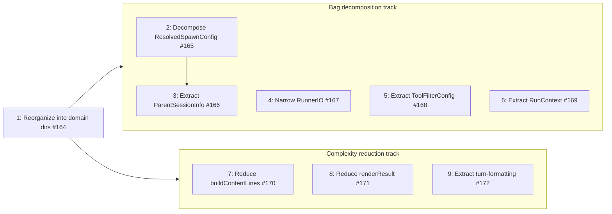

# Phase 10: Domain organization, bag decomposition, and complexity reduction

Target: reorganize source into domain directories; decompose remaining wide parameter bags into focused value objects; reduce cyclomatic complexity in rendering functions; eliminate production code duplication.

## Current smells

| Smell                                                   | Location                                           | Evidence                                                                                                              | Severity |
| ------------------------------------------------------- | -------------------------------------------------- | --------------------------------------------------------------------------------------------------------------------- | -------- |
| Flat `src/` directory                                   | `src/` root                                        | 20+ files in a single directory with no domain grouping; hard to see module boundaries                                | Medium   |
| `ResolvedSpawnConfig` is a 15-field bag                 | `spawn-config.ts`                                  | Mixes identity (name, slug), execution (model, permissions), and presentation (icon, color) concerns in one interface | Medium   |
| `AgentSpawnConfig` threads parent session fields        | `agent-manager.ts`                                 | `parentSessionFile`, `parentSessionId`, `toolCallId` always travel together but are separate parameters               | Low      |
| `RunnerIO` is too wide                                  | `foreground-runner.ts`                             | 9 methods spanning environment concerns (cwd, env) and session factory concerns (create, attach, resume)              | Medium   |
| `SessionConfig` mixes tool filtering with session setup | `session-config.ts`                                | `toolNames`, `disallowedSet`, `extensions` are a cohesive filter group buried in a larger config                      | Low      |
| `RunOptions` is a 12-field bag                          | `foreground-runner.ts`                             | Mixes execution context (exec, registry, cwd) with per-run options (model, prompt, permissions)                       | Medium   |
| `buildContentLines` high complexity                     | `ui/build-content-lines.ts`                        | ~60-line function with a switch over every content type; each branch is an independent formatter                      | Medium   |
| `renderResult` high complexity                          | `tools/agent-tool.ts`                              | ~80-line function with status-based branching; each status is an independent rendering concern                        | Medium   |
| Duplicated turn-formatting logic                        | `session/session-runner.ts`, `tools/agent-tool.ts` | 18 lines of identical `ToolCallContent` extraction and `getToolCallName` logic in two production files                | Low      |

## Step 1: Reorganize source into domain directories (#164)

Moved files into `config/`, `session/`, `lifecycle/`, `observation/`, and `service/` subdirectories.
All `src/` internal imports now use `#src/` path aliases.
Root `src/` reduced to 5 files + 8 directories.

Impact: domain boundaries are visible in the directory tree; imports communicate intent via path alias.

## Step 2: Decompose ResolvedSpawnConfig (#165)

Split the 15-field `ResolvedSpawnConfig` into three focused value objects:

- `SpawnIdentity` — name, slug, key
- `SpawnExecution` — model, permissions, tools, prompt, systemPrompt
- `SpawnPresentation` — icon, color, description

`ResolvedSpawnConfig` composes these three plus the remaining spawn-level fields.

Impact: each consumer receives only the fields it needs; adding a presentation field no longer touches execution code.

## Step 3: Extract ParentSessionInfo from AgentSpawnConfig (#166)

Extracted `parentSessionFile`, `parentSessionId`, and `toolCallId` into `ParentSessionInfo`.
`AgentSpawnConfig` and `AgentManager.spawn()` accept the single value object instead of three separate parameters.

Impact: eliminated parameter co-travel; the three fields that always move together are now a single concept.

## Step 4: Narrow RunnerIO (#167)

Split `RunnerIO` into two focused interfaces:

- `EnvironmentIO` (3 methods) — cwd, env, platform concerns
- `SessionFactoryIO` (5+1 methods) — create, attach, resume, and related session lifecycle

`RunnerIO` kept as a backward-compatible type alias (`EnvironmentIO & SessionFactoryIO`).

Impact: consumers declare which IO surface they actually need; test doubles shrink to the relevant subset.

## Step 5: Extract ToolFilterConfig from SessionConfig (#168)

Grouped `toolNames`, `disallowedSet`, and `extensions` into `ToolFilterConfig`.
`filterActiveTools` accepts a single `ToolFilterConfig` argument instead of three separate parameters.

Impact: tool-filtering concern is encapsulated; `SessionConfig` is narrower and more focused.

## Step 6: Extract RunContext from RunOptions (#169)

Extracted `exec`, `registry`, `cwd`, and `parentSession` into `RunContext`.
`RunOptions` reduced from 12 fields to 9 (the 4 extracted fields replaced by a single `context` field, plus the remaining per-run options).

Impact: execution context is a reusable value object; `RunOptions` focuses on per-run configuration.

## Step 7: Reduce buildContentLines complexity (#170)

Extracted per-content-type formatters into `ui/message-formatters.ts`.
Each content type (text, tool-use, tool-result, image, etc.) has a dedicated pure function.
`buildContentLines` is now a ~30-line dispatch loop that delegates to the appropriate formatter.

Impact: cyclomatic complexity of `buildContentLines` dropped from ~15 to ~5; each formatter is independently testable.

## Step 8: Reduce renderResult complexity (#171)

Extracted per-status formatters into `tools/result-renderer.ts`.
Each result status (success, error, timeout, cancelled) has a dedicated pure function.
`renderResult` reduced from ~80 lines to a 10-line guard that dispatches to the appropriate renderer.

Impact: cyclomatic complexity of `renderResult` dropped from ~10 to ~3; status rendering is independently testable.

## Step 9: Extract shared turn-formatting logic (#172)

Extracted `ToolCallContent`, `getToolCallName`, and `extractAssistantContent` into `session/content-items.ts`.
Both `session/session-runner.ts` and `tools/agent-tool.ts` import from the shared module.

Impact: eliminated 18 lines of production code duplication; single source of truth for turn-content extraction.

## Step dependencies

Step 1 unblocked all other steps.
Within the bag decomposition track, Step 2 enabled Step 3.
The bag decomposition and complexity reduction tracks were independent of each other.

## Impact

| Metric                         | Before                         | After                                         |
| ------------------------------ | ------------------------------ | --------------------------------------------- |
| Health score                   | ~65                            | 75                                            |
| `src/` root files              | 20+                            | 5 files + 8 directories                       |
| `ResolvedSpawnConfig` fields   | 15                             | 3 composed value objects                      |
| `RunOptions` fields            | 12                             | 9                                             |
| `RunnerIO` methods             | 9                              | 3 (`EnvironmentIO`) + 6 (`SessionFactoryIO`)  |
| `buildContentLines` complexity | ~15                            | ~5                                            |
| `renderResult` lines           | ~80                            | ~10                                           |
| Production duplication         | 18 lines                       | 0                                             |
| Test duplication               | ~1,400 lines (69 clone groups) | ~1,400 lines (69 clone groups) — not targeted |

## Related issues

- #164 — Reorganize source into domain directories
- #165 — Decompose ResolvedSpawnConfig
- #166 — Extract ParentSessionInfo from AgentSpawnConfig
- #167 — Narrow RunnerIO
- #168 — Extract ToolFilterConfig from SessionConfig
- #169 — Extract RunContext from RunOptions
- #170 — Reduce buildContentLines complexity
- #171 — Reduce renderResult complexity
- #172 — Extract shared turn-formatting logic
