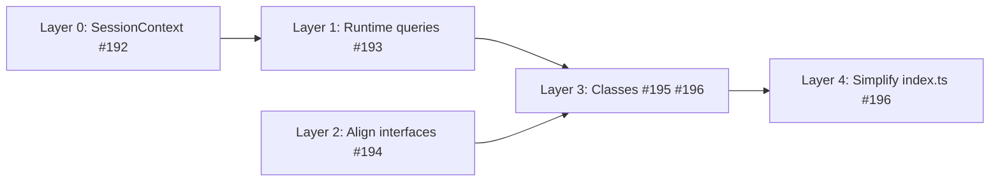

# Phase 11: Closure factories to classes

Target: convert all closure factories to classes, eliminating adapter closure density in `index.ts` (the package's #1 churn hotspot) and making the composition root a pure construction site.

## Root cause

The 44 adapter closures in `index.ts` existed because tool factories accepted narrow interfaces that didn't structurally match the real objects.
Four structural misalignments prevented direct wiring:

1. `SubagentRuntime.currentCtx` was typed `{ pi: unknown; ctx: unknown }` — every consumer had to `as any` cast.
2. Context queries (`buildSnapshot`, `getModelInfo`, `getSessionInfo`) lived as closures in `index.ts` instead of methods on the state holder.
3. `AgentToolManager` mixed fields from `AgentManager` and `SettingsManager` (source mismatch).
4. `AgentToolWidget` used different method names than `SubagentRuntime` (name mismatch).

## Layer 0: Define SessionContext narrow interface (#192)

Defined a `SessionContext` interface capturing the 5 fields `SubagentRuntime` actually needs.
Replaced the `{ pi: unknown; ctx: unknown }` typing with `SessionContext | undefined`.

Impact: typed foundation for all subsequent layers; no `as any` needed by consumers.

## Layer 1: SubagentRuntime stores typed context, owns its queries (#193)

Changed `currentCtx` to `SessionContext | undefined`.
The single `as SessionContext` cast moved into `handleSessionStart` — the SDK boundary.
Added typed methods: `buildSnapshot(inheritContext)`, `getModelInfo()`, `getSessionInfo()`.

Impact: 3 closure queries in `index.ts` → 0; 4 `as any` casts eliminated; `SubagentRuntime` is self-sufficient for tool deps.

## Layer 2: Align interfaces for structural typing (#194)

Three alignment changes:

1. Moved `getMaxConcurrent` off `AgentToolManager` — it reads from `SettingsManager`, not `AgentManager`.
2. Renamed widget methods — aligned `SubagentRuntime` method names with `AgentToolWidget`.
3. Removed dead re-export `getToolCallName` in `ui/message-formatters.ts`.

Impact: `AgentManager` structurally satisfies `AgentToolManager`; `SubagentRuntime` structurally satisfies `AgentToolWidget`; 0 dead exports.

## Layer 3: Convert closure factories to classes (#195, #196)

All five closure factories converted to classes:

| Factory                          | Class                 | Issue |
| -------------------------------- | --------------------- | ----- |
| `createAgentTool({...})`         | `AgentTool`           | #195  |
| `createGetResultTool(...)`       | `GetResultTool`       | #195  |
| `createSteerTool(...)`           | `SteerTool`           | #195  |
| `createAgentRunner(runnerIO)`    | `ConcreteAgentRunner` | #196  |
| `createAgentsMenuHandler({...})` | `AgentsMenuHandler`   | #196  |

Each class satisfies the existing interface via structural typing.
Tool classes expose `toToolDefinition()` for Pi tool registration.
`getModelLabel` internalized into `AgentsMenuHandler` (was a 7-line closure in `index.ts`).

Impact: deps are constructor params (inspectable, testable); no captured closures.

## Layer 4: Simplify index.ts (#196)

With all factories converted and `AgentManager` satisfying `AgentMenuManager` structurally:

- 4 adapter closures eliminated (3 manager method adapters + `getModelLabel`).
- 4 unused imports removed.
- Remaining ~15 closures are structural (event registrations, SDK factory callbacks).

Impact: adapter closure count halved; `AgentManager` passed directly without wrappers; churn hotspot stabilized.

## Step dependencies

Layers 0 and 2 were independent.
Layer 1 depended on Layer 0.
Layer 3 depended on both Layer 1 and Layer 2.
Layer 4 depended on Layer 3.

## Impact

| Metric                         | Before     | After                 |
| ------------------------------ | ---------- | --------------------- |
| Health score                   | 75/100 (B) | 76/100 (B)            |
| Adapter closures in `index.ts` | 44         | ~15 (structural only) |
| `as any` casts in `index.ts`   | 5          | 1 (SDK boundary)      |
| Dead exports                   | 1          | 0                     |
| Closure factories              | 5          | 0                     |
| `index.ts` fan-out             | 25 imports | 21 imports            |

## Related issues

- #192 — Define SessionContext narrow interface
- #193 — Runtime owns context queries
- #194 — Align tool interfaces for structural typing
- #195 — Convert tool factories to classes
- #196 — Convert AgentRunner and AgentsMenuHandler to classes, simplify index.ts
