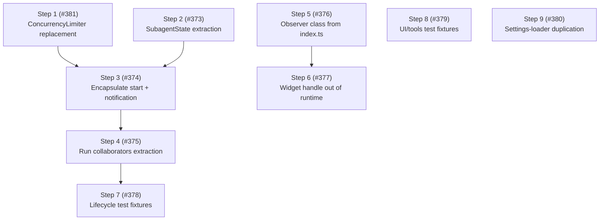

# Phase 17: Core consolidation

## Summary

Phase 17 consolidated the core's remaining structural debt before the UI reconsideration (Phase 18).
The findings came from the standard discovery pass — fallow suite, entry-point trace, design-review checklist, and test-constructibility audit — run after Phase 16 landed.

All nine steps are closed: [#381], [#373], [#374], [#375], [#376], [#377], [#378], [#379], [#380].
[#412] unified the overlapping session-mock builders identified during Step 7.
[#415] migrated `pi-subagents-worktrees` to the shared settings helper after the Step 9 published release.

## Context

Phase 17 is the consolidation slice of the [first-principles refinement](../architecture.md#first-principles-refinement-and-the-deeper-target), not the full domain split.
It lands the first cut of the lifecycle-state domain (Step 2's `SubagentState`) plus the wiring, queue, and duplication cleanups.
The fuller four-domain split — metrics as a projection, result delivery as its own domain, the hook/broadcast reclassification, and the push/pull (DIP) inversion — is recorded in the refinement and sequenced into later phases.

## Findings summary

Health metrics at the start of Phase 17 (fallow, package-wide including tests):

| Metric                     | Phase 16 baseline              | Phase 17 start                                                     |
| -------------------------- | ------------------------------ | ------------------------------------------------------------------ |
| Health score               | 78/100 (B)                     | 78/100 (B)                                                         |
| Source LOC                 | 7,778 (57 files)               | 8,356 (61 files, landed Phase 17 Step 5)                           |
| Dead code                  | 0 files, 0 exports             | 0 files, 0 exports                                                 |
| Maintainability index      | 90.8 (good)                    | 90.8 (good)                                                        |
| Avg / P90 cyclomatic       | 1.4 / 2                        | 1.4 / 2                                                            |
| Production duplication     | 11 lines (1 internal group)    | 11 lines (1 internal group; cross-package pair resolved in Step 9) |
| Test duplication           | 42 groups, 661 lines           | 44 groups, ~750 lines                                              |
| Fallow refactoring targets | 0                              | 0                                                                  |
| Top churn hotspot          | `index.ts` 65.0 ▲ accelerating | `index.ts` 31.3 ▼ cooling                                          |

The syntactic metrics are healthy and stable — the remaining debt is structural, mostly invisible to fallow, and concentrated in three places:

1. **`Subagent` construction duality.**
   `SubagentInit` carries ~20 fields, nearly all optional with "required for run(), optional for tests" semantics, and `run()` compensates with runtime throws ("not configured for execution").
   This violates principle 8 (construct complete): the class is simultaneously a passive record (tests build display-only snapshots) and an executor (production wires factory, observer, run config, workspace provider).
   The symptoms are in the tests: external writes `record.promise = …` (manager, queue callback, four test files) and `record.notification = new NotificationState(…)` (seven test sites) are output-argument smells on fields the object should own.
   This duality is the two most visible of four domains fused into `Subagent`; Phase 17 resolves it (Step 2) and defers the remaining split (metrics, result delivery) to a later phase per the [first-principles refinement](../architecture.md#first-principles-refinement-and-the-deeper-target).
2. **Wiring debt in `index.ts`.**
   Two forward references (settings → queue, queue → manager) are replicated with an `eslint-disable prefer-const` dance in `test/lifecycle/subagent-manager.test.ts`; the queue's start callback (`record.promise = record.run()` after a status check) is duplicated verbatim between `index.ts` and the test helper.
   A ~70-line inline `SubagentManagerObserver` literal mixes three concerns (event emission, `appendEntry` persistence, notification dispatch).
   `runtime.widget` is assigned post-construction behind five relay-only delegation methods on `SubagentRuntime`.
3. **Duplication.**
   A 23-line cross-package production clone (`settings.ts:198-211` ↔ `pi-subagents-worktrees/src/config.ts:51-73`: the layered global/project settings-file loader) and 44 test clone groups (~750 lines), with clone families concentrated in `test/lifecycle/` and `test/ui/`.

Deferred findings (scored below the priority cut, tracked here rather than as steps): the `resolveModel` error-as-string union return (callers branch on `typeof resolved === "string"`), the file-top SDK `eslint-disable` headers in 14 files (re-audit when the Pi SDK exports improve), missing unit tests for `observation/renderer.ts` (the top CRAP-risk file), and the 11-line internal clone in `ui/agent-config-editor.ts` (folds into the Phase 18 UI extraction).

## Steps

Priority = Impact × (6 − Risk).

| Step | Title                                                                                | Category | Impact | Risk | Priority |
| ---- | ------------------------------------------------------------------------------------ | -------- | ------ | ---- | -------- |
| 1    | Replace ConcurrencyQueue with a thunk-based ConcurrencyLimiter                       | A/C      | 4      | 2    | 16       |
| 2    | Extract `SubagentState`; make `Subagent` execution deps mandatory                    | B/D      | 4      | 3    | 12       |
| 3    | Encapsulate run start and notification attachment on Subagent                        | C        | 3      | 2    | 12       |
| 4    | Extract run-listener and workspace-bracket collaborators from Subagent               | B/C      | 3      | 2    | 12       |
| 5    | Extract the manager observer from index.ts into a class                              | B/E      | 3      | 2    | 12       |
| 6    | Split widget delegation out of SubagentRuntime                                       | C        | 3      | 3    | 9        |
| 7    | Consolidate lifecycle test fixtures                                                  | D        | 3      | 1    | 15       |
| 8    | Consolidate UI and tools test fixtures                                               | D        | 2      | 1    | 10       |
| 9    | Resolve the cross-package settings-loader duplication                                | A        | 2      | 2    | 8        |

### Step 1 — Replace ConcurrencyQueue with a thunk-based ConcurrencyLimiter ([#381])

- Targets: `src/lifecycle/concurrency-queue.ts` (→ `concurrency-limiter.ts`), `src/lifecycle/subagent-manager.ts`, `src/index.ts`, `test/lifecycle/concurrency-queue.test.ts`, `test/lifecycle/subagent-manager.test.ts`.
- Smell: Category C (forward references: the queue's ID-registry design forces a start callback that reaches back into the manager, duplicated between `index.ts` and the test helper) and Category A (dual counting: the queue's `running` counter is fed by `markStarted`/`markFinished` relays in the manager's observer, mirroring state the agents already carry).
- Change: replace the ID-registry queue with a `ConcurrencyLimiter` that schedules thunks FIFO against a dynamic `getLimit()` — the injected limiter knows nothing about agents, IDs, or the manager.
  Spawn gates background runs with `limiter.schedule(() => record.start())` — `start()` owns the abort-while-queued status guard and stores the promise internally; foreground and `bypassQueue` runs invoke `record.start()` directly.
  The settings `onMaxConcurrentChanged` hook wires to `limiter.recheck()` in `index.ts`; `dispose()` calls `limiter.clear()` to drop pending thunks.
- Outcome: dependency direction is strictly manager → limiter (no callback back-edge; the `prefer-const` eslint-disable in the test helper is deleted); the observer's two queue relays are gone; every spawned agent has a `promise` at spawn, collapsing `waitForAll`'s `while (true)` drain loop and its eslint-disable.

### Step 2 — Extract `SubagentState`; make `Subagent` execution deps mandatory ([#373])

- Targets: `src/lifecycle/subagent.ts` (state fields, transition/accumulation methods, constructor, `run()` guards), `src/lifecycle/subagent-manager.ts` (`spawn`), `test/helpers/make-subagent.ts`, `test/lifecycle/subagent.test.ts`, `test/observation/record-observer.test.ts`.
- Smell: Category B (god interface — ~20 fields) and Category D (constructibility: "optional for tests" fields with compensating runtime throws).
  The record/executor duality is the two most visible of the four conflated domains (see the first-principles refinement in [architecture.md](../architecture.md#first-principles-refinement-and-the-deeper-target)).
- Change: extract the passive-record state — status, result, error, timestamps, and the stats (toolUses, lifetimeUsage, compactionCount) — into a `SubagentState` value object that owns the transition and accumulation methods.
  `Subagent` holds one privately; its existing getters and `markX`/`incrementX`/`addUsage` methods become one-line delegations, so the ~40 read sites and the mutation callers are unchanged.
  This is not reach-through: `SubagentState` is a private owned value, not a foreign collaborator (contrast [#277], which removed reach-through to the raw SDK session).
  With the readable state extracted, the remaining execution inputs (snapshot, prompt, model, maxTurns, thinkingLevel, parentSession, signal, createSubagentSession, observer, getRunConfig, getWorkspaceProvider, baseCwd) collapse into a single **mandatory** `SubagentExecution` collaborator: production always supplies it (the one `spawn()` site), the passive-record construction moves entirely into `make-subagent.ts`, and `run()`'s two "not configured" throws vanish by construction.
- Outcome: state-machine and observer tests target `SubagentState` directly (no stub execution); `Subagent` is construct-complete with no optional execution fields and no runtime throws (grep-verifiable: no "not configured for execution" in `subagent.ts`); the record-vs-executor duality is resolved, not type-encoded.
- Scope boundary: stats stay on `SubagentState` for now.
  Hoisting **metrics** into a projection over the child session's event stream and extracting **result delivery** (`notification`/`resultConsumed`) into its own domain are the remaining two of the four domains, deferred to a later phase per the refinement.
- Landed: `SubagentState` (`src/lifecycle/subagent-state.ts`) owns status/result/error/timestamps/stats and the transition/accumulation methods; `Subagent` delegates getters and `markX`/`incrementX`/`addUsage` to it.
  `subscribeSubagentObserver` targets `SubagentState`, so observer and state-machine tests no longer stub execution.
  `SubagentExecution` is a mandatory constructor collaborator (production wires it in the single `spawn()` site; passive records build via `make-subagent.ts`), and the two `run()` throws are gone.

### Step 3 — Encapsulate run start and notification attachment on Subagent ([#374])

- Targets: `src/lifecycle/subagent.ts`, `src/lifecycle/subagent-manager.ts`, `test/tools/get-result-tool.test.ts`, `test/lifecycle/subagent-manager.test.ts`, `test/service/service-adapter.test.ts`, `test/observation/notification.test.ts`, `test/helpers/make-subagent.test.ts`, `test/lifecycle/subagent.test.ts`.
- Smell: Category C — output arguments: external writes to `record.promise` (2 production sites in `subagent-manager.ts`, 4 test sites) and `record.notification` (7 test sites; the production path was resolved in Step 2 — the constructor creates `notification` from `execution.parentSession?.toolCallId`, so Step 3's remaining work is making the field read-only and updating tests to supply it via `parentSession`).
- Change: add `Subagent.start()` that runs and stores its own promise (plus an awaitable accessor for `spawnAndWait`/`waitForAll`); make `promise` and `notification` externally read-only (private `_promise`/`_notification` fields backed by public getters); the abort-while-queued status guard folds into `start()`, removing the inline check from the limiter callback; tests use `createTestSubagent({ toolCallId })` or spawn with `parentSession.toolCallId` instead of post-construction assignment.
- Outcome: zero external writes to `Subagent` fields outside its own methods (grep-verifiable: `\.promise =` and `\.notification =` appear only inside `subagent.ts`); 6 new unit tests for `start()` behaviour; test count +6 (975 → 981).
- Landed: `Subagent.start()` (immediate path) and `Subagent.scheduleVia(schedule)` (queued path) own the promise and the shared `guardedRun()` status guard; `SubagentManager.spawn()` calls one or the other; `TestSubagentOptions.toolCallId` wires notification state via the constructor path.
- Correction (post-merge): the first cut used `void this.limiter.schedule(() => record.start())`, which left a queued agent's `promise` unset until its slot opened — silently regressing Step 1's "every spawned agent has a `promise` at spawn" invariant.
  Fixed by inverting control: `scheduleVia` captures the limiter promise eagerly inside the agent (no external `.promise =` write), restoring the invariant.
  Lesson: a step's acceptance criteria must include the cross-step invariants it could regress, not only its own grep-verifiable outcome.

### Step 4 — Extract run-listener and workspace-bracket collaborators from Subagent ([#375])

- Targets: `src/lifecycle/subagent.ts` (455 LOC after Step 2 extracted SubagentState — still the largest source file).
- Smell: Category B (oversized class; per-run listener fields declared mid-class) and Category C (state owns its mutations: workspace dispose logic appears in `run()`'s catch, `completeRun`, and `failRun`).
- Change: extract a `RunListeners` object owning the observer-unsubscribe and signal-detach handles (`wireSignal`/`attachObserver`/`release`), and a `WorkspaceBracket` collaborator owning prepare/dispose-with-addendum, centralising the dispose logic.
- Outcome: `subagent.ts` ≤ 450 LOC; workspace disposal logic in exactly one place; listener handles no longer raw nullable fields.
- Landed: `RunListeners` (`src/lifecycle/run-listeners.ts`) owns the signal-detach and observer-unsub handles with a single `release()` call; `WorkspaceBracket` (`src/lifecycle/workspace-bracket.ts`) owns prepare-at-run-start and dispose-with-addendum — `completeRun` and `failRun` call `workspaceBracket.dispose(outcome)` and receive the addendum string (or `""`) without reaching through to the workspace object directly.
  `Subagent.wireSignal`, `attachObserver`, and `releaseListeners` are removed.
  `subagent.ts`: 488 → 448 LOC.
  Test count: 982 → 994 (+12: 7 RunListeners + 13 WorkspaceBracket − 8 redundant Subagent listener tests).

### Step 5 — Extract the manager observer from index.ts into a class ([#376])

- Targets: `src/index.ts` (inline `SubagentManagerObserver` literal, ~70 lines), new module under `src/observation/`.
- Smell: Category B/E — `index.ts` is the dominant churn hotspot (31.3, 91 commits); the literal mixes event emission, record persistence (`appendEntry`), and notification dispatch; principle 9 (state and behavior belong in classes, not closure-captured literals).
- Change: extract a class (e.g. `SubagentEventsObserver`) constructed with narrow deps (`emit`, `appendEntry`, the `NotificationSystem`).
- Outcome: `index.ts` < 170 lines; the observer's three concerns unit-tested directly without booting the extension.
- Landed: `src/observation/subagent-events-observer.ts` (new, 97 LOC); `index.ts` 226 → 177 lines; 60 → 61 source files; 994 → 1009 tests (+15 covering all four observer methods).

### Step 6 — Split widget delegation out of SubagentRuntime ([#377])

- Targets: `src/runtime.ts`, `src/tools/agent-tool.ts` (`AgentToolRuntime`), `src/handlers/tool-start.ts` (`ToolStartRuntime`), `src/observation/notification.ts` (`NotificationManager` constructor), `src/ui/agent-widget.ts`, `src/index.ts`.
- Smell: Category C — relay-only dependency (five delegation methods that only forward to `widget`) and a post-construction `runtime.widget =` write violating principle 8.
- Constraint discovered in planning: "pass the handle directly to the consumers" is infeasible for `NotificationManager`, which is a _transitive dependency_ of the widget (`NotificationManager → widget → manager → observer → NotificationManager`).
  The `runtime.widget` lazy field exists to break exactly this cycle; removing it forces the one late seam to move, and the operator's principles (no setters, instantiate ready-to-work) rule out relocating it to a setter or forward-ref `let`.
- Change (tidy-first): first dissolve the cycle by giving `AgentWidget.update()` self-seeding of `finishedTurnAge` for finished agents it observes via `listAgents()`, then drop the `markFinished`/`updateWidget` callbacks from `NotificationManager` (it keeps `agentActivity.delete` + nudge scheduling).
  With the cycle gone, the widget is constructed as a `const` after the manager and injected directly into `AgentTool` and `ToolStartHandler`; the `widget` field, the five relay methods, and the post-construction write delete cleanly, and `AgentToolRuntime` narrows to its context-query slice.
- Outcome: `SubagentRuntime` has zero widget knowledge; no post-construction field writes in `index.ts`; the construction graph is a cycle-free DAG (`notifications → observer → manager → widget → {AgentTool, ToolStartHandler}`).
- Landed: `AgentWidget.seedFinishedAgents` owns completion detection; `NotificationManager` has no widget dependency (2-arg constructor); `AgentToolWidget` (in `agent-tool.ts`) and `ToolStartWidget` (in `tool-start.ts`) are narrow per-consumer interfaces the real widget satisfies structurally; tool fixtures stub a `widget` separate from the narrowed `runtime` mock.
  Behavior-preserving: the widget timer runs through every background completion, so self-seeding lands ≤80ms later within the same turn (linger is turn-based).
  Test count: 1009 → 1005 (+3 widget self-seed tests, −7 removed relay/field tests).

### Step 7 — Consolidate lifecycle test fixtures ([#378])

- Targets: `test/lifecycle/subagent-manager.test.ts`, `test/lifecycle/subagent-session.test.ts`, `test/lifecycle/create-subagent-session.test.ts`, `test/lifecycle/create-subagent-session-extension-tools.test.ts` (deleted), `test/helpers/subagent-session-io.ts`.
- Smell: Category D — at planning time fallow reported four clone families across the lifecycle tests (the issue's "five" predated Steps 1–6, which renamed the queue and dissolved the `subagent.test.ts`/`concurrency-limiter.test.ts` families).
- Change: extract the repeated spawn/run/factory arrangements into shared helpers, migrating incrementally (lift-and-shift, never a single-step rewrite of a large test file).
- Outcome: package test duplication below 600 lines; lifecycle clone families reduced, with the residual deliberately left as the visible test subject (see Landed).
- Landed: added a shared `createFactorySession` mock-session builder (`test/helpers/subagent-session-io.ts`); grouped the `createSubagentSession` arrange into describe-scoped `beforeEach` hooks with the `createSubagentSession(...)` act kept explicit per test (AAA); extracted a `programTurns` arrange helper for the turn-limit tests; consolidated the manager spawn/queued-pair arrangements; and folded `create-subagent-session-extension-tools.test.ts` (4 post-bind guard tests) into `create-subagent-session.test.ts`, deleting the file and its duplicated scaffolding.
  Package test duplication: 669 → 512 lines; test files 64 → 63; test count 1005 → 1010 (+5 `createFactorySession` self-tests).
  Two lifecycle clone families remain (`create-subagent-session.test.ts` ~29 lines, `subagent-manager.test.ts` ~23 lines): both are the repeated `await createSubagentSession(...)` / `spawn(...)` **act** with test-specific arrange, intentionally not extracted because hiding the system-under-test behind a helper is the wrong abstraction for test code (Sandi Metz: "duplication is far cheaper than the wrong abstraction").
  Lesson: the original "families ≤ 1" target was a weak signal for _test_ code — an early act-wrapping helper that hit the metric was reverted in favour of the AAA structure above; the metric was relaxed deliberately.
  The three overlapping session-mock builders this surfaced were resolved in [#412] by targeted reuse: `createFactorySession` now spreads the shared `createMockSession` core (inheriting the `messages`/`subscribe`/`emit`/`steer`/`dispose`/`sessionManager` base) and layers only the factory facet on top.
  `createSubagentSessionStub` was left as-is — it already composes `createMockSession` as its wrapped `.session`, so its overlap is intrinsic delegation glue rather than duplication.

### Step 8 — Consolidate UI and tools test fixtures ([#379])

- Targets: `test/ui/agent-creation-wizard.test.ts`, `test/ui/agent-config-editor.test.ts`, `test/ui/ui-observer.test.ts`, `test/tools/foreground-runner.test.ts`, `test/tools/background-spawner.test.ts`, `test/session/session-config.test.ts`, and `test/service/service-adapter.test.ts` (a seventh non-lifecycle family fallow reports; added to scope in planning).
- Smell: Category D — remaining clone families outside the lifecycle tree.
- Change: extract per-file repeated arrangements into local helpers or `test/helpers/` where shared across files.
- Outcome: each named family's extractable arrange consolidated; resulting fallow figures reported (the roadmap's original "44 → ≤ 25 groups; ≤ 0.6%" target predated Steps 1–7 and used a different baseline, so acceptance was "consolidate and measure," not a binding number).
- Landed: promoted the cross-file `ResolvedSpawnConfig` builder to `test/helpers/make-spawn-config.ts` (`createResolvedSpawnConfig`, flat options that derive the mirrored `agentInvocation`/`presentation.detailBase` regions) with a 5-test companion; consolidated the remaining six families with file-local, value-returning arrange builders and `beforeEach` setup (`spawnAndWaitRegistering`, `ui-observer` session/tracker `beforeEach` with `vi.fn()` onUpdate counters, `generateUI`/`manualUI`/`withInputs`, `disabledConfig`, `exploreConfig`, `createManagerStub`).
  Package test duplication: 512 → 355 lines; clone groups 32 → 24; duplication 2.49% → 1.73%; test files 63 → 64; test count 1010 → 1015 (+5 `createResolvedSpawnConfig` self-tests).
  Three multi-group families remain: the two lifecycle residuals from Step 7 (`create-subagent-session.test.ts`, `subagent-manager.test.ts`) and `agent-config-editor.test.ts`, whose residual clones are the repeated `await editor.showAgentDetail(...)` **act** plus its `setupDetail` arrange and `ui.select.mock.calls` menu assertion — left inline because wrapping the system-under-test is the wrong abstraction for test code (Step 7 lesson; Sandi Metz: "duplication is far cheaper than the wrong abstraction").

### Step 9 — Resolve the cross-package settings-loader duplication ([#380])

- Targets: `src/settings.ts:198-211`, `packages/pi-subagents-worktrees/src/config.ts:51-73`.
- Smell: Category A — 23-line production clone: the layered global/project JSON read-sanitize-warn-merge loader.
- Decision: **extract** — `loadLayeredSettings<T>` added to `src/layered-settings.ts` and published via the `@gotgenes/pi-subagents/settings` dedicated subpath export (`dist/settings.d.ts`); `loadSettings` in `settings.ts` delegates to it internally.
  Option 2 (fallow suppression) was rejected; the public-API cost is accepted as the right long-term tradeoff for a shared convention in the `@gotgenes/pi-*` family.
  Worktrees migration (swap `config.ts`'s inlined loader for the shared helper) is deferred to [#415] — worktrees resolves pi-subagents from the registry, so it must wait for a published release carrying the helper.
- Outcome: `pnpm fallow:dupes --skip-local` no longer reports the `settings.ts` ↔ `config.ts` pair.
  The parametrised helper's token sequence diverged sufficiently that the contiguous identical run dropped below the reporting threshold even before the worktrees migration lands.
  Definitive semantic elimination completed when worktrees adopted the helper in [#415].

## Step dependency diagram

Steps 8 and 9 have no dependencies and can run at any point.

## Tracks

| Track                         | Steps         | Theme                                                                              |
| ----------------------------- | ------------- | ---------------------------------------------------------------------------------- |
| A — Subagent constructibility | 2 → 3 → 4 → 7 | Construct complete; encapsulate run state; then consolidate the tests that churned |
| B — Wiring debt               | 1, 5 → 6      | Shrink index.ts; eliminate forward references and relay delegation                 |
| C — Test hygiene              | 8             | Clone families outside the lifecycle tree                                          |
| D — Duplication policy        | 9             | Cross-package clone decision                                                       |

Tracks A and B intersect only at Step 3 (which needs Step 1's queue relocation); otherwise they proceed in parallel.
Tracks C and D are fully independent.

[#277]: https://github.com/gotgenes/pi-packages/issues/277
[#373]: https://github.com/gotgenes/pi-packages/issues/373
[#374]: https://github.com/gotgenes/pi-packages/issues/374
[#375]: https://github.com/gotgenes/pi-packages/issues/375
[#376]: https://github.com/gotgenes/pi-packages/issues/376
[#377]: https://github.com/gotgenes/pi-packages/issues/377
[#378]: https://github.com/gotgenes/pi-packages/issues/378
[#379]: https://github.com/gotgenes/pi-packages/issues/379
[#380]: https://github.com/gotgenes/pi-packages/issues/380
[#381]: https://github.com/gotgenes/pi-packages/issues/381
[#412]: https://github.com/gotgenes/pi-packages/issues/412
[#415]: https://github.com/gotgenes/pi-packages/issues/415
