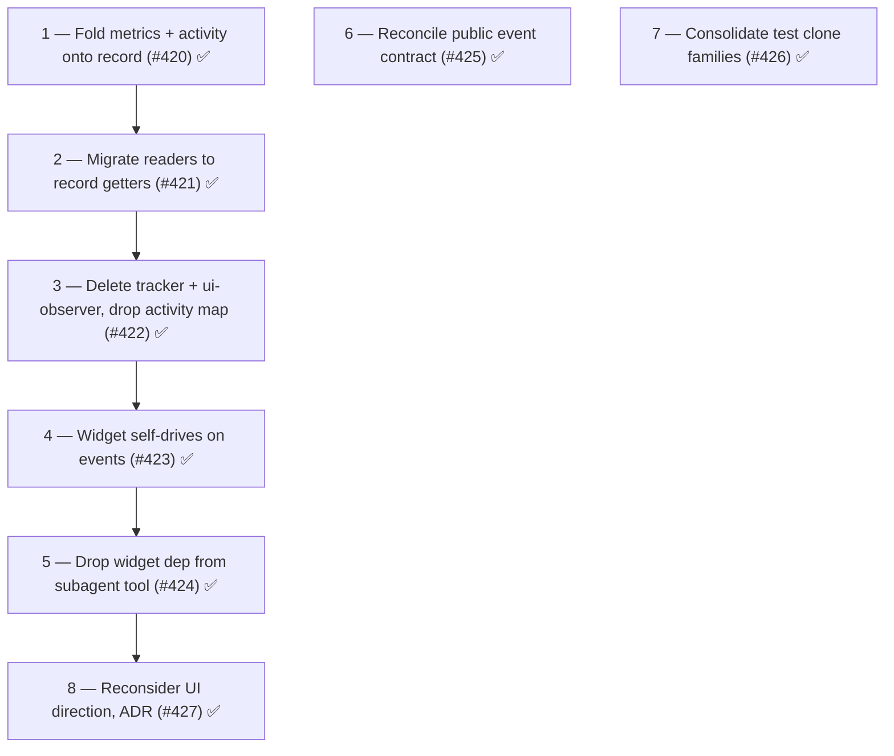

# Phase 18: Reconsider UI from first principles

## Summary

Phase 18 disentangled the activity tier from the core and recorded a first-principles decision about the UI's direction and distribution.
Steps 1–5 (the spine) removed the activity-tier entanglement: run state was consolidated onto `SubagentState`, `AgentActivityTracker` and `ui-observer` were deleted, and the widget was made a pure reactive consumer of lifecycle events.
Steps 6–7 delivered independent hygiene: the public event contract was reconciled (breaking) and residual test clone families were consolidated.
Step 8 captured the outcome as [ADR-0004] — a per-component UI decision recorded to gateway Phase 19.

All eight steps are closed: [#420], [#421], [#422], [#423], [#424], [#425], [#426], [#427].

## Health metrics

Baseline at the start of Phase 18 (end of Phase 17):

| Metric                                   | Phase 18 start                                                     | Phase 18 end                          |
| ---------------------------------------- | ------------------------------------------------------------------ | ------------------------------------- |
| Health score                             | 78/100 (B)                                                         | 78/100 (B)                            |
| Source LOC                               | 7,751 (62 files)                                                   | 7,650 (61 files)                      |
| Dead code                                | 0 files, 0 exports                                                 | 0 files, 0 exports                    |
| Maintainability index                    | 90.9 (good)                                                        | 90.9 (good)                           |
| Avg cyclomatic complexity                | 1.4                                                                | 1.4                                   |
| P90 cyclomatic complexity                | 2                                                                  | 2                                     |
| Fallow refactoring targets               | 0                                                                  | 0                                     |
| Production duplication                   | 11 lines (1 internal clone group in `agent-config-editor.ts`)      | 11 lines (1 internal clone group)     |
| Test duplication                         | 28 clone groups, 503 lines                                         | 14 clone groups (below <15 target)    |
| Tests                                    | 1,031 passing                                                      | 1,047 passing                         |
| Activity-tier modules slated for removal | `ui-observer.ts` (61) + `agent-activity-tracker.ts` (84) = 145 LOC | Deleted in Step 3                     |

## Findings

Six findings told one story — the activity tier had metastasized out of the UI and into the core.

1. **UI state lives on the core runtime.**
   `SubagentRuntime.agentActivity: Map<string, AgentActivityTracker>` puts a UI streaming-state map on the core composition root.
   `SubagentRuntime` owns session-scoped lifecycle state; `AgentActivityTracker` (active tools, response text, turn count) is pure rendering state the core never reads.
   Category C (coupling).
2. **Core spawn tools wire UI streaming.**
   `foreground-runner.ts` and `background-spawner.ts` construct `AgentActivityTracker`, call `subscribeUIObserver` (a second session subscription parallel to the core's own `record-observer`), call `setSession`, and populate or delete the activity map and drive the widget (`ensureTimer`, `update`, `markFinished`).
   Their own doc comments list "AgentActivityTracker creation, UI observer subscription" as responsibilities.
   Category C (mixed responsibility, parameter relay).
3. **The LLM-facing tool depends on the widget.**
   `AgentTool` takes a 4-method `widget` dependency plus `runtime.agentActivity` and calls `this.widget.setUICtx(ctx.ui)`.
   Every `AgentTool` unit test must stub the widget and the activity map (`createToolDeps`), although the tool's real concern is dispatch — testability friction marking a domain seam.
   Category C/D.
4. **Two parallel observers split the run-metric domain.**
   Each child session gets two subscriptions: `record-observer` accumulates `SubagentState` (tool uses, usage, compactions) and `ui-observer` accumulates `AgentActivityTracker` (active tools, response text, turn count).
   `turnCount` is a genuine run metric that lives only in the UI tracker, so `notification.ts` and the foreground result text reach into the tracker to recover it.
   Category C (anemic split, duplication).
5. **A core observation concern reaches into UI state.**
   `NotificationManager` holds the activity map and reads `turnCount`/`maxTurns` from it to build notification details, and deletes entries from it.
   Category C (Law of Demeter).
6. **The public event contract is both vacant and incomplete.**
   `SUBAGENT_EVENTS.ACTIVITY = "subagents:activity"` is declared in the service surface and the lifecycle-events table but is never emitted anywhere — a vacant hook the "no vacant hooks" rule forbids.
   Meanwhile three emitted channels (`subagents:failed`, `subagents:compacted`, `subagents:created`) are absent from the constant map.
   Category A/E.

## Steps

The spine (Steps 1–5) removes the activity-tier entanglement, leaving the core a pure orchestrator whose run state lives in one place and whose UI is a reactive consumer of broadcast events plus discrete queries.
Steps 6–7 are independent hygiene.
Step 8 is the user-driven UI reconsideration the disentangled core finally makes possible — a decision about the UI's distribution once it is substitutable, not optional.

The deeper target in the [first-principles refinement] — metrics as a pure observer projection rather than mutable fields — is deliberately **not** forced here.
Folding the live activity onto the record (the single owner of run state, consistent with Phase 17's `SubagentState`) removes the duplication without inventing the asynchronous-observation seam the `improvement-discovery` skill warns is essential, not structural.

1. **✅ Fold run metrics and live activity onto the core record (pure addition) — complete (v16.5.0).**
   ([#420]) Target: `lifecycle/subagent-state.ts`, `observation/record-observer.ts`, `lifecycle/subagent.ts`.
   Extend the single owned run-state value object with `turnCount`, active tools, and response text; have the already-subscribed `record-observer` handle `turn_end`, `tool_execution_start`, `message_start`, `message_update`; expose read-only `turnCount`/`maxTurns`/`activeTools`/`responseText` getters on `Subagent`.
   `AgentActivityTracker` still exists; nothing reads the new getters yet (tidy-first).
   Smell: Category C. Outcome: `Subagent` is the single home for all run state; getters available for migration.
   Landed: `SubagentState` owns `turnCount`/`activeTools`/`responseText` plus their transition methods; `record-observer` populates them on a single subscription; `Subagent` exposes the four read-only getters; +27 tests (1031 → 1058).
2. **✅ Migrate every activity reader to the record getters — complete.**
   ([#421]) Target: `ui/widget-renderer.ts`, `ui/conversation-viewer.ts`, `ui/agent-menu.ts`, `tools/foreground-runner.ts`, `observation/notification.ts`.
   Switch each reader from `AgentActivityTracker` to the record getters added in Step 1 (widget-renderer reads activity off `listAgents()`; viewer/menu drop the `activity` param; notification reads `turnCount`/`maxTurns` off the record).
   Smell: Category C (Law of Demeter).
   Outcome: no consumer references `AgentActivityTracker`.
   Landed: `WidgetAgent` folds the live-activity fields and a `contextPercent` projection; `AgentWidget` projects records; `ConversationViewer`, `AgentsMenuHandler`, `buildDetails`, and `buildNotificationDetails` read off the record; `NotificationSystem.cleanupCompleted` removed; `SubagentEventsObserver` returns early on consumed results; +8 tests (1058 → 1066).
3. **✅ Delete `AgentActivityTracker` and `ui-observer`; drop the activity map from the runtime and spawn tools — complete.**
   ([#422]) Target: `ui/agent-activity-tracker.ts` (delete), `ui/ui-observer.ts` (delete), `runtime.ts`, `tools/foreground-runner.ts`, `tools/background-spawner.ts`.
   The spawn tools stop constructing trackers, subscribing, and populating maps; `SubagentRuntime.agentActivity` is removed.
   Smell: Category A + C. Outcome: −145 LOC, one session subscription per child, runtime holds zero UI state.
   Landed: deleted `agent-activity-tracker.ts` (84) + `ui-observer.ts` (61) and their unit suites; dropped the `agentActivity` parameter from `runForeground`/`spawnBackground`, the `AgentActivityAccess` interface, and the `AgentToolRuntime`/`SubagentRuntime` activity-map fields; the foreground `observer.onSessionCreated` keeps `recordRef`/`fgId` binding and `widget.ensureTimer`; −34 tests (1066 → 1032).
4. **✅ Make the widget self-drive from lifecycle events — complete.**
   ([#423]) Target: `ui/agent-widget.ts`, `observation/composite-subagent-observer.ts` (new), `index.ts`.
   The widget starts/stops its timer in response to started/created/completed notifications instead of tool calls; spawn tools no longer call `ensureTimer`/`update`/`markFinished`.
   Smell: Category C (coupling direction).
   Outcome: the widget is a reactive consumer; no inbound calls from core spawn tools.
   Landed: `AgentWidget implements SubagentManagerObserver` (starts the 80 ms loop on `onSubagentStarted`/`onSubagentCreated`, re-renders on `onSubagentCompleted`/`onSubagentCompacted`); a new `CompositeSubagentObserver` fans the manager's single observer slot out to `[eventsObserver, widget]` (wired in `index.ts`, keeping `SubagentManager` unchanged); dropped the `widget` parameter and `ForegroundWidgetDeps`/`BackgroundWidgetDeps` interfaces from both spawners, deleted `AgentWidget.markFinished` (redundant with `seedFinishedAgents`), made `ensureTimer` private, and narrowed `AgentToolWidget` to `setUICtx`; +11 tests (1032 → 1043, then −4 with the dropped spawner widget-driving tests → 1039).
5. **✅ Drop the widget dependency from the `subagent` tool — complete.**
   ([#424]) Target: `tools/agent-tool.ts`, `test/helpers/make-deps.ts`.
   `AgentTool` loses its `widget` constructor param (UICtx capture stays in `ToolStartHandler`); `createToolDeps` sheds the widget stub.
   The activity-map (`agentActivity`) dependency this step originally named was already removed from the tool and runtime in Step 3 ([#422]), so only `widget` remained to drop.
   Smell: Category C/D.
   Outcome: the LLM tool depends only on manager/runtime/settings/registry; fixture drops 1 field.
   Landed: removed the `widget` constructor param and the redundant `this.widget.setUICtx(ctx.ui)` call from `AgentTool.execute`, deleted the `AgentToolWidget` interface and its `UICtx` import, updated the sole `index.ts` call site, and dropped the `widget` field/stub plus two now-obsolete tests (`agent-tool` UICtx capture, `make-deps` widget defaults) — UICtx capture is pinned by `handlers/tool-start.test.ts`; −2 tests (1039 → 1037).
6. **✅ Reconcile the public event contract — complete.**
   ([#425]) Target: `service/service.ts`, the lifecycle-events table in [architecture.md](../architecture.md).
   Remove the vacant `ACTIVITY` channel (or emit a real broadcast for it) and add the emitted `failed`/`compacted`/`created` channels so declared constants match emitted events.
   Smell: Category A/E.
   Outcome: declared channels equal emitted channels; no vacant hook.
   Landed: removed `SUBAGENT_EVENTS.ACTIVITY` (breaking) and added `FAILED`/`COMPACTED`/`CREATED`/`STEERED` — `subagents:steered` (from `steer-tool.ts`) was also emitted-but-undeclared, so all four emitted agent-lifecycle channels are now declared; corrected the stale `subagents:completed` payload in the lifecycle-events table to the real `buildEventData` shape; +1 test (1037 → 1038).
7. **✅ Consolidate residual test clone families — complete.**
   ([#426]) Target: `test/settings.test.ts` + `test/layered-settings.test.ts`, `test/lifecycle/create-subagent-session.test.ts`, `test/ui/agent-config-editor.test.ts`.
   Extract shared fixtures for the clone families fallow reports that the spine does not already rewrite.
   Smell: Category D. Outcome: test clone groups drop below 15.
   Landed: extracted `test/helpers/tmp-settings-dirs.ts` (global+project tmp-dir fixture) and `test/helpers/capture-warn.ts` (a `console.warn` capture helper), each with a paired self-test; table-drove the `create-subagent-session` post-bind membership cases and the `agent-config-editor` menu + confirm-remove cases into `it.each`; pi-subagents test clone groups dropped from 24 to 14 (below the <15 target); +9 tests (1038 → 1047).
8. **✅ Reconsider the UI direction (first-principles ADR) — complete.**
   ([#427]) Target: `docs/decisions/`, `ui/`.
   The spine already made the UI _substitutable_; this step decides its _distribution_, not whether the experiment is possible.
   The goal is **substitutable, not optional**: a human needs some surface, but the specific UI is replaceable — the way Pi ships a default TUI built on the same public API any extension targets.
   The disentangled core stays byte-for-byte identical whether or not a given UI consumer is installed (the composition test), so a replacement UI is a downstream concern even though _some_ UI is not.
   Unlike the worktrees provider seam (generative, rationed — one provider the core consults), the UI is an observational consumer (unlimited, the core never waits on it) reading the broadcast-plus-query surface, which is why packaging it is the secondary question and decoupling it was the real win.
   Two standing concerns are the evidence this decision weighs and the better boundaries the reconsideration is meant to surface:
   - **Truncated transcript.**
     The conversation viewer shows a truncated view, yet `Subagent.messages` already exposes the full history and the core already persists each child as a standard Pi session JSONL (`outputFile`) — the limit is the bespoke overlay's rendering, not data access.
   - **Foreground widget redundancy.**
     In foreground the tool's inline `onUpdate` stream already shows progress, so the above-editor widget duplicates it; the widget earns its keep only for background agents — a per-mode judgment the fused UI cannot vary.
   Candidate redesign to record: replace the bespoke overlay with "open the child session in the same viewer Pi uses for any session," following the recursive-Pi insight and the already-persisted session file.
   Judge the widget, conversation viewer, and `/agents` menu per component — keep, shrink, extract to `@gotgenes/pi-subagents-ui`, or remove — and capture the decision in an ADR that gateways Phase 19.
   Smell: Category E (organization / boundary).
   Outcome: a recorded per-component decision motivated by the two concerns; the inherited UI is substitutable and no longer preserved by default.
   Landed: [ADR-0004] records the per-component decision — (A) shrink the widget to background agents only; (B) remove the bespoke `ConversationViewer`, replacing it with native session navigation over the persisted child JSONL (`switchSession`/`loadEntriesFromFile`, mechanism gated on a Phase 19 spike); (C) dissolve the `/agents` command (remove the create wizard and the agent-types config editor, re-home running-agent visibility onto the widget + session navigation, extract settings to a focused `/subagents:settings` command); (D) keep the surviving UI in-core (substitutable, not extracted).
   The ADR gateways Phase 19, which implements these decisions under its own plan; no runtime code changed in this step.

## Step dependency diagram

## Parallel tracks

- **Track A — Disentangle the activity tier (spine):** Steps 1, 2, 3.
  Strictly ordered; each is a safe lift-and-shift over the previous.
- **Track B — Decouple widget and tool wiring:** Steps 4, 5.
  Begins once the activity map is gone (Step 3).
- **Track C — Public-contract hygiene:** Step 6.
  Independent; can land any time.
- **Track D — Test consolidation:** Step 7.
  Independent; can land any time.
- **Track E — UI reconsideration:** Step 8.
  Gated on the spine and Track B (the UI must be a clean consumer first).

[ADR-0004]: ../../decisions/0004-reconsider-ui-direction.md
[first-principles refinement]: ../architecture.md#first-principles-refinement-and-the-deeper-target
[#420]: https://github.com/gotgenes/pi-packages/issues/420
[#421]: https://github.com/gotgenes/pi-packages/issues/421
[#422]: https://github.com/gotgenes/pi-packages/issues/422
[#423]: https://github.com/gotgenes/pi-packages/issues/423
[#424]: https://github.com/gotgenes/pi-packages/issues/424
[#425]: https://github.com/gotgenes/pi-packages/issues/425
[#426]: https://github.com/gotgenes/pi-packages/issues/426
[#427]: https://github.com/gotgenes/pi-packages/issues/427
