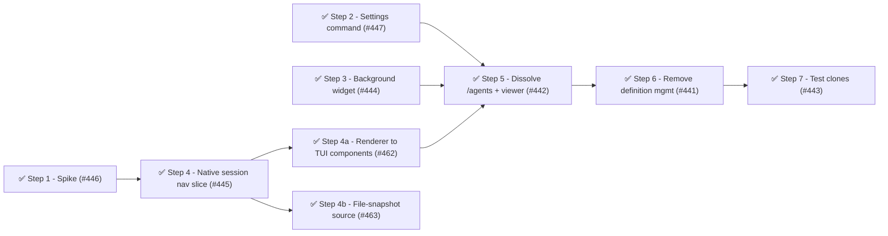

# Phase 19: Implement the ADR-0004 UI decisions

## Summary

Phase 19 implements the per-component UI decisions recorded in [ADR-0004]: shrink the widget to background-only, replace the bespoke conversation viewer with native session navigation, dissolve the monolithic `/agents` menu, and keep the surviving UI in-core.

The sequencing follows Kent Beck's "make the change easy, then make the easy change."
The end state deletes `agent-menu.ts` — the god-command that bundles four unrelated jobs — and everything reachable only from it.
Rather than surgically mutate that doomed module (and the #1 churn hotspot `index.ts`) once per option, Phase 19 first stood up the replacement surfaces additively, then removed the now-orphaned subtree in a single terminal cut.
This kept every responsibility's old surface live until its replacement existed (ADR-0004's no-interim-regression invariant), turned the three replacement steps into genuinely parallel work (none touched `agent-menu.ts`), and reduced `index.ts` edits from four surgical removals to one deregistration.

Seven numbered steps in three phases, plus two follow-ups (Steps 4a–4b) carved from the #445 slice:

- **Phase A — stand up replacements (additive):** spike, settings command, background widget, native session navigation and its renderer/source follow-ups (Steps 1–4, 4a–4b).
- **Phase B — dissolve `/agents` (terminal cut):** delete the orphaned subtree in two deletion commits, one per subtree (Steps 5–6).
- **Phase C — test health:** consolidate the test clones that survive the cut (Step 7).

All nine steps are closed: [#446], [#447], [#444], [#445], [#462], [#463], [#442], [#441], [#443].
A follow-on issue, [#470] (README staleness — the terminal cut removed `/agents` but left the README describing it), was filed after Steps 5–6 shipped and closed independently; see "Follow-on issues" below.

## Health metrics

| Metric                 | Phase 18 (start)         | Phase 19 target      | Phase 19 (delivered)                 |
| ---------------------- | ------------------------ | -------------------- | ------------------------------------ |
| Health score           | 78/100 (B)               | 83/100 (B+)          | 78/100 (B) — unchanged               |
| Source LOC             | 7,650 (61 files)         | ~6,780 (~55 files)   | 7,068 (57 files)                     |
| Production duplication | 11 lines (1 group)       | 0 lines              | 0 lines ✅                           |
| Test clone groups      | 16                       | ≤ 10                 | 9 ✅                                 |
| Top churn hotspot      | `index.ts` (103 commits) | `index.ts` (cooling) | `index.ts` (109 commits, cooling) ✅ |

The health score held flat at 78/100 rather than reaching the 83/100 target — the score's `hotspots` and `unit size` deductions are dominated by long-lived test-suite characteristics (large test functions, `index.ts`'s cumulative churn history) that this phase's scope did not target.
Every metric the phase's steps directly controlled — production duplication, test clone groups, and the churn trend on `index.ts` — hit or beat its target.

## Steps

### Step 1 — Spike: resolve ADR-0004 entry criteria ([#446])

Smell: Category C (coupling boundary) — four open decisions block the session-navigation implementation.
Target: `docs/decisions/0004-reconsider-ui-direction.md` addendum.

The four entry criteria from ADR-0004:

1. **Root-continuity:** Does the root's in-flight turn survive `ctx.switchSession()` and a return gesture?
2. **View-only vs interactive:** `switchSession` (full interactive takeover) or `loadEntriesFromFile` (read-only transcript built from JSONL)?
3. **Parallel-agent navigation:** Operator gesture to select which of N background agents to view (from the widget, a command, or both).
4. **Settings command name:** `/subagents-settings`, `/agents-settings`, or another form consistent with sibling packages?

Produce a minimal spike (observed test or PoC against a real session) that answers each question, then record the answers as an addendum to ADR-0004.
No production source files change; the spike closes when the ADR addendum is merged.

Outcome: ADR-0004 updated with all four entry-criteria answers; Step 4 unblocked.

`Release: independent`

### Step 2 — Extract settings to a focused `/subagents-settings` command ([#447])

Smell: Category E (naming/organization) — settings are buried inside the monolithic `/agents` command per ADR-0004 Decision C. This step is purely additive: it stands up the new surface without touching `agent-menu.ts`.
Target files:

- New `src/ui/subagents-settings.ts` — `SubagentsSettingsHandler` lifted from `AgentsMenuHandler.showSettings`, carrying its own narrow `SubagentsSettingsManager` interface (the three `apply*` methods and three readonly accessors only).
- `src/index.ts` — register the new command (name confirmed by Step 1); pass `settings` directly.
- New `test/ui/subagents-settings.test.ts` — unit tests for the extracted handler.

`showSettings` depends only on `this.settings` (the self-contained `AgentMenuSettings` shape), so the extraction copies that logic into a new file with zero coupling to the wizard, editor, or viewer.
The old in-menu Settings option keeps working until the terminal cut deletes `agent-menu.ts` wholesale — there is no surgical removal of `showSettings` or `AgentMenuSettings` from the doomed file.

Outcome: new `subagents-settings.ts` (~80 LOC) and focused command registered; `agent-menu.ts` untouched.

`Release: independent`

### Step 3 — Shrink widget to background agents only ([#444])

Smell: Category C (coupling) — the widget shows all agents including foreground ones, duplicating the `subagent` tool's inline `onUpdate` stream for foreground runs.
Target files:

- `src/ui/agent-widget.ts` — funnel both `manager.listAgents()` call sites (`update()` and `renderWidget()`) through a single private accessor, then flip that accessor to background-only via `record.invocation?.runInBackground === true`.
- `src/ui/widget-renderer.ts` — verify no foreground-specific rendering path survives.
- `test/ui/agent-widget.test.ts` — add background-only filtering tests; update assertions.

The widget calls `listAgents()` at two sites today — `update()` (feeding `seedFinishedAgents`, `assembleWidgetState`, and `clearWidget`) and `renderWidget()` (the tree map).
Filtering at only one site leaves the other rendering foreground agents, so the enabling move is to route both through one accessor and apply the predicate once at the source.
`Subagent.invocation.runInBackground` is the reliable signal: set by `spawn-config.ts` → `AgentInvocation.runInBackground` → stored on `Subagent.invocation`.
ADR-0004 Decision A: foreground runs suppress the widget; the inline `onUpdate` stream is authoritative there.

Outcome: widget shows only background agents; foreground/widget duplication eliminated; the background predicate lives at a single funnel.

`Release: independent`

### Step 4 — Implement native session navigation ([#445])

Smell: Category C (coupling) — the bespoke `ConversationViewer` re-implements session-transcript rendering when Pi's own machinery targets the already-persisted child session JSONL.
This step adds the new surface alongside the existing viewer; it does not touch `agent-menu.ts`.
Target files:

- New `src/ui/session-navigator.ts` — a flat command that lists any subagent with a live record or a persisted session file (foreground included, never background-filtered), lets the operator pick one, and renders that child's transcript read-only.
- New typed accessor on `Subagent`/`SubagentSession` returning `record.messages` as `AgentMessage[]` (the boundary currently widens it to `readonly unknown[]`).
- `src/index.ts` — register the new command; the background widget ([#444]) is an optional secondary selection gesture, not a dependency.

ADR-0004 Decision B: "Tell-Don't-Ask — hand Pi the session path; Pi owns the viewer."
Mechanism (confirmed by the Step 1 spike and revised by [ADR-0004] Addendum 2): a **read-only** (non-interactive) transcript **dual-sourced by liveness**, rendered through Pi's own public entry components (no bespoke renderer).

- **Tracked agent** (still in `manager.listAgents()`) — render live from the in-memory record: `record.messages` for history, `record.subscribeToUpdates()` to re-render on streaming updates, and `record.activeTools` / `record.responseText` for the running-agent streaming indicator.
- **Evicted / untracked agent** — render from the file snapshot: `parseSessionEntries(readFileSync(record.outputFile, "utf8"))` → drop the `SessionHeader` → `buildSessionContext(...).messages`.

Both sources yield `AgentMessage[]`, so one Pi-component renderer serves both: Pi's public entry components (`AssistantMessageComponent` / `ToolExecutionComponent` / …) or `serializeConversation` (see the [ADR-0004] addendum, Findings 0 and 1).
Neither `switchSession` (a full takeover that invalidates the root's in-flight turn) nor `loadEntriesFromFile` (a test-only export the package's public barrel does not re-export, in both `0.79.1` and `0.79.8`) is used.
`Subagent.outputFile` already exposes the persisted child session JSONL path via `subagentSession?.outputFile` — no new SDK dependency.
The new surface stands up while the old `viewAgentConversation`/`ConversationViewer` path still works; the bespoke viewer is removed only by the terminal cut (Step 5).

Outcome: operator views any subagent's session through Pi's native machinery — live for a running agent, a file snapshot for an evicted one; the new surface coexists with the old viewer until Step 5.

Landed ([#445], sliced): #445 shipped the first releasable vertical slice — the `/subagent-sessions` command (`src/ui/session-navigator.ts`), the pure selection/sourcing/text-render core (`src/ui/session-navigation.ts`), and the typed `agentMessages` accessor (`SessionMessage` on `SubagentSession`/`Subagent`).
It is **live-source only** behind a renderer-agnostic `TranscriptSource` seam, rendered via Pi's `serializeConversation` text.
With the `manager.listAgents()`-only candidate set, no listed record is ever session-disposed (dispose-and-delete are atomic), so the file-snapshot branch has no reachable caller and was deferred to keep `fallow dead-code` clean.
Step 4 (#445, the slice) is complete and released (`pi-subagents` v17.3.0); the remaining work is now tracked as two follow-up steps behind the same seam: Step 4a ([#462]) upgrades the renderer from `serializeConversation` text to Pi's per-entry TUI components (gates Step 5 for rendering parity); Step 4b ([#463]) broadens the candidate set to evicted agents and adds the file-snapshot source (`parseSessionEntries` → `buildSessionContext`, independent).

`Release: independent` (spike-gated)

### Step 4a — Upgrade native-navigation renderer to Pi TUI components ([#462])

Smell: Category C (coupling) — the #445 slice renders the transcript as `serializeConversation` plain text, while the bespoke `ConversationViewer` it replaces renders richer per-message formatting.
Until the native renderer reaches parity, the terminal cut (Step 5) cannot delete the bespoke viewer without a fidelity regression.
This step swaps the renderer behind the existing `TranscriptSource` seam (`src/ui/session-navigation.ts` / `session-navigator.ts`) for Pi's per-entry components (`AssistantMessageComponent` / `ToolExecutionComponent` / …); selection and sourcing are untouched.

Gates Step 5: per [ADR-0004]'s no-interim-regression invariant, the native navigator must reach rendering parity with the bespoke viewer before Step 5 deletes it.

Outcome: native session navigation renders at parity with the removed `ConversationViewer`; Step 5 can delete the bespoke viewer with no fidelity regression.

Landed ([#462]): the renderer now mounts Pi's per-entry components (`AssistantMessageComponent` / `ToolExecutionComponent` / `BashExecutionComponent` / `UserMessageComponent` / `CompactionSummaryMessageComponent` / `BranchSummaryMessageComponent` / `SkillInvocationMessageComponent`) into a `Container`, mirroring Pi's own `renderSessionContext` mapping.
The `TranscriptOverlay` caches that `Container` and rebuilds it on source change only (Pi's `rebuildChatFromMessages` path), keeping the lightweight `◍` streaming indicator.
Tool calls render with their real `ToolDefinition`, resolved through a dependency-safe `getToolDefinition` read accessor on the record (mirroring `agentMessages`) surfaced on the `TranscriptSource` seam — no inbound call into the core.
The pure `session-navigation.ts` sheds `renderTranscriptLines`/`serializeConversation`; rendering now lives in the SDK/TUI `session-navigator.ts`, which threads `cwd` from the command context.
`custom`-role messages are skipped (the bespoke viewer never rendered them either).
Selection and sourcing are untouched; native navigation now renders at parity, unblocking Step 5 for rendering fidelity.

`Release: independent`

### Step 4b — File-snapshot source for evicted agents ([#463])

Smell: Category C (coupling) — the #445 slice sources transcripts live from `manager.listAgents()` only; an agent evicted by the 10-minute cleanup sweep has a persisted session JSONL but no live record, so it is unreachable.
This step adds the file-snapshot `TranscriptSource` branch (`parseSessionEntries(readFile(outputFile))` → drop the `SessionHeader` → `buildSessionContext(...).messages`) and broadens the candidate set to evicted agents, behind the same seam; the renderer is untouched.

Independent: this is a new capability the bespoke viewer never had, so it gates nothing and is not a Step 5 prerequisite.
Best sequenced after Step 4a (shared renderer), but carries no hard dependency.

Outcome: the operator can view a fully-evicted agent's transcript from its persisted session file; the dual-source design recorded in [ADR-0004] Addendum 2 is fully realized.

Landed ([#463]): `fileSnapshotSource(outputFile, readFile)` lands in the pure `session-navigation.ts` (`parseSessionEntries` → drop the `SessionHeader` → `buildSessionContext(...).messages`; a static no-subscribe, no-streaming source).
The candidate set is broadened via **manager-retained descriptors**, not a directory scan: the persisted child session carries no subagent `type`/`description` (those live only on the in-memory record), so a scan would yield degraded labels and parse every file per open.
Instead `SubagentManager.cleanup()` stashes a lightweight `EvictedSubagent` descriptor (label fields + `outputFile`, no messages) before disposing a record with a persisted file, exposed via `listEvicted()` and cleared by `clearCompleted()`/`dispose()`.
`NavigationEntry` became a `live | evicted` discriminated union; the handler selects `liveSource` vs `fileSnapshotSource` by kind inside a `try/catch` (an unreadable file notifies and skips), and `index.ts` injects `readFileSync`.
Evicted entries carry an `· evicted (snapshot)` label marker.
Coverage is in-session evictions (the sweep's only targets); old-session orphan files — the ones a scan would surface with degraded labels — are out of scope.

`Release: independent`

### Step 5 — Dissolve `/agents` and remove the conversation-viewer subtree ([#442])

Smell: Category A (dead subsystem) plus Category B (oversized) — once Steps 2–4 re-home all four menu responsibilities, the `/agents` command and everything reachable only from `agent-menu.ts` is an unreferenced subtree.
This is the first of two deletion commits (split by subtree).
The hub `agent-menu.ts` is deleted here, not surgically narrowed, and deleting it is what orphans the leaf subtrees — so it must precede the definition-management deletion (Step 6), because `agent-menu.ts` statically imports the wizard, editor, and file-ops, and dynamically imports the viewer.
Target files:

- `src/index.ts` — remove the `registerCommand("agents", …)` block, the `AgentsMenuHandler` construction and import, and the `FsAgentFileOps` import/construction (its only use is wiring the menu).
- Delete `src/ui/agent-menu.ts` (331 LOC) and `test/ui/agent-menu.test.ts` (185 LOC).
- Delete `src/ui/conversation-viewer.ts` (241 LOC) and `test/conversation-viewer.test.ts` (239 LOC) — its only consumer is `agent-menu.ts`'s dynamic import, gone with the hub.
- Delete `src/ui/message-formatters.ts` (195 LOC) and `test/message-formatters.test.ts` (388 LOC, the largest test function by LOC) — its only consumer is `ConversationViewer`.

Running-agent visibility is now owned by the background widget (Step 3); session navigation replaces the bespoke overlay (Step 4); settings live in `/subagents-settings` (Step 2).
Deleting the hub in one move avoids any surgical edit to the doomed file and leaves the definition-management leaves orphaned for Step 6.

Actual approach (vs. original plan): a tidy-first preparatory commit first extracted `MenuUI` from `agent-menu.ts` into a new `src/ui/menu-ui.ts` module, breaking the bidirectional type cycle — the hub imported the wizard/editor classes while the leaves imported back the `MenuUI` type.
Without the prep commit, deleting either subtree first would have left the other half referencing a deleted module.
`index.ts` also shed the now-dead `join` (node:path) and `buildParentSnapshot` imports in addition to the two module imports.
The `menu-ui.ts` module is transient and is removed with the wizard/editor in Step 6.

Outcome: ✅ `/agents` dissolved; −767 LOC source (menu hub + viewer + formatters); −812 LOC test; largest test function eliminated; `index.ts` dewired.

`Release: batch "dissolve-agents"`

### Step 6 — Remove the orphaned agent-definition management subtree ([#441])

Smell: Category A (dead subsystem) — the creation wizard and config editor are removed per ADR-0004 Decision C; after Step 5 deletes their only importer (`agent-menu.ts`), they and their file-ops helpers are pure orphans.
This is the second deletion commit (split by subtree).
Target files:

- Delete `src/ui/agent-creation-wizard.ts` (233 LOC) and `test/ui/agent-creation-wizard.test.ts` (296 LOC).
- Delete `src/ui/agent-config-editor.ts` (199 LOC) and `test/ui/agent-config-editor.test.ts` (392 LOC) — eliminates the 11-line internal production clone in `disableAgent`/`ejectAgent`, the package's only remaining production duplication.
- Delete `src/ui/agent-file-ops.ts` (59 LOC) and `test/ui/agent-file-ops.test.ts` (112 LOC) — only consumers were wizard + editor.
- Delete `src/ui/agent-file-writer.ts` (55 LOC) and `test/ui/agent-file-writer.test.ts` (148 LOC) — only consumers were wizard + editor.
- `test/helpers/ui-stubs.ts` — delete `makeFileOps`, `createTestSubagentConfig`, and `spawnAndWait` from `makeMenuManager` if no surviving consumer remains; delete the file outright once all consumers are gone.

An operator generates a new agent `.md` by asking a Pi session directly (more capable than a fixed wizard) or by writing the file in an editor; viewing and editing definitions is served by opening the `.md` files in an editor or IDE.
These files are orphaned by Step 5, so this is a pure `git rm` with no surviving references and no edit to any doomed file.

Outcome: −546 LOC source (wizard + editor + file-ops + file-writer); −948 LOC test; production duplication → 0 lines; 1 production and 1 test clone group eliminated.

Landed ([#441]): deleted `agent-creation-wizard.ts`, `agent-config-editor.ts`, `agent-file-ops.ts`, `agent-file-writer.ts`, and `menu-ui.ts` (orphaned transient) from `src/ui/`, plus their four test files.
`test/helpers/ui-stubs.ts` pruned to `makeMenuUI` only (still consumed by `subagents-settings.test.ts`); `makeFileOps`, `makeMenuManager`, and `createTestSubagentConfig` removed with their `ui-stubs.test.ts` describe blocks.
Production duplication: 0 lines (confirmed by `fallow dupes`); `fallow dead-code`: clean. 16 test clone groups remain — Step 7 consolidation target.

`Release: batch "dissolve-agents"`

### Step 7 — Consolidate remaining test clone families ([#443])

Smell: Category D (testability) — 16 clone groups at Phase 18 end; the terminal cut (Steps 5–6) removes ~4 groups; remaining groups are extraction targets.
Run after the cut so no helper is extracted into a file the cut then deletes.
Target files:

- `test/lifecycle/subagent-manager.test.ts` — extract a shared assertion helper for 3 clone families (23 lines across groups at :92/:109, :282/:330, and :323 shared with `subagent.test.ts`).
- `test/ui/agent-widget.test.ts` — merge the duplicate `makeWidget` helper defined twice across two `describe` blocks (14-line clone at :225/:284).
- `test/session/session-config.test.ts` — extract a shared fixture for the 16-line internal clone (lines 131–146 / 151–166).
- `test/lifecycle/concurrency-limiter.test.ts` — extract shared setup for the 10-line clone (lines 21–30 / 148–155).
- `test/tools/spawn-config.test.ts` — extract a shared fixture for the 9-line clone (lines 22–30 / 35–43).

Outcome (landed): test clone groups reduced from 16 to 9 (≤ 10 target met).
Eight genuine arrange/fixture/helper families were extracted: `makeNavigable` (shared `test/helpers/make-navigable.ts`), `emitResumeUsageAndCompaction` (shared `test/helpers/mock-session.ts`), and local helpers for `makeWidget`, the captured-overlay render (`renderCapturedOverlay`), the `resultConsumed` observer (`seedResultConsumedObserver`), the ready subagent (`makeReadySubagent`), and the prepared bracket (`preparedBracket`).
The nine residual families are the repeated system-under-test call (`resolveSpawnConfig`, `assembleSessionConfig`, `schedule`, `SessionNavigatorHandler.handle`, `spawnBg`+`await`, `agent.run()`, `execute`), left intact per the testing guardrail — the repeated act is the test subject, not duplication to remove.
One family the plan pre-classified as captured-overlay boilerplate (`dup:ea0a1bce`) proved to be an act-clone once the boilerplate was extracted, so it joins the residual set rather than being wrapped.

`Release: independent`

## Step dependency diagram

The terminal cut (Step 5) depends on all three replacements — settings (Step 2), widget (Step 3), and session navigation **at rendering parity** (Step 4a, which completes the #445 slice) — because each of the four `/agents` options must have its responsibility re-homed, and the viewer replacement at parity, before its branch can die.
Step 4b (file-snapshot source) is a new capability and gates nothing.
The old `S1 → S6 → S7` chain hid the widget dependency; this diagram makes it explicit.

## Parallel tracks

- **Track A — Replacements (Steps 1–4):** the spike gates session navigation (Step 1 → Step 4); settings (Step 2) and the background widget (Step 3) are independent of the spike and of each other.
  None of these steps edits `agent-menu.ts`, so they carry no shared-file collision on the menu — genuinely parallelizable, unlike the prior plan's Steps 2/3/5, which all collided on `agent-menu.ts` and `index.ts`.
  Steps 2 and 4 each append a command registration to `index.ts` (additive, low-conflict).
  Steps 4a (renderer parity) and 4b (file-snapshot source) complete the #445 slice behind its `TranscriptSource` seam; Step 4a gates Step 5, Step 4b is independent.
- **Track B — Dissolution (Steps 5 → 6):** the terminal cut, gated on all of Track A landing.
  Hub-first ordering is forced: Step 5 deletes `agent-menu.ts` (orphaning the leaves), then Step 6 `git rm`s the now-orphaned definition-management subtree.
- **Track C — Test health (Step 7):** clone consolidation, run after the cut so no surviving helper is extracted into a doomed file.

## Release batches

- **Batch "dissolve-agents":** Steps 5, 6 (ship together; tail = Step 6).
  Depends on Steps 2, 3, 4 already merged.
- Independently releasable: Steps 1, 2, 3, 4, 4a, 4b, 7.

## Follow-on issues

- [#470] — the terminal cut (Steps 5–6) removed `/agents`, the conversation viewer, and the creation wizard/config editor, but `README.md` was never updated and continued documenting the removed surface through the `pi-subagents-v18.0.0` release.
  Filed and closed independently after the phase's steps landed; the README now documents `/subagents:settings`, `/subagents:sessions`, and the background widget.

[ADR-0004]: ../../decisions/0004-reconsider-ui-direction.md
[#441]: https://github.com/gotgenes/pi-packages/issues/441
[#442]: https://github.com/gotgenes/pi-packages/issues/442
[#443]: https://github.com/gotgenes/pi-packages/issues/443
[#444]: https://github.com/gotgenes/pi-packages/issues/444
[#445]: https://github.com/gotgenes/pi-packages/issues/445
[#446]: https://github.com/gotgenes/pi-packages/issues/446
[#447]: https://github.com/gotgenes/pi-packages/issues/447
[#462]: https://github.com/gotgenes/pi-packages/issues/462
[#463]: https://github.com/gotgenes/pi-packages/issues/463
[#470]: https://github.com/gotgenes/pi-packages/issues/470
