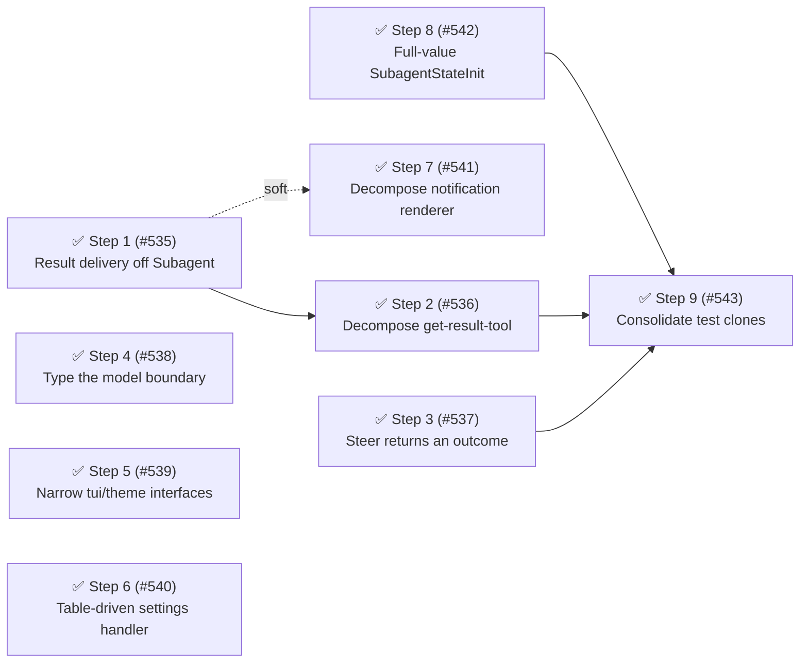

# Phase 20: Result delivery extraction and boundary cleanup

## Summary

Phase 20 realizes the last un-extracted domain from the [first-principles refinement](../architecture.md#first-principles-refinement-and-the-deeper-target) — **result delivery** — and clears the residual boundary and complexity debt discovery surfaced around it.

Discovery findings (fallow + entry-point trace + test-constructibility audit, 2026-07-03):

1. `NotificationState` (`toolCallId`, `resultConsumed`) still lives on `Subagent`; `get-result-tool` reaches through `record.notification?.markConsumed()` twice, always paired with `notifications.cancelNudge(id)` — the doc's own "homeless field" (result-delivery domain) plus a scattered two-step reset.
2. Both `steer-tool` and `service-adapter` pre-check `status !== "running"` before calling `record.steer()` — ask-then-tell, contradicting the target's "tell by id, with outcomes" rule.
3. Five file-level eslint-disable headers (`agent-tool` disables 6 rules; `spawn-config` and `agent-widget` 4 each; `model-resolver` 2; `index` 1) and `model: unknown`/`Model<any>`/`any` threading through 8 files mark the SDK type boundary as the largest remaining `any` surface.
4. Three src functions carry HIGH CRAP scores (notification renderer arrow 79.4, `service-adapter.spawn` 71.3, `get-result-tool.execute` 63.6 — resolved by Step 2); `subagents-settings.handle` (13 cyclomatic, 24 cognitive) is three copy-pasted select→input→validate→apply branches; `service-adapter.ts` is the sole accelerating churn file.
5. `createTestSubagent` is the most complex function in the workspace (19 cyclomatic, 25 cognitive) because `SubagentStateInit` accepts only transition fields, forcing mutation loops to seed metrics — a Category D "shared factory complexity" signal pointing at the production init surface.
6. Test duplication sits at 9 in-package clone groups (81 lines), at the ≤ 10 target but with two consolidatable clone families.

No finding scores ≥ 20 on the priority scale (Impact × (6 − Risk)); the phase is a should-fix band (10–15) consolidation.
Directory organization is healthy (seven domain directories, six root files) — no reorg this phase.

All nine steps are closed: [#535], [#536], [#537], [#538], [#539], [#540], [#541], [#542], [#543].
Two metrics missed their target on delivery — source LOC and `createTestSubagent`'s cyclomatic complexity — recorded honestly below rather than papered over.

## Health metrics

| Metric                                           | Phase 19 (end)   | Phase 20 target        | Phase 20 (delivered)                            |
| ------------------------------------------------ | ---------------- | ---------------------- | ----------------------------------------------- |
| Health score                                     | 78/100 (B)       | ≥ 78 (B)               | 78/100 (B) ✅                                   |
| Source LOC                                       | 7,068 (57 files) | ~7,050 (no net growth) | 7,211 (57 files) — +143 LOC ⚠️ (miss, see note) |
| `record.notification?.` reach-throughs           | 4 sites          | 0                      | 0 ✅                                            |
| Steer status pre-checks outside `Subagent.steer` | 2 sites          | 0                      | 0 ✅                                            |
| src functions with CRAP ≥ 60                     | 3                | 0                      | 0 ✅                                            |
| File-level eslint-disable headers                | 5                | ≤ 2                    | 1 ✅                                            |
| `createTestSubagent` cyclomatic                  | 19               | ≤ 8                    | 13 ⚠️ (miss — see Step 8)                       |
| Test clone groups (in-package)                   | 9 (81 lines)     | — retired (see note)   | retired ✅                                      |

The "Test clone groups (in-package)" metric is retired as of Step 9 ([#543]). fallow 3.2.0 excludes `**/*.test.*` from duplication detection by default, so `pnpm fallow dupes --workspace @gotgenes/pi-subagents` no longer surfaces test-file clones — the tool treats test-suite token runs as expected scaffolding.
The suites' arrange was already well-factored by Phase 17 and Phase 20 Step 8; the residual repetition is the system-under-test act call, which stays explicit per the `testing` skill.

Source LOC grew by 143 lines instead of holding flat: the phase's extraction and typed-boundary work (`get-result-report.ts`, the `NumericSettingDescriptor` table, `SteerOutcome`, `TuiSurface`, the extended `SubagentStateInit`) added more lines than the removed complexity subtracted.
`createTestSubagent`'s cyclomatic complexity dropped from 19 to 13 (not the targeted ≤ 8) — well below the fallow refactoring-target/large-function thresholds (20/30 CRAP) and off both lists, but short of the specific number the step's `Outcome:` line named.
Both misses are retro input for the next planning round, not corrected after the fact.

## Steps

### ✅ Step 1 — Extract result delivery from `Subagent` ([#535])

Smell: Category C (anemic domain / misplaced state, Law of Demeter, scattered resets) — the result-delivery domain named in the first-principles refinement is still fused into the execution record.
Target files:

- `src/lifecycle/subagent.ts` — drop `_notification` / `notification`; stop constructing `NotificationState` from `parentSession.toolCallId`.
- `src/observation/notification.ts` — `NotificationManager` owns consumed-state keyed by agent id behind a single tell operation (e.g. `consume(id)`) that also cancels the pending nudge.
- `src/observation/notification-state.ts` — dissolve into the manager or move wholly into the observation domain.
- `src/observation/subagent-events-observer.ts`, `src/tools/get-result-tool.ts` — call the new delivery interface instead of reaching through the record.

The `toolCallId` needed by `formatTaskNotification` already travels on `execution.parentSession`; expose it without routing through a notification object.
The pre-await consumption ordering (the "Bug 1" race tests in `test/lifecycle/subagent-manager.test.ts`) is a preserved invariant — consuming before awaiting must still suppress the completion nudge.

Outcome: zero `record.notification?.` reach-throughs in `src/`; `Subagent` carries no notification field; delivery state lives in the observation domain.

Landed: `notification-state.ts` deleted; `Subagent.toolCallId` getter added over `execution.parentSession`; `NotificationManager` owns `consumed: Set<string>` behind one `consume(id)` tell that adds to the set and cancels the pending nudge atomically.
Collapsing the old two-step reset (`markConsumed()` + `cancelNudge()`) into one atomic operation structurally eliminates the historical "Bug 1" race rather than just reordering it — `consume()` now suppresses the nudge regardless of whether it runs before or after the completion promise resolves, as long as it runs within the 200 ms hold window.

`Release: batch "result-delivery"`

### ✅ Step 2 — Decompose `get-result-tool.execute` ([#536])

Smell: Category B (oversized function) — 61 lines, 15 cyclomatic, CRAP 63.6; mixes wait/consume policy, stats formatting, and output assembly.
Target files:

- `src/tools/get-result-tool.ts` — extract a pure report formatter (status line, stats parts, body selection) alongside the existing `result-renderer.ts` pattern; consume via the Step 1 delivery interface.
- `test/tools/get-result-tool.test.ts` — unit-test the pure formatter directly.

Outcome: `execute` ≤ 30 lines with cyclomatic < 10; off the fallow high-complexity list.

Landed: `src/tools/get-result-report.ts` added — `AgentReport` value object plus `renderStatsParts` / `renderReportBody` / `formatAgentReport` pure functions, unit-tested directly in `test/tools/get-result-report.test.ts`.
`GetResultTool.execute` now owns only record lookup and the wait/consume policy (13 lines), delegating report assembly to a private `buildReport` + `formatAgentReport`; output is byte-identical.
`get-result-tool.execute` is off the HIGH-CRAP list (3 → 2 remaining: `service-adapter.spawn`, the notification renderer arrow).

`Release: batch "result-delivery"`

### ✅ Step 3 — `Subagent.steer` returns an outcome ([#537])

Smell: Category C (ask-then-tell) — coordinators pre-check status before telling.
Target files:

- `src/lifecycle/subagent.ts` — `steer` owns the non-running rejection and returns a discriminated outcome (`delivered` / `buffered` / `rejected` with the observed status).
- `src/tools/steer-tool.ts`, `src/service/service-adapter.ts` — drop the status pre-checks and switch on the outcome; the adapter maps the outcome to the public `SubagentsService.steer` boolean, so the published contract is unchanged.

Outcome: zero steer status pre-checks outside `Subagent.steer`; `steer-tool.execute` cyclomatic drops below 10.

Landed: `Subagent.steer` returns a discriminated `SteerOutcome` (`delivered` / `buffered` / `rejected` with the observed status) and owns the non-running rejection as its first guard; `SteerOutcome` is exported from `subagent.ts` and re-exported via `types.ts`.
`SteerTool.execute` and `SubagentsServiceAdapter.steer` dropped their `status !== "running"` pre-checks and switch on the outcome — the adapter maps `outcome.kind !== "rejected"` to the unchanged public boolean, and the tool's delivered-path stats moved into a private `renderDelivered` helper.
Zero steer status pre-checks remain outside `Subagent.steer`.

`Release: independent`

### ✅ Step 4 — Type the model boundary ([#538])

Smell: Category C (platform type threading) — `ModelRegistry.find/getAll/getAvailable` return `any`, forcing `any`/`unknown` model threading through `model-resolver`, `spawn-config`, `service-adapter`, and `parent-snapshot`.
Target files:

- `src/session/model-resolver.ts` — type the registry against `Model<any>` from `@earendil-works/pi-ai` (already imported elsewhere); remove the file-level eslint-disable; extract the fuzzy-scoring loop as a named helper if `resolveModel` (17 cyclomatic, 60 lines) still trips the threshold.
- `src/service/service-adapter.ts` — type the resolved model in `spawn` (16 cyclomatic, CRAP 71.3, sole accelerating churn file) and extract the model-resolution branch.
- `src/tools/spawn-config.ts` — shrink the 4-rule file-level disable to line-level or remove it.

Outcome: `model-resolver.ts` file-level eslint-disable removed; `service-adapter.spawn` off the HIGH CRAP list; `any` model returns eliminated from the resolver.

Landed: `ModelRegistry.find/getAll/getAvailable` and `resolveModel`'s return are typed against `Model<any>` from `@earendil-works/pi-ai`; the file-level eslint-disable headers on `model-resolver.ts` (2 rules) and `spawn-config.ts` (4 rules) are both removed — running disable-header tally 5 → 3 (`agent-tool` 6, `agent-widget` 4, `index` 1 remain, all Step 5 scope).
`resolveModel`'s fuzzy-scoring loop was extracted to a private `findBestFuzzyMatch` helper, dropping `resolveModel` off the complexity list entirely.
`service-adapter.spawn`'s model-resolution branch was extracted to a private `resolveModelOption`, dropping `spawn` from 16 cyclomatic / CRAP 71.3 (HIGH) to 13 cyclomatic / CRAP 49.5 (moderate) — off the HIGH-CRAP list; running HIGH-CRAP tally 2 → 1 remaining (the notification renderer arrow, untouched — Step 7 scope).
`resolveInvocationModel` gained a `registry: ModelRegistry | undefined` guard (typed error instead of a crash when a model override is requested with no registry present); the residual `unknown` thread through `ParentSnapshot.model` / `SessionContext.model` is a separate SDK-boundary gap, deferred.

`Release: independent`

### ✅ Step 5 — Narrow `tui`/`theme` render interfaces ([#539])

Smell: Category C/D (platform type threading; wide `any` params in render callbacks).
Target files:

- `src/ui/agent-widget.ts` — replace `tui: any` with a lean local interface (`terminal.columns`, `requestRender()`); shrink the 4-rule file-level disable.
- `src/tools/agent-tool.ts` — type `renderCall`/`renderResult` params (`theme`, `result`) with lean local interfaces; shrink the 6-rule file-level disable to the genuinely SDK-gapped lines.
- `src/tools/foreground-runner.ts` — retire the line-level `details as any` cast if the SDK surface allows.

Some disables are irreducible SDK export gaps; the goal is line-level precision, not zero.

Outcome: file-level eslint-disable headers 5 → ≤ 2; remaining suppressions are line-level with named rules.

Landed: `agent-widget.ts` gained a lean local `TuiSurface` interface (`{ terminal: { columns }, requestRender() }`) replacing all three `tui: any` sites; its 4-rule file-level disable is removed.
`agent-tool.ts`'s `renderCall`/`renderResult` now type `theme` against the existing local `display.Theme` and `result` against the SDK-exported `AgentToolResult<AgentDetails | undefined>`/`ToolRenderResultOptions`; `textResult` was retyped (`details?: AgentDetails`) so the tool's inferred `TDetails` is honest end-to-end, eliminating the `result.details` cast; `ctx` params are typed `ExtensionContext`.
Its 6-rule file-level disable is removed with zero residual — a pre-existing `params.resume` (`unknown`) gap surfaced at three template-literal sites once the header lifted, fixed with the same `as string` cast already used a few lines away for `getRecord`/`resume`.
`foreground-runner.ts`'s `details as any` cast and its line-level disable are retired.
Running disable-header tally 3 → 1 (only `index.ts`'s 1-rule `no-unsafe-argument` remains, an accepted SDK gap outside this step's scope) — under the `≤ 2` Phase 20 target.

`Release: independent`

### ✅ Step 6 — Table-driven settings handler ([#540])

Smell: Category B (function duplication inside one function) — `subagents-settings.handle` (13 cyclomatic, 24 cognitive, 52 lines) repeats the select→input→parse→validate→apply→notify flow three times.
Target files:

- `src/ui/subagents-settings.ts` — describe each numeric setting as a descriptor (label, prompt, minimum, validation message, apply method) and drive one loop over the table.
- `test/ui/subagents-settings.test.ts` — assert per-descriptor behavior.

Outcome: `handle` cyclomatic ≤ 6 and cognitive ≤ 10; off the fallow high-complexity list.

Landed: `handle` now dispatches through a module-private `NumericSettingDescriptor` table (label, current-value display, input title/default, minimum, validation message, apply method) with a single `select` → `find` → `input` → `parse` → `validate` → `apply`/`notify` pass; the three copy-pasted branches are gone.
The validation comparison direction (`n >= descriptor.minimum`) was kept unchanged and pinned with a new non-numeric-input regression test before the rewrite, so `NaN` from a malformed input still warns rather than silently applying.
`subagents-settings.ts` no longer appears in fallow's hotspot list (file-level cyclomatic 19 / cognitive 7 across 13 small functions, `crap_above_threshold: 0`) — off the fallow high-complexity list.

`Release: independent`

### ✅ Step 7 — Decompose the notification renderer ([#541])

Smell: Category B/D (oversized arrow, untested complexity) — the renderer arrow in `src/observation/renderer.ts` is fallow's top triage concern (17 cyclomatic, CRAP 79.4).
Target files:

- `src/observation/renderer.ts` — extract pure line-assembly helpers (status→icon/label selection, stats-parts assembly, preview truncation) that are unit-testable without `Text` or a theme; the arrow becomes a thin wrapper.
- `test/observation/renderer.test.ts` — test the pure helpers directly.

Soft ordering: land after Step 1 so the notification-domain files settle first.

Outcome: renderer arrow cyclomatic < 10; `renderer.ts` off the top of the fallow triage list.

Landed: extracted three pure, exported helpers — `resolveStatusPresentation` (status→icon/label, the one OCP dispatch point), `buildStatsParts` (ISP-narrowed `StatsSource` `Pick` over `NotificationDetails`), and `buildPreviewLines` (collapsed 80-column slice vs. expanded 30-line cap).
The arrow now composes the three helpers and applies theme styling only; marker/indentation/`theme.fg` assembly stayed in the wrapper so rendered output is unchanged.
`renderer.ts` no longer appears in `fallow health --targets` (0 refactoring targets) or the file-scores list for the package — off the triage list entirely.
The steered-status wrapper test was pruned as fully subsumed by the new `resolveStatusPresentation` unit test; all other wrapper tests were kept because each exercises genuine multi-piece theme composition the pure helpers don't cover.

`Release: independent`

### ✅ Step 8 — Full-value `SubagentStateInit` ([#542])

Smell: Category D (shared factory complexity → narrow/complete the production init surface) — `createTestSubagent` (19 cyclomatic, 25 cognitive) seeds metrics via mutation loops because `SubagentStateInit` accepts only transition fields.
Target files:

- `src/lifecycle/subagent-state.ts` — extend `SubagentStateInit` to optionally seed the full value (toolUses, lifetimeUsage, compactionCount, turnCount, activeTools, responseText); a value object is legitimately constructible at any point in its value space.
- `test/helpers/make-subagent.ts` — collapse the mutation loops into direct init.

Outcome: `createTestSubagent` cyclomatic ≤ 8; off the fallow complexity list; no production behavior change.

Landed: extended `SubagentStateInit` with six optional value fields (`toolUses`, `lifetimeUsage`, `compactionCount`, `turnCount`, `activeTools`, `responseText`), seeded in the constructor — `lifetimeUsage` is spread-copied so a later `addUsage` cannot mutate the caller's object, and `activeTools` is seeded by name through `addActiveTool` to preserve the `_toolKeySeq` keying invariant.
`createTestSubagent` collapsed its post-construction mutation loops into direct init and dropped off both the fallow refactoring-targets and large-functions lists (was 19 cyclomatic, the workspace's most complex function).
No production behavior change — the accumulation methods stay as the `record-observer` runtime path.

Delivered number (recomputed at archive time): `createTestSubagent` is now 13 cyclomatic / 12 cognitive — a real drop from 19, and off both fallow lists (default thresholds: 20 cyclomatic, 30 CRAP), but short of the `≤ 8` target named in `Outcome:`.
The destructured-overrides parameter and its four `?? default` / `!== undefined` conditional-spread pairs account for the residual complexity; a further reduction would need a different construction shape (e.g. a builder), judged out of scope for this step.

`Release: independent`

### ✅ Step 9 — Consolidate remaining test clone families ([#543])

Smell: Category D (test duplication) — two clone families (`spawn-config.test.ts`: 2 groups / 21 lines; `subagent-manager.test.ts`: 2 groups / 15 lines) plus the `session-config.test.ts` pair (16 lines).
Target files: the three test files and `test/helpers/` as needed.

Runs last — Steps 1–3 and 8 rewrite portions of these suites, so consolidating first would churn twice.

Outcome: the numeric clone-group target is retired — fallow 3.2.0 excludes `**/*.test.*` from duplication detection, so `fallow dupes` no longer surfaces in-package test clones.
The suites' arrange was already well-factored by Phase 17 and Phase 20 Step 8; the residual repetition is the system-under-test act call, retained explicitly per the `testing` skill.

`Release: independent`

Landed: the `SubagentManager — lifecycle observer forwarding` describe's shared arrange hoisted into a describe-scoped `beforeEach` (`subagent-manager.test.ts`) — the one genuine arrange consolidation found.
`spawn-config.test.ts` and `session-config.test.ts` are unchanged: their only repetition is the act call.
The Phase 20 health-metrics row is retired with a rationale note (fallow's test-ignore).

## Step dependencies

## Parallel tracks

- **Track A — Result delivery:** Steps 1 → 2, then 7 (soft).
- **Track B — Tell-don't-ask:** Step 3.
- **Track C — SDK boundary:** Steps 4, 5 (independent of each other).
- **Track D — UI polish:** Step 6.
- **Track E — Test health:** Step 8, then 9 (9 also waits on Tracks A/B test churn).

Tracks A–D can proceed in parallel; only Step 9 serializes behind the rest.

## Release batches

- **Batch "result-delivery":** Steps 1, 2 (ship together; tail = Step 2).
- Independently releasable: Steps 3, 4, 5, 6, 7, 8, 9.

Every step lands as a `refactor:`/`test:` commit — hidden changelog types that cut no release on their own; the work auto-batches into the next unhidden release.

[#535]: https://github.com/gotgenes/pi-packages/issues/535
[#536]: https://github.com/gotgenes/pi-packages/issues/536
[#537]: https://github.com/gotgenes/pi-packages/issues/537
[#538]: https://github.com/gotgenes/pi-packages/issues/538
[#539]: https://github.com/gotgenes/pi-packages/issues/539
[#540]: https://github.com/gotgenes/pi-packages/issues/540
[#541]: https://github.com/gotgenes/pi-packages/issues/541
[#542]: https://github.com/gotgenes/pi-packages/issues/542
[#543]: https://github.com/gotgenes/pi-packages/issues/543
