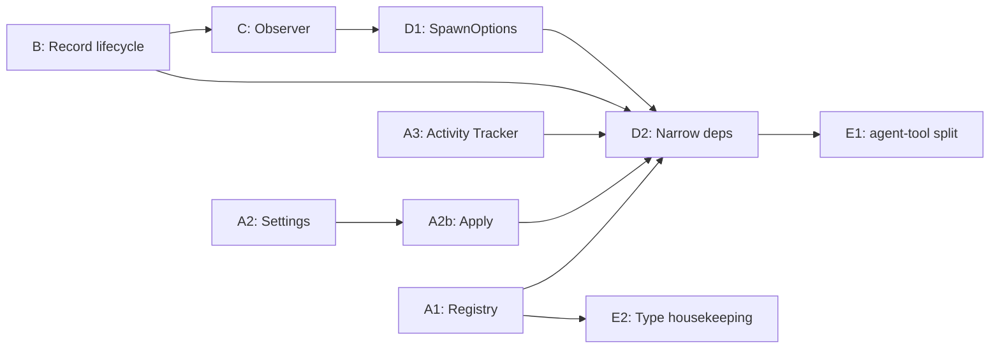

# Phase 7: Encapsulation and dependency narrowing

Every mutable state bag became a class, every dependency bag narrowed to what its consumer uses, every callback became either a method on a collaborator or an event on an observable.

## AgentManager decomposition

AgentManager was decomposed in three steps to untangle record management, concurrency control, and execution orchestration.

### Step 1: Record state machine (#98, #102)

Extracted status-transition methods (`markRunning`, `markCompleted`, `markAborted`, `markSteered`, `markError`, `markStopped`, `resetForResume`) onto `AgentRecord`.
Replaced scattered field writes across 6 sites with encapsulated transition methods.
Issue #102 consolidated test `AgentRecord` construction into a shared factory.

### Step 2: Parent snapshot (#99)

Replaced live `ctx: ExtensionContext` capture in `SpawnArgs` with an immutable `ParentSnapshot` data object.
The snapshot is taken once at spawn time; queued agents execute against frozen state rather than a potentially stale session reference.
`runAgent()` accepts `ParentSnapshot` instead of `ctx`.
`pi: ExtensionAPI` was removed from `SpawnArgs` - `runAgent()` accepts a `ShellExec` function instead.

### Step 3: Session-event observation (#100)

Replaced three-layer callback threading with direct session subscriptions.
`record-observer.ts` subscribes to the session to update record statistics (tool uses, lifetime usage, compaction count).
`ui/ui-observer.ts` subscribes to the session to stream UI state (active tools, response text, turn count).
`SpawnOptions` and `RunOptions` dropped all `on*` callback fields except `onSessionCreated` (which delivers the session object to enable external subscriptions).

### Realized impact

| Metric                            | Before | After                   |
| --------------------------------- | ------ | ----------------------- |
| `SpawnOptions` callback fields    | 6      | 1 (`onSessionCreated`)  |
| `RunOptions` callback fields      | 6      | 1 (`onSessionCreated`)  |
| Callback layers                   | 3      | 0 (direct subscription) |
| Live `ctx` references in queue    | 1      | 0 (snapshot)            |
| Scattered status-transition sites | 6      | 1 (state machine)       |

## Encapsulation roadmap

Phase 7 encapsulated mutable state into classes, replaced callbacks with semantic components, and narrowed dependency bags.

Each step was sequenced so it made the next step easier.

### Resolved smells

All nine smells identified at the start of Phase 7 were resolved:

| Smell                      | Resolution                                                                                                                                 |
| -------------------------- | ------------------------------------------------------------------------------------------------------------------------------------------ |
| Global mutable state       | `AgentTypeRegistry` class (#108); `reloadCustomAgents` callback removed from dep bags                                                      |
| Closure bag as class       | `NotificationManager` class (#116); `pendingNudges` and timer state are private fields                                                     |
| Mutable state bag          | `AgentActivityTracker` class (#110); transition methods replace external writes                                                            |
| Settings relay             | `SettingsManager` class (#109); 6 callback fields collapsed to one object                                                                  |
| Post-construction mutation | `ExecutionState`, `WorktreeState`, `NotificationState` collaborators (#111); stats behind mutation methods                                 |
| Fire-and-forget callbacks  | `AgentManagerObserver` interface (#112); one observer object replaces 3 closure lambdas                                                    |
| Duplicate `SpawnOptions`   | Internal type renamed to `AgentSpawnConfig` (#113); public `SpawnOptions` unchanged                                                        |
| Type dumping ground        | `NotificationDetails`, `ParentSnapshot`, `EnvInfo` moved to their natural modules (#116); narrow subsets defined                           |
| Wide dependency bags       | `AgentToolDeps` 9 → 6, `AgentMenuDeps` 8 → 7 (#114); `emitEvent` removed; description text derived from registry; `agentActivity` narrowed |

### Step A: Extract state into classes (foundation, parallel)

These three extractions are independent and can proceed in any order.
Each eliminates a category of global/closure state and gives orphaned callbacks a natural home.

#### A1. AgentTypeRegistry class (#108)

Wrapped the module-scoped `agents` Map and free functions in `agent-types.ts` into an injectable class.
`reloadCustomAgents` callback removed from `AgentToolDeps` and `AgentMenuDeps`; replaced by `registry.reload()`.
`DEFAULT_AGENT_NAMES` moved from `types.ts` to the registry.

#### A2. SettingsManager class (#109, #118)

Encapsulated settings load/save/apply cycle into `SettingsManager` (in `settings.ts`).
Owns `defaultMaxTurns`, `graceTurns`, `maxConcurrent` with normalizing property accessors.
Added `applyMaxConcurrent(n)`, `applyDefaultMaxTurns(n)`, `applyGraceTurns(n)` - each owns the full consequence chain: normalize → set in memory → notify callback → persist → emit event → return toast.
The 6 settings-related fields in `AgentMenuDeps` collapsed to `settings: AgentMenuSettings`.

#### A3. AgentActivityTracker class (#110)

Wrapped the 7-field mutable `AgentActivity` interface in an `AgentActivityTracker` class (`src/ui/agent-activity-tracker.ts`).
`ui-observer.ts` calls transition methods; consumers use read-only accessors.
The shared map on `SubagentRuntime` is `Map<string, AgentActivityTracker>`.

### Step B: Split AgentRecord lifecycle state (#111)

Split post-construction mutation into phase-specific collaborators, each born complete:

- **`ExecutionState`** (`session`, `outputFile`) - constructed in `onSessionCreated`.
- **`WorktreeState`** (`path`, `branch`, `cleanupResult`) - constructed at worktree setup.
- **`NotificationState`** (`toolCallId`, `resultConsumed`) - constructed by `AgentManager.spawn()` when `toolCallId` is provided.
- **`pendingSteers`** moved to `Map<string, string[]>` on `AgentManager`.
- Stats encapsulated behind mutation methods with read-only getters.
- `AgentRecordInit` trimmed from 19 optional fields to 4 construction-time fields.

### Step C: Replace AgentManager callbacks with observer (#112)

`AgentManagerObserver` interface replaces `onStart`/`onComplete`/`onCompact`.
`index.ts` constructs one observer object instead of 3 closure lambdas.
`AgentManagerOptions` drops from 9 → 7 fields.

### Step D: Disambiguate SpawnOptions and narrow dependency bags

#### D1. Disambiguate SpawnOptions (#113)

Internal `SpawnOptions` in `agent-manager.ts` renamed to `AgentSpawnConfig`.
Public `SpawnOptions` in `service.ts` unchanged.

#### D2. Narrow AgentToolDeps and AgentMenuDeps (#114)

| Bag             | Before   | After | How                                                                                                         |
| --------------- | -------- | ----- | ----------------------------------------------------------------------------------------------------------- |
| `AgentToolDeps` | 9 fields | 6     | `emitEvent` → observer; `typeListText`/`availableTypesText` derived from registry; `agentActivity` narrowed |
| `AgentMenuDeps` | 8 fields | 7     | Dead `emitEvent` removed; `agentActivity` narrowed to read-only `AgentActivityReader`                       |

### Step E: Decompose large files and relocate types

#### E1. Split agent-tool.ts foreground/background (#115)

Extracted `foreground-runner.ts` (~175 lines) and `background-spawner.ts` (~116 lines).
`agent-tool.ts` reduced from 579 → 411 lines.

#### E2. Type housekeeping (#116)

- Moved `NotificationDetails`, `ParentSnapshot`, `EnvInfo` to their natural modules.
- Converted `createNotificationSystem` closure to `NotificationManager` class.
- Converted `ConversationViewer` constructor from 7 positional parameters to `ConversationViewerOptions` bag.
- Defined `AgentIdentity` and `AgentPromptConfig` narrow subsets; `buildAgentPrompt` narrowed to `AgentPromptConfig`.

### Phase 7 results

| Metric                                     | Before | After |
| ------------------------------------------ | ------ | ----- |
| Module-scoped mutable state                | 1      | 0     |
| Closure-bag "classes"                      | 2      | 0     |
| Externally-mutated state bags              | 2      | 0     |
| `AgentManagerOptions` fields               | 9      | 7     |
| `AgentToolDeps` fields                     | 9      | 6     |
| `AgentMenuDeps` fields                     | 13     | 7     |
| `SpawnOptions` callback fields             | 6      | 1     |
| `RunOptions` callback fields               | 6      | 1     |
| Callbacks threaded through deps            | 8      | 0     |
| Types in `types.ts` without a natural home | 4      | 0     |

### Dependency graph

## Related issues

- #98 — Record state machine
- #99 — Parent snapshot
- #100 — Session-event observation
- #102 — Consolidated test AgentRecord construction
- #108 — AgentTypeRegistry class
- #109 — SettingsManager class
- #110 — AgentActivityTracker class
- #111 — Split AgentRecord lifecycle state
- #112 — Replace AgentManager callbacks with observer
- #113 — Disambiguate SpawnOptions
- #114 — Narrow AgentToolDeps and AgentMenuDeps
- #115 — Split agent-tool.ts foreground/background
- #116 — Type housekeeping
- #118 — SettingsManager apply methods
