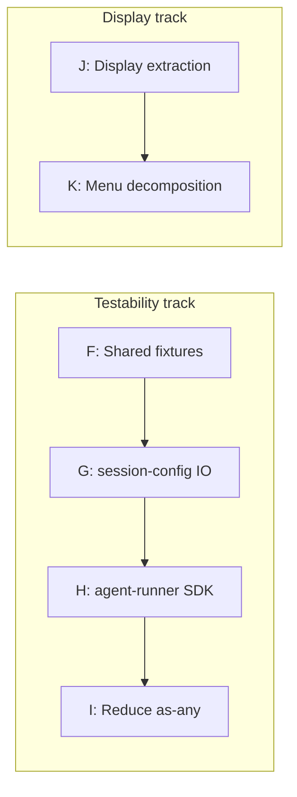

# Phase 8: Testability, display extraction, and menu decomposition

Eliminated `vi.mock()` module mocking in the two most fragile test suites by injecting IO-touching collaborators; consolidated shared test fixtures; extracted display helpers into a reusable module; decomposed the largest UI file.

Steps G and H eliminated 11 of the original 12 `vi.mock()` calls in the runner tests, removing fragile call-sequence assertions in favour of injected stubs.
Step G resolved `session-config.test.ts`; Step H resolved both `agent-runner.test.ts` and `agent-runner-extension-tools.test.ts`.

The display and menu improvements were identified during Phase 7 but deferred because they did not gate encapsulation work.
The display extraction unblocked menu decomposition.

## Test pain points (resolved)

| Symptom                                                       | Resolution                                                     |
| ------------------------------------------------------------- | -------------------------------------------------------------- |
| 7 `vi.mock()` calls in `agent-runner.test.ts`                 | Step H (#133): injected `RunnerIO` stubs                       |
| 7 `vi.mock()` calls in `agent-runner-extension-tools.test.ts` | Step H (#133): same                                            |
| 52 `as any` casts across test suite                           | Step I (#134): reduced to 15                                   |
| 3× duplicated `mockSession()`                                 | Step F (#131): shared `createMockSession()` in `test/helpers/` |
| 3× duplicated `makeDeps()`                                    | Step F (#131): shared `createToolDeps()` in `test/helpers/`    |

The well-designed test suites - `agent-manager.test.ts` (1 mock, DI via `AgentRunner` interface), `notification.test.ts` (0 mocks, pure functions + DI), and `agent-tool.test.ts` (0 mocks, tests via deps bag) - confirmed the pattern: modules that accept collaborators through injection produce resilient tests; modules that import collaborators directly produce fragile mock-heavy tests.

## Step F: Shared test fixtures (#131)

Consolidated duplicated mock factories into `test/helpers/`.

1. `createMockSession()` - subscribable event bus with `emit()` helper; replaced 3 hand-rolled copies.
2. `createToolDeps()` - builds `AgentToolDeps` with sensible defaults and override support; replaced 3 `makeDeps()` copies.
3. `makeRecord()` - `AgentRecord` factory with sensible defaults; replaced scattered inline construction.
4. `STUB_CTX` - shared stub `ExtensionContext` constant; centralised unavoidable bridge casts.

Impact: reduced test boilerplate; single source of truth for mock shapes; changes to dep interfaces propagate automatically.

## Step G: Inject IO collaborators into session-config (#132)

`assembleSessionConfig` now accepts `io: AssemblerIO` as a required parameter.
`index.ts` constructs the real `AssemblerIO` from direct imports via the `RunnerIO.assemblerIO` field (wired in Step H).
`session-config.test.ts` injects stubs - all 4 `vi.mock()` calls eliminated, assertions shifted to `SessionConfig` output properties.

## Step H: Inject SDK boundary into agent-runner (#133)

`runAgent()` now accepts `io: RunnerIO` as a required parameter bundling all IO collaborators: `detectEnv`, `getAgentDir`, `createResourceLoader`, `deriveSessionDir`, `createSessionManager`, `createSettingsManager`, `createSession`, and `assemblerIO`.

`createAgentRunner(io: RunnerIO): AgentRunner` factory captures the boundary at construction time so `AgentManager` and the `AgentRunner` interface remain unchanged.
`index.ts` constructs the real `RunnerIO` from Pi SDK imports and sibling modules.

Impact: all 7 `vi.mock()` calls eliminated from both `agent-runner.test.ts` and `agent-runner-extension-tools.test.ts`; tests verify behavior (turn limits, tool filtering, response collection) through injected stubs; SDK imports moved to the extension entry point.

## Step I: Reduce `as any` casts in tests (#134)

Reduced `as any` count from 93 to 15 (plus 13 explicit `as unknown as T` bridge casts).

Production changes:

- `ResourceLoaderOptions.appendSystemPromptOverride` typed to match `DefaultResourceLoaderOptions`; `createResourceLoader` factory cast removed from `index.ts`.
- `CreateSessionOptions.settingsManager` / `RunnerIO.createSettingsManager` typed as `SettingsManager`.
- `WidgetLike` interface in `runtime.ts` narrows the widget field.
- Local `ToolCallContent` / `BashExecutionMessage` type guards replace `as any` duck-typing in `conversation-viewer.ts` and `agent-runner.ts`.
- `textResult()` return no longer casts `details as any`.
- `toAgentSession()` helper and `STUB_CTX` constant centralise unavoidable bridge casts.

Remaining 15 `as any` casts are: 8 menu-handler `ctx as any` (deferred - requires `AgentManager.spawn` to accept `ParentSnapshot` directly), 2 `print-mode.test.ts` (same ExtensionContext/API pattern), 2 private-field test access, 1 `createSession` SDK bridge in `index.ts`, 1 `foreground-runner.ts` `AgentToolResult<any>` detail, 1 `stub-ctx.ts` comment.

## Step J: Extract display helpers (#135)

`ui/display.ts` now contains all pure formatters, display helpers, constants, and shared types (`Theme`, `AgentDetails`).
`agent-widget.ts` dropped from 522 → ~340 lines.
All consumer modules (menu, tools, renderer, conversation viewer) import from `ui/display.ts` directly.
`test/agent-widget.test.ts` renamed to `test/display.test.ts`.

## Step K: Decompose agent-menu.ts (#136)

`agent-menu.ts` (668 lines) decomposed into four modules:

1. `ui/agent-file-ops.ts` - `AgentFileOps` interface (`exists`, `read`, `write`, `remove`, `ensureDir`, `findAgentFile`) + `FsAgentFileOps` production implementation.
2. `ui/agent-config-editor.ts` - `showAgentDetail` with edit/delete/reset/eject/disable/enable transitions (~200 lines).
3. `ui/agent-creation-wizard.ts` - AI-generation and manual-form creation paths (~250 lines).
4. `ui/agent-menu.ts` - menu orchestration, agent listing, running-agent viewer, settings form (~300 lines).

Impact: `agent-menu.ts` dropped from 668 → 296 lines; extracted modules receive `AgentFileOps` via injection; `vi.mock("node:fs")` eliminated from `agent-menu.test.ts`.

## Step dependencies

The two tracks are independent and can proceed in parallel.

## Related issues

- #131 — Shared test fixtures
- #132 — Inject IO collaborators into session-config
- #133 — Inject SDK boundary into agent-runner
- #134 — Reduce as-any casts in tests
- #135 — Extract display helpers
- #136 — Decompose agent-menu.ts
