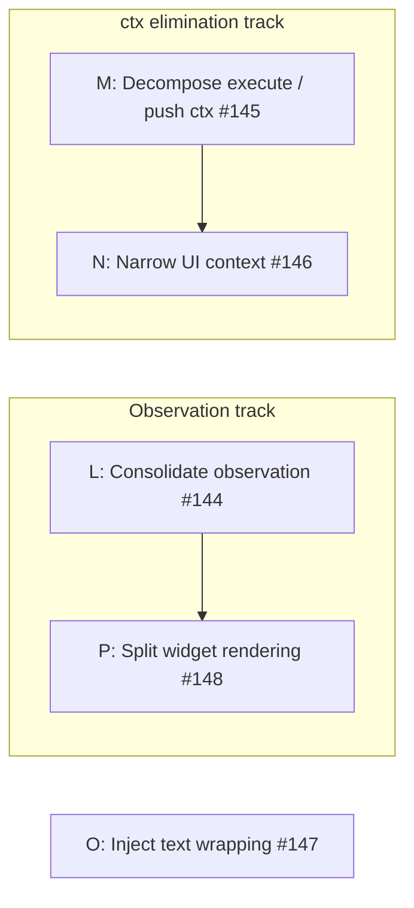

# Phase 9: Observation consolidation, ctx elimination, and remaining mocks

Target: consolidate the dual observation model so stats live in one place; remove `ExtensionContext` from all internal APIs; eliminate remaining `vi.mock()` calls and `as any` casts; split widget rendering from lifecycle; apply dependency bag convention.

## Current smells

| Smell                                             | Location                                                                  | Evidence                                                                                                                       | Severity |
| ------------------------------------------------- | ------------------------------------------------------------------------- | ------------------------------------------------------------------------------------------------------------------------------ | -------- |
| `execute` does config resolution for its callees  | `agent-tool.ts` (145-line `execute`)                                      | ~60 lines unpack config, resolve model, compute metadata, repack into 16-field bags for spawners; `ctx` threaded 4 layers deep | Medium   |
| ~~Wide `ctx` in menu handlers~~                   | ~~`agent-menu.ts`, `agent-config-editor.ts`, `agent-creation-wizard.ts`~~ | Resolved by #146: `MenuUI` interface introduced; 42 `ctx as any` casts eliminated across 5 test files                          | Done     |
| ~~Direct SDK import in `conversation-viewer.ts`~~ | ~~`conversation-viewer.test.ts`~~                                         | Resolved by #147: `wrapText` injected via `ConversationViewerOptions`; `vi.mock("@earendil-works/pi-tui")` eliminated          | Done     |
| ~~Widget mixes rendering, lifecycle, and state~~  | ~~`agent-widget.ts` (370 lines)~~                                         | Resolved by #148: rendering extracted to `widget-renderer.ts`; widget is now 198 lines                                         | Done     |
| `deps.` prefix noise in function bodies           | remaining modules across tools, UI, service-adapter                       | Functions accept a `deps` bag and access every field as `deps.foo`; hides real dependencies and lengthens every call line      | Low      |

## Dependency bag convention

Applied incrementally as each step touches a module:

- **≤4 fields** - accept as plain parameters; drop the interface.
- **≥5 fields** - keep a named interface but destructure in the function signature (`{ manager, widget }: ForegroundDeps`) so the function body uses bare names, not `deps.foo`.

This eliminates the `deps.` prefix noise across ~124 callsites in 12 modules.

## Step L: Consolidate observation model (#144)

Removed `_toolUses` and `_lifetimeUsage` from `AgentActivityTracker`.
UI consumers read stats from `AgentRecord` instead of the tracker.
The UI observer retains event subscriptions for re-render triggers but no longer accumulates stats independently.

Add `session` and `outputFile` convenience getters on `AgentRecord` to hide the `execution?.` traversal.
The 15+ callsites that navigate `record.execution?.session` simplify to `record.session`.

Apply the dependency bag convention to touched modules: `NotificationDeps` (4 fields) becomes plain parameters on `NotificationManager` constructor.

Impact: eliminates dual counting; removes `??` fallback pattern from widget and conversation viewer; hides `ExecutionState` structure from consumers.

## Step M: Decompose execute and push ExtensionContext to the boundary (#145)

Extracted config resolution into `resolveSpawnConfig` (pure function in `spawn-config.ts`).
Injected three collaborators (`buildSnapshot`, `getModelInfo`, `getSessionInfo`) into `createAgentTool` so `execute` no longer reads `ctx` beyond `ctx.ui` (already delegated to `widget.setUICtx`).
`AgentManager.spawn()` and `spawnAndWait()` accept `ParentSnapshot` instead of `ExtensionContext`.
`service-adapter.ts` calls `buildParentSnapshot(session.ctx)` at its boundary.
`foreground-runner` and `background-spawner` receive `ResolvedSpawnConfig` + domain values (`snapshot`, `parentSessionFile`, `parentSessionId`) instead of `ctx`.

Dissolved `ForegroundDeps`, `BackgroundDeps`, and `AdapterDeps` into plain parameters.
`AgentToolDeps` is destructured in the `createAgentTool` signature.

After this step, `ExtensionContext` appears only in:

- `index.ts` closures (wired at extension startup)
- `service-adapter.ts` (cross-extension boundary)
- Menu handlers (addressed by Step N)

Impact: `execute` dropped from ~145 to ~25 lines; eliminated 16-field parameter bags; eliminated `vi.mock("../src/parent-snapshot.js")` in `agent-manager.test.ts`; foreground/background runner tests no longer need `ctx` mocks; `AgentManager` operates entirely on domain types.

## Step N: Narrow UI context for menu handlers (#146)

Defined `MenuUI` interface (exported from `agent-menu.ts`) with `select`, `confirm`, `input`, `notify`, `editor`, and `custom` methods — the exact subset `ctx.ui` methods used by menu handlers.
All inner functions in `agent-menu.ts`, `agent-config-editor.ts`, and `agent-creation-wizard.ts` now accept `(ui: MenuUI)` instead of `(ctx: ExtensionContext)`.
`index.ts` passes `ctx.ui`, `ctx.modelRegistry`, and `buildParentSnapshot(ctx)` to the handler.

`AgentMenuManager.spawnAndWait` and `WizardManager.spawnAndWait` both accept `ParentSnapshot` (enabled by Step M).
Creation wizard threads `parentSnapshot` from `showCreateWizard(ui, parentSnapshot)` → `showGenerateWizard(ui, parentSnapshot, targetDir)` → `manager.spawnAndWait(parentSnapshot, ...)`.

Applied the dependency bag convention:

- `AgentConfigEditorDeps` (4 fields), `GetResultDeps` (4 fields), `SteerToolDeps` (4 fields) dissolved into plain parameters.
- `AgentMenuDeps` (8 fields) and `AgentCreationWizardDeps` (5 fields) kept as interfaces, destructured in the function signature.

After Steps M and N, `ExtensionContext` appears only at true boundaries: `index.ts` closures and `service-adapter.ts` (cross-extension bridge).

Impact: eliminated 42 `ctx as any` casts across 5 test files (`agent-menu.test.ts`: 8, `agent-config-editor.test.ts`: 20, `agent-creation-wizard.test.ts`: 14); tests construct plain `MenuUI`-shaped objects with no cast.

## Step O: Inject text wrapping into ConversationViewer (#147)

Accepted `wrapText: (text: string, width: number) => string[]` via `ConversationViewerOptions`.
`agent-menu.ts` passes the real `wrapTextWithAnsi` import at the `ConversationViewer` construction site.
Tests inject a stub or the real function directly via options — no module-level mock needed.

Applied the dependency bag convention: `ConversationViewerOptions` is now destructured in the constructor signature.

Impact: eliminated the hoisted `vi.mock("@earendil-works/pi-tui")` from `conversation-viewer.test.ts`; 1 test deleted (mock-mechanism sentinel); net −1 test.

## Step P: Split AgentWidget rendering (#148)

Extracted pure rendering functions (`renderWidgetLines`, `renderFinishedLine`, `renderRunningLines`) from `AgentWidget` into `ui/widget-renderer.ts`.
The widget is now a thin lifecycle/polling wrapper (198 lines, down from 374) that delegates to pure render functions.
Rendering functions receive data (agent list, activity map, registry) and return formatted strings - testable without widget lifecycle. 23 new unit tests cover all status variants, overflow, tree connectors, and empty states.

## Step dependencies

The three tracks are independent of each other.

## Projected impact

| Metric                             | Before                   | After                    |
| ---------------------------------- | ------------------------ | ------------------------ |
| `vi.mock()` calls remaining        | 4                        | 1 (`print-mode.test.ts`) |
| `as any` casts remaining           | 45                       | ~5                       |
| Independent tool-use counters      | 2                        | 1                        |
| `record.execution?.` traversals    | 15+                      | 0                        |
| `ExtensionContext` in domain types | 1 (`AgentManager.spawn`) | 0                        |
| `deps.` prefix accesses            | ~124                     | 0                        |

## Related issues

- #144 — Consolidate observation model
- #145 — Decompose execute and push ExtensionContext to boundary
- #146 — Narrow UI context for menu handlers
- #147 — Inject text wrapping into ConversationViewer
- #148 — Split AgentWidget rendering
