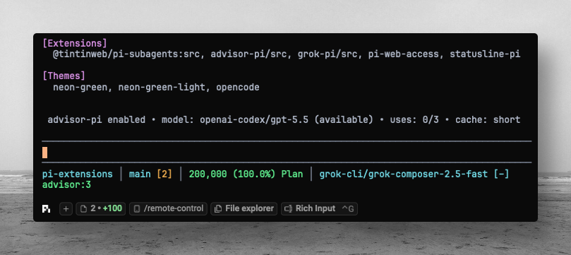

# advisor-pi

Advisor-style strategic guidance for Pi Coding Agent.



`advisor-pi` adds an LLM-callable `advisor` tool. During complex workflows, the
executor model can pause and consult a configured higher-capability advisor model
for planning, risk analysis, course correction, or review guidance.

The advisor receives the current conversation transcript plus the executor's
question. It has no tools and cannot modify files; it only returns strategic
advice to the executor.

## Behavior

- Registers an `advisor` tool for complex or high-risk tasks.
- Lets the executor decide when a consultation is useful.
- Calls a configured advisor model through Pi's model registry and auth.
- Tracks advisor uses per session branch and stops after the configured limit.
- Passes a prompt-cache preference (`none`, `short`, or `long`) where the
  selected provider supports it.
- Defaults to `openai-codex/gpt-5.6-sol` with `high` thinking.
- Shows a compact `advisor:<provider>/<model> <thinking> <remaining>` status in Pi's
  footer when UI is available.

## Commands

```text
/advisor-pi status
/advisor-pi enable
/advisor-pi disable
/advisor-pi model <provider>/<model>
/advisor-pi thinking <minimal|low|medium|high|xhigh|max>
/advisor-pi max-uses <number>
/advisor-pi cache <none|short|long>
/advisor-pi reset
```

Examples:

```text
/advisor-pi model openai-codex/gpt-5.6-sol
/advisor-pi thinking high
/advisor-pi max-uses 5
/advisor-pi cache long
```

## CLI flags

```bash
pi --advisor-model openai-codex/gpt-5.6-sol \
   --advisor-thinking high \
   --advisor-max-uses 5 \
   --advisor-cache short
```

Disable on startup:

```bash
pi --advisor-enabled=false
```

## Install

Published on npm: [`advisor-pi`](https://www.npmjs.com/package/advisor-pi). Register the package with **Pi** (`pi install`) — plain `npm install` does not add it to Pi's `settings.json`.

```bash
pi install npm:advisor-pi
pi install npm:advisor-pi@1.0.0   # pin version
pi install -l npm:advisor-pi      # project-local (.pi/settings.json)
pi -e npm:advisor-pi              # one session, no install
```

Then run `/reload` in Pi (or restart).

```bash
pi list
pi update npm:advisor-pi
pi remove npm:advisor-pi
```

**From [pi-extensions](https://github.com/luongnv89/pi-extensions) (git):**

```bash
cp -r extensions/advisor-pi ~/.pi/agent/extensions/
# or: curl -fsSL .../install.sh | bash -s -- --auto
```

## Cost and latency

Each advisor consultation is a separate model call. That means:

- Advisor input and output are billed separately by the selected provider.
- Streaming from the executor pauses while the advisor call runs.
- Longer transcripts cost more because the advisor reads the conversation
  context.
- The `max-uses` setting is a safety budget; raise it only when deeper review is
  worth the extra cost.

## Caching

`advisor-pi` passes the configured cache preference to Pi's AI provider layer:

- `none` — do not request prompt caching.
- `short` — request normal/short cache retention where supported.
- `long` — request long cache retention where supported.

Provider support varies. Some providers ignore cache preferences, some require
specific model compatibility, and cache reads/writes may still be billed.

## Known limitations

- This is a portable Pi custom-tool approximation, not Anthropic's native beta
  `advisor_20260301` server tool.
- Native provider-specific advisor usage fields may not appear in provider usage
  reports.
- The advisor has no tools and cannot inspect files beyond what appears in the
  transcript.
- Very long conversations can make advisor calls slower and more expensive.
- `max-uses` is tracked per Pi session branch from extension state and tool
  result details; manual session editing can affect reconstruction.
