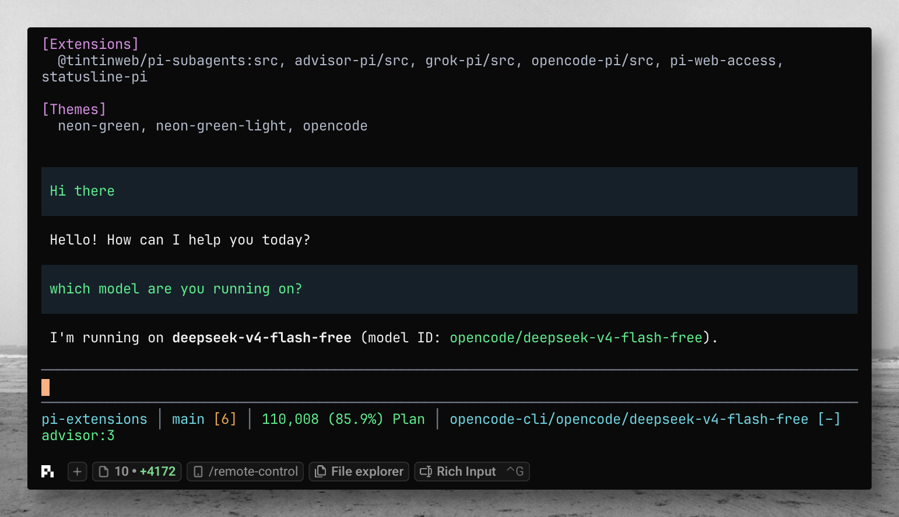
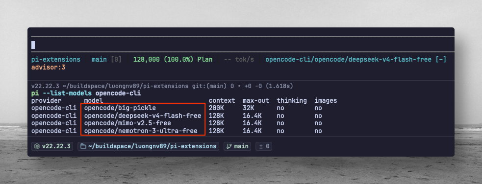
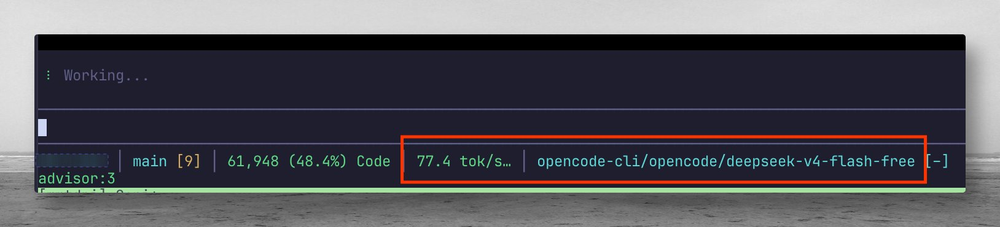

# opencode-pi

`opencode-pi` registers an `opencode-cli` provider in Pi and delegates model calls to the local `opencode` CLI.







It is intended for the free OpenCode models that work without `opencode auth login`, such as:

- `opencode/deepseek-v4-flash-free`
- `opencode/mimo-v2.5-free`
- `opencode/nemotron-3-super-free`
- `opencode/big-pickle`

## Requirements

- Pi Coding Agent
- OpenCode installed and available on the same machine:

```bash
opencode --version
opencode models opencode --verbose
```

No OpenCode login is required for the bundled free OpenCode models.

## Install

Published on npm: [`opencode-pi`](https://www.npmjs.com/package/opencode-pi). Use **Pi's package manager** (`pi install`), not `npm install` alone.

```bash
pi install npm:opencode-pi
pi install npm:opencode-pi@1.1.0   # pin version
pi install -l npm:opencode-pi      # project-local (.pi/settings.json)
pi -e npm:opencode-pi                # one session, no install
```

Then run `/reload` in Pi (or restart).

```bash
pi list
pi update npm:opencode-pi
pi remove npm:opencode-pi
```

**From [pi-extensions](https://github.com/luongnv89/pi-extensions) (git):**

```bash
cp -r extensions/opencode-pi ~/.pi/agent/extensions/
# or from repo root: npm run install-extensions
```

## Usage

Pick the provider from `/model`, or start Pi directly:

```bash
pi --provider opencode-cli --model opencode/deepseek-v4-flash-free
```

Print-mode smoke test:

```bash
pi -p --provider opencode-cli --model opencode/deepseek-v4-flash-free "Reply with exactly OK"
```

Commands:

```text
/opencode-pi status
/opencode-pi models
/opencode-pi test
/opencode-pi update
/opencode-pi help
```

### Refreshing the model list

OpenCode changes its free model roster frequently. Refresh the registered models at runtime:

```text
/opencode-pi update
```

This queries `opencode models opencode --verbose`, parses each model's capabilities and limits, updates the provider's model list, and shows how many new models were added. Pi receives the discovered display name, reasoning and image capabilities, context window, and output limit. The status command also displays the timestamp of the last discovery.

## Configuration

| Environment variable | Description                                                                                         |
| -------------------- | --------------------------------------------------------------------------------------------------- |
| `OPENCODE_PI_BIN`    | Override the OpenCode executable path. Defaults to `opencode`.                                      |
| `OPENCODE_PI_MODELS` | Comma- or space-separated model list to register. Values without `/` are prefixed with `opencode/`. Registers immediately with conservative fallback metadata (skipping verbose discovery so startup never pays a discovery timeout); run `/opencode-pi update` to enrich these models with real capabilities from verbose discovery. |

Example:

```bash
OPENCODE_PI_MODELS="opencode/deepseek-v4-flash-free,opencode/mimo-v2.5-free" pi
```

## How it works

For each Pi model call, the extension:

1. Discovers model metadata from the ID/JSON pairs printed by `opencode models opencode --verbose`.
2. Creates a temporary OpenCode project with a locked-down `pi-model` agent.
3. Denies OpenCode's own tools (`bash`, `edit`, `read`, web tools, subagents, etc.).
4. Sends Pi's current prompt/context to `opencode run --format json` over stdin.
5. Writes user and tool-result images to temporary files and adds one `--file` argument per image when the selected model advertises image input.
6. Enables `--thinking` for reasoning models, maps supported Pi reasoning levels to discovered OpenCode variants, and converts reasoning JSON events into Pi thinking blocks.
7. Converts marker-only `<pi_tool_call>{...}</pi_tool_call>` responses into real Pi tool calls, so Pi executes tools rather than OpenCode.

Tool markers are treated as control syntax only inside `<pi_tool_call>` blocks. The parser accepts markers surrounded by model prose, whole-response JSON-quoted markers, common unambiguous closing-tag variants, and a complete JSON payload whose closing tag was omitted. It also narrowly repairs unescaped quotes inside JSON string values—a compatibility case seen when reasoning models generate shell commands—then applies the normal payload validation and current-tool allowlist. Truncated or ambiguous markers, other malformed arguments, and unavailable tools are never executed. Rejected requests report whether the marker structure, payload, or allowlist caused the failure. Tool-call IDs are retained in the serialized transcript so later results can be matched correctly.

This keeps file access and edits under Pi's normal tool pipeline. Temporary image and agent files are removed after each turn.

## Testing

Run the automated suite from this extension directory:

```bash
npm test
```

## Notes and limitations

- This is a CLI bridge, not a native provider API. It is slower than direct HTTP providers because it starts `opencode run` for each model turn.
- Tool calling is prompt-bridged. Marker payloads remain shape-validated and tool-allowlisted; the only leniency is prose extraction and narrow repair of unescaped quotes inside JSON strings. Native tool-call providers can still be more reliable.
- Image and reasoning support are advertised per model only when verbose discovery reports those capabilities. Models configured via `OPENCODE_PI_MODELS` start on conservative text-only, non-reasoning fallback metadata (no discovery call at startup) until `/opencode-pi update` runs discovery to enrich them; default (unconfigured) IDs fall back the same way if discovery fails.
- Reasoning levels are exposed only for variants reported by OpenCode; models without variants do not claim selectable thinking levels.
- If OpenCode ever attempts to use its own tools, the extension fails the turn instead of hiding it.
