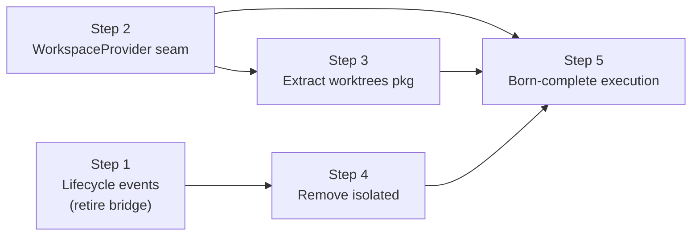

# Phase 16: Invert dependencies — extensions on a minimal core

## Summary

Phase 16 reclaimed its original intent — invert the core's outbound dependencies — and extended it: worktree isolation joined permissions as an *extension* on a minimal core, leaving pi-subagents a pure child-session orchestrator.
The decision and the full reasoning chain are recorded in [ADR-0002]; the two-surface extension model is described under [Target architecture](../architecture.md#target-architecture).

All five steps are closed: [#261], [#262], [#263], [#264], [#265].

## Two extension surfaces

Extensions attach through exactly two surfaces, distinguished by the direction of information flow.

1. **Lifecycle events (observational) — unlimited.**
   The core emits awaited, ordered events for the child-execution lifecycle (`spawning`, `session-created` before `bindExtensions()`, `completed`, `disposed`).
   Any number of extensions subscribe; handlers return nothing.
   Reactive concerns live here: permission detection, telemetry, UI, notifications.
   Adding a reactive concern never modifies the core.
2. **Provider seams (generative) — rationed.**
   The rare concern that must *inject* a value the core consumes synchronously registers a provider the core consults.
   Today there is exactly one: the **workspace provider** (returns the child's working directory plus bracketed setup/teardown).
   A provider seam is the only place the core is "open," so the list is kept as small as possible.

The discriminator when deciding how a concern attaches:

- It only needs to **know** what happened → subscribe to a lifecycle event (observational, unlimited).
- It must **return a value the core consumes** → register a provider (generative, rationed).

The governing rule — **no vacant hooks**: the architecture must *admit* a seam without *shipping* it until a concrete consumer exists.
A provider seam with no consumer is a speculative abstraction that taxes every reader and that `fallow` flags as dead.
Latent extensibility is the deliverable; a vacant hook is not.

## Abandoned exploration: agent collaborator architecture

An earlier Phase 16 plan ("agent collaborator architecture") proposed giving `Agent` three collaborators — a session factory, a `WorktreeIsolation`, and a lifecycle observer — and dissolving the runner.
That framing was abandoned.
Pulling on a single late-bound `create(cwd?)` parameter on the planned `ChildSessionFactory` exposed deeper problems:

- `WorktreeIsolation.setup()` is a two-phase `construct-then-setup()` that violates "Construct complete" (principle 8) — the worktree is only *ready* at dequeue.
- The worktree and the child session share one lifespan, so they are one run-scoped resource, not sibling collaborators that `Agent` must sequence; the `cwd` parameter only existed because the worktree was split out and `Agent` relayed its output back in.
- Worktrees are not intrinsic to subagents — they are one *workspace strategy* and belong outside the core, exactly as Phase 14 evicted tool/extension policy.

Issue #256 (`WorktreeIsolation` as a collaborator) shipped under the abandoned plan and was superseded by #263; issue #257 (`ChildSessionFactory` extraction) was parked.
Issues #258 (Agent owns session lifecycle via factory) and #259 (dissolve runner concept) belonged to the same abandoned plan — both depended on #256/#257 and were closed as not planned; their structural goals were recovered by Step 5 (#265) via a cleaner route.
The structural win the collaborator plan chased — a born-complete child execution and the dissolution of the runner — is recovered once the workspace seam exists (Step 5).

## Steps

### Step 1: Child-execution lifecycle events; retire permission-bridge — [#261]

Emit ordered child-execution events (`spawning`, `session-created` before `bindExtensions()`, `completed`, `disposed`) carrying child identity (session directory, agent name, parent session id).
Migrated `@gotgenes/pi-permission-system` to subscribe to `session-created`/`disposed` for registration instead of being looked up by the core; deleted `permission-bridge.ts`.

- Cross-package: pi-subagents (emit + remove bridge) and pi-permission-system (subscribe).
- Investigation (resolved): `pi.events` is a Node `EventEmitter`, so `emit()` dispatches listeners synchronously on the same call stack — a synchronous subscriber completes before `emit()` returns.
  Emitting `session-created` immediately before `bindExtensions()` therefore guarantees the registry entry lands pre-bind, with no new SDK hook.
  The synchronous-handler constraint is encoded as a real-bus test in pi-permission-system.
- Outcome: the core stops reaching out to a named consumer; permission detection rides events.
- Deferred: removing the now-caller-less `registerSubagentSession`/`unregisterSubagentSession` from `PermissionsService` → #267; registry-detected resume ("executing now" → "exists" semantics) → #265.

### Step 2: Define the `WorkspaceProvider` seam — [#262]

Added the `WorkspaceProvider` / `Workspace` interfaces (`src/lifecycle/workspace.ts`) and `SubagentsService.registerWorkspaceProvider` (single provider, throws on duplicate, returns an unregister disposer).
All five workspace types are named-re-exported from `service.ts`: `WorkspaceProvider`, `Workspace`, `WorkspacePrepareContext`, `WorkspaceDisposeOutcome`, and `WorkspaceDisposeResult` (added in #272).
At run-start `Agent.run()` consults the registered provider for the child's cwd and a disposal handle; with no provider the child runs in the parent's cwd.
On completion the core calls `Workspace.dispose({ status, description })` and appends the returned `resultAddendum` verbatim — the provider owns the wording.

- The seam is additive and non-breaking.
- Landed alongside its first consumer (Step 3) to avoid a vacant hook — the "no vacant hooks" rule.
- Outcome: a single generative seam; the core no longer knows what an "isolation strategy" is.

### Step 3: Extract worktrees to `@gotgenes/pi-subagents-worktrees` — [#263]

New package implementing `WorkspaceProvider`: prepares a git worktree at run-start (born complete), tears it down after (saving the branch), and owns the "changes saved to branch" result.
Worktree isolation is opt-in per agent type via the package's own `worktreeAgents` config; creation failure for an opted-in agent throws (strict, no silent fallback).
Removed `worktree.ts`, `worktree-isolation.ts`, `GitWorktreeManager`, and the `isolation: "worktree"` mode from the core; dropped `isolation` from the spawn API and `SubagentsService`, and `worktreeResult` from `SubagentRecord`.

- Supersedes #256.
  New package registered in `release-please-config.json` and `.pi/settings.json` (after pi-subagents); consumes the published `@gotgenes/pi-subagents` from the registry (`linkWorkspacePackages: false`).
- Outcome: git leaves the core; worktree users install one package, everyone else pays nothing.

### Step 4: Remove `isolated` / `extensions: false` / `noSkills` — [#264]

Children always load the parent's extensions and skills; the recursion guard is now unconditional.
Deny-at-use (the in-child permission layer) covers tool restriction; prevent-load is left as a latent provider seam (not shipped).
The `skills` curation axis collapsed symmetrically with `extensions`: `AgentConfig.skills`, the skill-preload path (`skill-loader.ts`, `safe-fs.ts`, `preloadSkills`, `PromptExtras`), `SessionConfig.{extensions,noSkills,extras}`, and the `isolated:` / `extensions:` / `skills:` custom-agent frontmatter keys are all gone.

- Depended on: Step 1 (deny-at-use over events).
- Outcome: the `isolated`/`extensions`/`noSkills`/`skills` axis is gone; the guard is unconditional.

### Step 5: Born-complete child execution; dissolve the runner — [#265]

`createSubagentSession()` is an assembly factory that returns a born-complete `SubagentSession` (session created, extensions bound, recursion guard applied).
`SubagentSession` owns turn driving (`runTurnLoop`/`resumeTurnLoop`), steering, and disposal.
`Agent.run()` is coordination, not assembly; `runAgent` / `resumeAgent` / `ConcreteAgentRunner` / `AgentRunner` / `RunOptions` / `RunResult` / `ExecutionState` dissolved.
`getAgentConversation()` relocated to `session/conversation.ts`; `normalizeMaxTurns()` to `lifecycle/turn-limits.ts`.
`disposed` now fires at true session disposal (cleanup), so resume executions are registry-detected (closing the gap deferred from #261).

- Depends on: Steps 2–4.
- Outcome: the "runner" concept is gone; `Agent.run()` is coordination, not assembly — the structural goal of the abandoned collaborator plan, reached cleanly.

## Step dependency diagram

## Tracks

1. **Track A — Inversion seams** (Steps 1, 2): lifecycle events and the workspace seam.
   Independent of each other — proceeded in parallel.
2. **Track B — Eviction** (Steps 3, 4): worktrees and `isolated` leave the core.
   Step 3 depends on Step 2.
3. **Track C — Consolidation** (Step 5): dissolve the runner around the new seam.
   Depends on Tracks A and B.

## Composition model

In the post-Phase-16 state, pi-subagents publishes events and a provider seam; other packages hook in:

- **pi-permission-system** (observational) subscribes to child-session lifecycle events, detects subagent execution context in the child, and gates tool calls at runtime.
- **pi-subagents-worktrees** (generative) registers a `WorkspaceProvider` that prepares a git worktree at run-start and tears it down after, supplying the child's cwd.
- **pi-subagents-ui** (future, Phase 17) subscribes to the service API, renders the widget, conversation viewer, and `/agents` menu.
- **Any future extension** (OTel, auditing, cost tracking) subscribes to the same events without pi-subagents knowing.

Composition test: install neither extension, only permissions, only workspaces, or both — the core is byte-for-byte identical in all four cases, and the two extensions never reference each other.

[#261]: https://github.com/gotgenes/pi-packages/issues/261
[#262]: https://github.com/gotgenes/pi-packages/issues/262
[#263]: https://github.com/gotgenes/pi-packages/issues/263
[#264]: https://github.com/gotgenes/pi-packages/issues/264
[#265]: https://github.com/gotgenes/pi-packages/issues/265
[ADR-0002]: ../../decisions/0002-extensions-on-a-minimal-core.md
